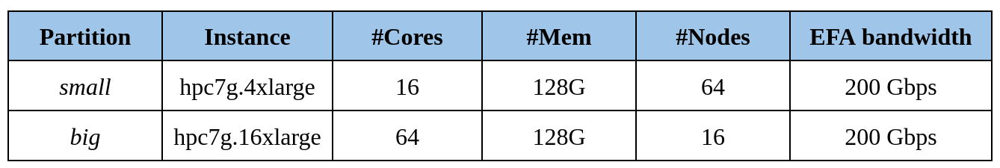

# Context & System Overview

{: style="width:300px;"}
{: style="width:300px;"}

## Context

The University of Luxembourg announced a [collaboration](https://www.uni.lu/en/news/university-of-luxembourg-to-use-aws-processors-in-hpc-research/) with Amazon Web Services (AWS) to deploy Amazon Elastic Compute Cloud (Amazon EC2) cloud computing infrastructure in order to accelerate strategic high-performance computing (HPC) research and development in Europe.

University of Luxembourg will be among the first European universities to provide research and development communities with access to compute environments that use an architecture similar to the European Processor Initiative (EPI), which will be the basis for Europe’s future exascale computing architecture.

Using Amazon EC2 instances powered by [AWS Graviton3](https://aws.amazon.com/blogs/aws/new-amazon-ec2-c7g-instances-powered-by-aws-graviton3-processors/), the University of Luxembourg will make simulation capacity available to University researchers. This autumn, research projects will be selected from proposals submitted by University R&D teams.

As part of this project, AWS will provide cloud computing services to the University that will support the development, design, and testing of numerical codes (i.e., codes that use only digits, such as binary), which traditionally demands a lot of compute power. This will give researchers an accessible, easy-to-use, end-to-end environment in which they can validate their simulation codes on ARM64 architectures, including servers, personal computers, and Internet of Things (IoT).

After initial project selection by a steering committee that includes representatives from the University of Luxembourg and AWS, additional projects will be selected each quarter. Selections will be based on the University’s outlined research goals. Priority will be given to research carried out by the University of Luxembourg and its interdisciplinary research centers; however, based on available capacity and project qualifications, the initiative could extend to European industrial partners.

## System description and environment 

The AWS Parallel Cluster based on the new [HPC-based Graviton3 instances](https://aws.amazon.com/ec2/instance-types/hpc7g/) (all instances and storage located in US-EAST-1) will provide cloud computing services to Uni.lu that will support the development, design, and testing of numerical codes, which traditionally demands a lot of compute power. This will give researchers an accessible, easy-to-use, end-to-end environment in which they can validate their simulation codes on ARM64 architectures, including servers, personal computers, and Internet of Things (IoT). The cluster will consist in two main partitions and jobs will be submitted using the [Slurm scheduler](https://slurm.schedmd.com/documentation.html) :

PIs and their teams of the funded projects under this call will have the possibility to compile their code with the [Arm compiler](https://developer.arm.com/Tools%20and%20Software/Arm%20Compiler%20for%20Linux) and using the [Arm Performance Library(APL)](https://developer.arm.com/Tools%20and%20Software/Arm%20Performance%20Libraries). Support will be provided by the ULHPC team as well as training activities.

