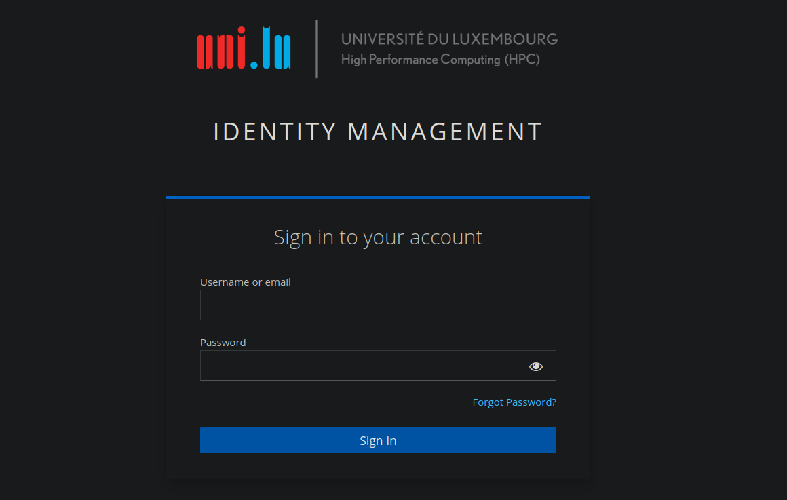

# ULHPC Identity Management Portal (IdM)

[:fontawesome-solid-link: ULHPC Identity Management Portal](https://hpc-account.uni.lu/){: .md-button .md-button--link }

## First connection

You need to setup a password to access the Identity Management Portal for the first time. Click _Forgot Password?_ and enter either your HPC username or the email address linked to your account.



You will then be prompted to setup a Two Factor Authentication (2FA) method. Scan the QR code with an application of your choice such as FreeOPT, Authy, Google Authenticator, etc.

<div style="text-align: center;">
    
</div>

Enter the code generated by your application in the _one-time code_ field and name your 2FA device to help you identify it as you can register multiple 2FA devices.


## Upload your SSH key on the ULHPC Identity Management Portal

!!! tips "SSH Key Management"
    You are responsible for uploading and managing your _authorized_ public SSH keys for your account, under the terms of the [Acceptable Use Policy](../policies/aup.md). **Be aware that the ULHPC team review on a periodical basis the compliance to the policy, as well as the security of your keys.** See also the [note on deprecated/weak DSA/RSA keys](troubleshooting.md#access-denied-or-permission-denied-publickey)

You need to upload your public SSH key(s) `*.pub` on the  ULHPC Identity Management Portal to be able to connect to the clusters. For that, connect to the ULHPC IdM portal (use the URL communicated to you by the UL HPC team in your "welcome" mail) and connect using your HPC username or the email address linked to your account.

Copy the content of the key you want to add (see [SSH key generation](./ssh.md#ssh-key-generation) or [SSH key generation on windows](./windows.md))

``` bash
# Example with ED25519 **public** key
(laptop)$> cat ~/.ssh/id_ed25519.pub
ssh-ed25519 AAAA[...]
# OR the RSA **public** key
(laptop)$> cat ~/.ssh/id_rsa.pub
ssh-rsa AAAA[...]
```

Then on the portal:

1. Go to the _Personal info_ page
2. Paste the Base64-encoded public key string
3. Click on _Add SSH Public Key_ to add more keys
4. Click _Save_
5. You should see a popup that confirms your change

!!! tips "Listing SSH keys attached to your account through SSSD"
    [SSSD](https://sssd.io/) is a system daemon used on ULHPC computational resources. Its primary function is to provide access to local or remote identity and authentication resources through a common framework that can provide caching and offline support to the system. To easily access the _authorized_ keys configured for your account from the command-line (i.e. without login on the ULHPC IPA portal), you can use:
    ```
    sss_ssh_authorizedkeys $(whoami)
    ```
