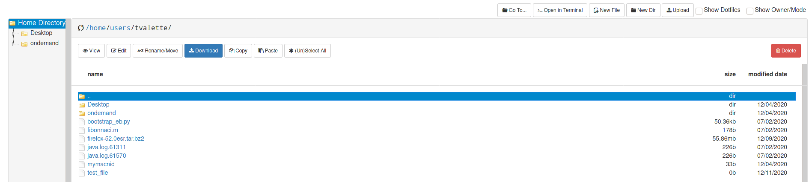
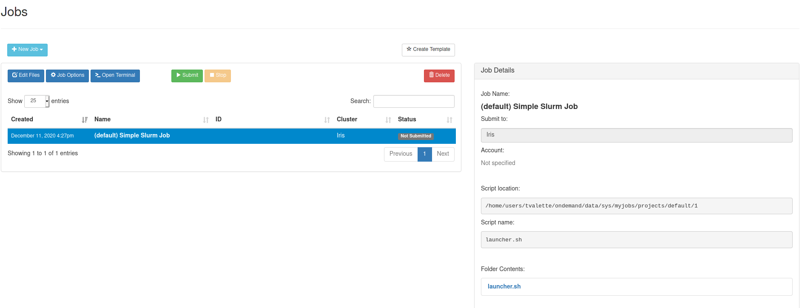
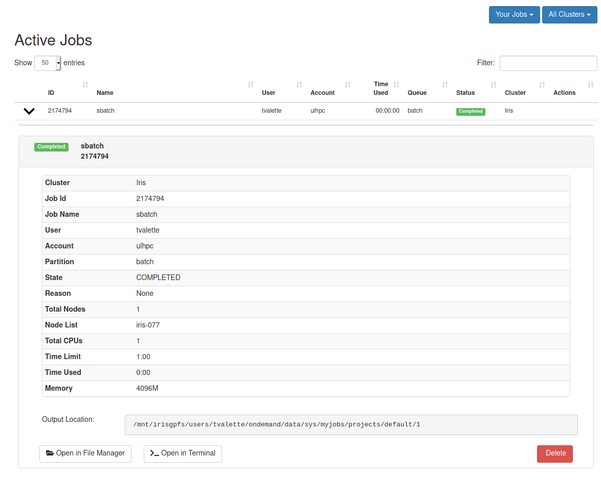
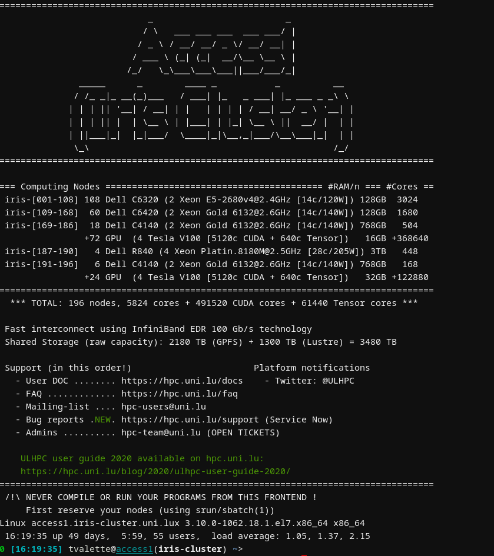
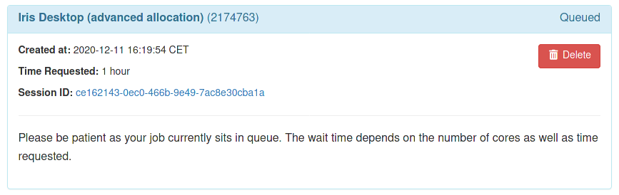
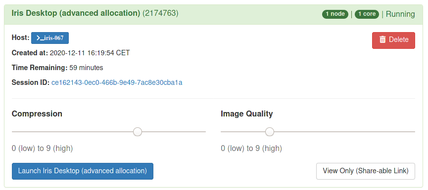
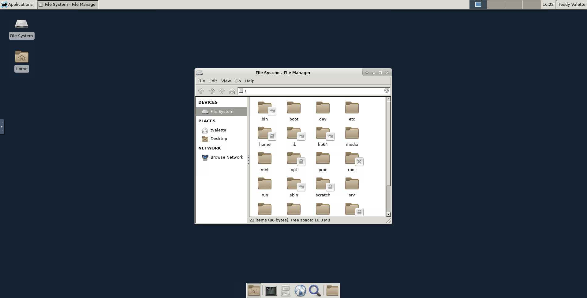

# ULHPC Open On Demand (OOD) Portal

{: style="width:350px; float: right;"}

_[Open OnDemand (OOD)](https://openondemand.org/)_ is a Web portal compatible with Windows, Linux and MacOS.
You should login with your ULHPC credential using the URL communicated to you by the UL HPC team.

OOD provides a convenient web access to the HPC resources and integrates

* a file management system
* a job management system (job composer, monitoring your submitted jobs, ...)
* an interactive command-line shell access
* interactive apps with graphical desktop environments

!!! warning "ULHPC OOD Portal limitations"
    The _ULHPC OOD portal_ is **NOT** accessible outside the UniLu network.
    If you want to use it, you will need to setup a VPN to access the [UniLu network](https://vpn.uni.lu/)
    _Note_: The portal is in _still under active development state: missing features and bugs can be reported to the ULHPC team via the [support portal](https://hpc.uni.lu/support)

Live tests and demo are proposed during the [ULHPC Tutorial: Preliminaries / OOD](https://ulhpc-tutorials.readthedocs.io/en/latest/setup/preliminaries/).

Below are illustrations of OOD capabilities on the ULHPC facility.

## File management

## Job composer and Job List

## Shell access

### Interactive sessions

### Graphical Desktop Environment

