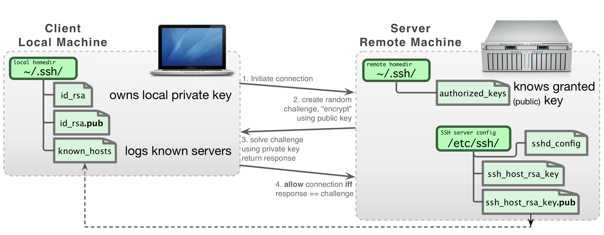
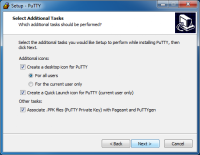
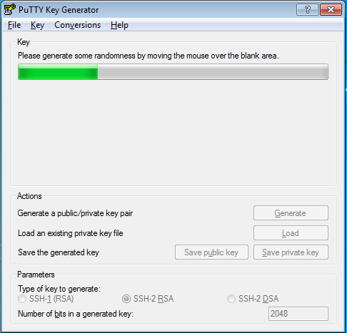
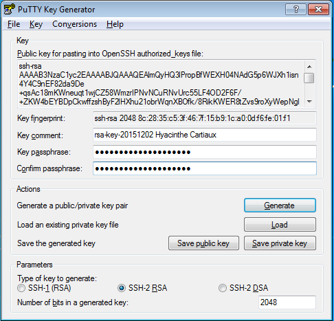
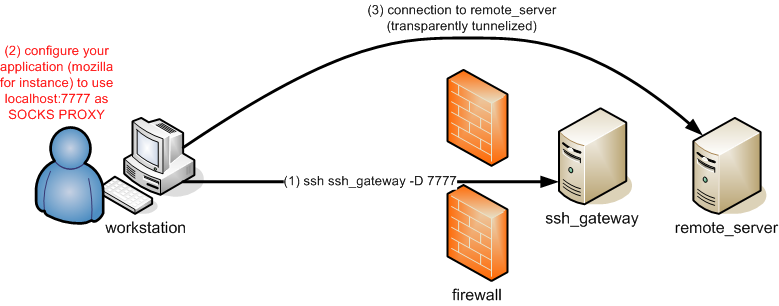
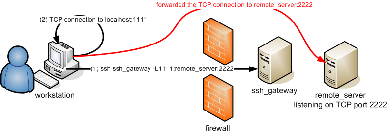
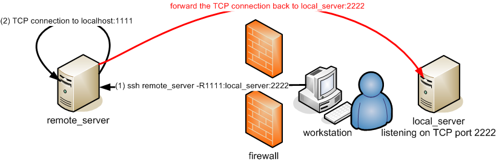

# SSH

All ULHPC servers are reached using either the Secure
Shell (SSH) communication and encryption protocol (version 2).

Developed by [SSH Communications Security Ltd.](http://www.ssh.com), Secure Shell is a an encrypted network protocol used to log into another computer over an unsecured network, to execute commands in a remote machine, and to move files from one machine to another in a secure way.
On UNIX/LINUX/BSD type systems, SSH is also the name of a suite of software applications for
connecting via the SSH protocol. The SSH applications can execute
commands on a remote machine and transfer files from one machine to
another.  All communications are automatically and transparently
encrypted, including passwords. Most versions of SSH provide login
(`ssh`, `slogin`), a remote copy operation (`scp`), and many also provide a
secure ftp client (`sftp`). Additionally, SSH allows secure X Window
connections.

To use SSH, you have to generate a pair of keys, one **public** and the other
**private**.
The public key authentication is the most secure and flexible approach to ensure a multi-purpose transparent connection to a remote server.
This approach is enforced on the ULHPC platforms and assumes that the _public_ key is known by the system in order to perform an authentication based on a challenge/response protocol instead of the
classical password-based protocol.

The way SSH handles the keys and the configuration files is illustrated in the following figure:



## Installation

* OpenSSH is natively supported on Linux / Mac OS / Unix / WSL (see below)
* On Windows, you are thus encouraged to install [Windows Subsystem for Linux](https://docs.microsoft.com/en-us/windows/wsl/about) (WSL) and setup an Ubuntu subsystem from  [Microsoft Store](https://aka.ms/wslstore).
    - You probably want to also install [Windows Terminal](https://github.com/microsoft/terminal) and  [MobaXterm](http://mobaxterm.mobatek.net/)
    - Better performance of your Linux subsystem can be obtained by migrating to WSL 2
    - Follow the [ULHPC Tutorial: Setup Pre-Requisites / Windows](https://ulhpc-tutorials.readthedocs.io/en/latest/setup/preliminaries/#microsoft-windows) for detailed instructions.

## SSH Key Generation

To generate an RSA SSH keys **of 4096-bit length**, just use the `ssh-keygen` command [as follows](https://explainshell.com/explain?cmd=ssh-keygen+-t+rsa+-o+-a+100):

```bash
ssh-keygen -t rsa -b 4096 -a 100
```

After the execution of this command, the generated keys are stored in the following files:

* SSH RSA _Private_ key: `~/.ssh/id_rsa`.      **NEVER EVER TRANSMIT THIS FILE**
* SSH RSA _Public_ key:  `~/.ssh/id_rsa.pub`.  **This file is the ONLY one SAFE to distribute**

!!! danger "To passphrase or not to passphrase"
    To ensure the security of your SSH key-pair on your laptop, you **MUST** protect your SSH keys with a passphrase!
    Note however that while possible, this passphrase is purely private and has _a priori_ nothing to do with your University or your ULHPC credentials. Nevertheless, a strong passphrase follows the same recommendations as for strong passwords (for instance: see [password requirements and guidelines](../policies/passwords.md#password-requirements-and-guidelines).

    Finally, just like encryption keys, passphrases need to be kept safe and protected from _unauthorised_ access. A _Password Manager_  can help you to store all your passwords safely. The University is currently not offering a university wide password manger but there are many free and paid ones you can use, for example: [KeePassX](https://www.keepassx.org/), [PWSafe](https://www.pwsafe.org/relatedprojects.shtml), [Dashlane](https://www.dashlane.com/), [1Password](https://1password.com/) or [LastPass](https://www.lastpass.com/).

You may want to generate also **ED25519** Key Pairs (which is the most recommended public-key algorithm available today) -- see [explaination](https://explainshell.com/explain?cmd=ssh-keygen+-t+ed25519+-o+-a+100)

```
ssh-keygen -t ed25519 -a 100
```

Your key pairs will be located under `~/.ssh/` and follow the following format -- the `.pub` extension indicated the **public** key part and is the **ONLY one SAFE to distribute**:

```bash
$ ls -l ~/.ssh/id_*
-rw------- username groupname ~/.ssh/id_rsa
-rw-r--r-- username groupname ~/.ssh/id_rsa.pub     # Public  RSA key
-rw------- username groupname ~/.ssh/id_ed25519
-rw-r--r-- username groupname ~/.ssh/id_ed25519.pub # Public ED25519 key
```

Ensure the access rights are correct on the generated keys using the '`ls -l`' command.
In particular, the _private_ key should be readable only by you:

For more details, follow the [ULHPC Tutorials: Preliminaries / SSH](https://ulhpc-tutorials.readthedocs.io/en/latest/preliminaries/#secure-shell-ssh).

??? note "(deprecated - Windows only): SSH key management with MobaKeyGen tool"
    On Windows with [MobaXterm](http://mobaxterm.mobatek.net/), a tool exists and can be used to generate an SSH key pair. While not recommended (we encourage you to run WSL), here are the instructions to follow to generate these keys:

    * Open the application **Start > Program Files > MobaXterm**.
    * Change the default home directory for a persistent home directory instead of the default Temp directory. Go onto **Settings > Configuration > General > Persistent home directory**.
         - choose a location for your home directory.
             * your local SSH configuration will be located under `HOME/.ssh/`
    * Go onto **Tools > Network > MobaKeyGen (SSH key generator)**.
         - Choose **RSA** as the type of key to generate and change "Number of bits in a generated key" to 4096.
         - Click on the **Generate** button. Move your mouse to generate some randomness.
         - Select a strong passphrase in the **Key passphrase** field for your key.
    * Save the public and private keys as respectively `id_rsa.pub` and `id_rsa.ppk`.
         - Please keep a copy of the public key, you will have to add this public key into your account, using the IPA user portal (use the URL communicated to you by the UL HPC team in your "welcome" mail).

    

??? note "(deprecated - Windows only): SSH key management with PuTTY"
    While no longer recommended, you may still want to use [Putty](http://www.chiark.greenend.org.uk/~sgtatham/putty/) and the associated tools, more precisely:

    * [PuTTY](https://the.earth.li/~sgtatham/putty/latest/w64/putty.exe), the free SSH client
    * [Pageant](https://the.earth.li/~sgtatham/putty/latest/w64/pageant.exe), an SSH authentication agent for PuTTY tools
    * [PuTTYgen](https://the.earth.li/~sgtatham/putty/latest/w64/puttygen.exe), an RSA key generation utility
    * [PSCP](https://the.earth.li/~sgtatham/putty/latest/w64/pscp.exe), an SCP (file transfer) client, i.e. command-line secure file copy
    * [WinSCP](http://winscp.net/eng/download.php), SCP/SFTP (file transfer) client with easy-to-use graphical interface

    The different steps involved in the installation process are illustrated below (**REMEMBER to tick the option "Associate .PPK files (PuTTY Private Key) with Pageant and PuTTYGen"**):

    

    Now you can use the [PuTTYgen](http://the.earth.li/~sgtatham/putty/latest/x86/puttygen.exe) utility to generate an RSA key pair. The main steps for the generation of the keys are illustrated below (yet with **4096 bits** instead of 2048):

    

    

    

    * Save the public and private keys as respectively `id_rsa.pub` and `id_rsa.ppk`.
         - Please keep a copy of the public key, you will have to add this public key into your account, using the IPA user portal (use the URL communicated to you by the UL HPC team in your "welcome" mail).


## Password-less logins and transfers

Password based authentication is disabled on all ULHPC servers.
You can **only use public-key authentication**.
This assumes that you upload your **public** SSH keys `*.pub` to your user entry on the [ULHPC Identity Management Portal](ipa.md).

Consult the [associated documentation](ipa.md) to discover how to do it.

Once done, you can connect by SSH to the ULHPC clusters.
Note that the port on which the SSH servers are listening is **not** the default SSH one (*i.e.* 22) but **8022**. Consequently, if you want to connect to the Iris cluster, open a terminal and run (substituting *yourlogin* with the login name you received from us):

=== "Iris"
    ```bash
    # ADAPT 'yourlogin' accordingly
    ssh -p 8022 yourlogin@access-iris.uni.lu
    ```

=== "Aion"

    ```bash
    # ADAPT 'yourlogin' accordingly
    ssh -p 8022 yourlogin@access-aion.uni.lu
    ```

Of course, we advise you to setup your SSH configuration to avoid typing this detailed command. This is explained in the next section.

## SSH Configuration

On Linux / Mac OS / Unix / WSL, your SSH configuration is defined in `~/.ssh/config`.
As recommended in the [ULHPC Tutorials: Preliminaries / SSH](https://ulhpc-tutorials.readthedocs.io/en/latest/preliminaries/#secure-shell-ssh), you probably want to create the following configuration to easiest further access and data transfers:

```bash
# ~/.ssh/config -- SSH Configuration
# Common options
Host *
    Compression yes
    ConnectTimeout 15

# ULHPC Clusters
Host iris-cluster
    Hostname access-iris.uni.lu

Host aion-cluster
    Hostname access-aion.uni.lu

# /!\ ADAPT 'yourlogin' accordingly
Host *-cluster
    User yourlogin
    Port 8022
    ForwardAgent no
```

You should now be able to connect as follows

=== "Iris"
    ```bash
    ssh iris-cluster
    ```

=== "Aion"
    ```bash
    ssh aion-cluster
    ```

??? note "(Windows only) Remote session configuration with MobaXterm"
    This part of the documentation comes from [MobaXterm documentation page](http://mobaxterm.mobatek.net/documentation.html#1_1)
    MobaXterm allows you to launch remote sessions. You just have to click on the "Sessions" button to start a new session. Select SSH session on the second screen.

    

    

    Enter the following parameters:

    * Remote host: `access-iris.uni.lu` (repeat with `access-aion.uni.lu`)
    * Check the **Specify username** box
    * Username: `yourlogin`
         - Adapt to match the one that was sent to you in the Welcome e-mail once your HPC account was created
    * Port: `8022`
    * Go in **Advanced SSH settings** and check the **Use private key** box.
        - Select your previously generated key `id_rsa.ppk`.

    

    You can now click on **Connect** and enjoy.

??? note "(deprecated - Windows only) - Remote session configuration with PuTTY"
    If you want to connect to one of the ULHPC cluster, open Putty and enter the following settings:

    * In _Category:Session_ :
      - Host Name: `access-iris.uni.lu` (or `access-aion.uni.lu` if you want to access Aion)
      - Port: `8022`
      - Connection Type: `SSH` (leave as default)
    * In _Category:Connection:Data_ :
       - Auto-login username: `yourlogin`
           * Adapt to match the one that was sent to you in the Welcome e-mail once your HPC account was created
    * In _Category:SSH:Auth_ :
       - Upload your private key: `Options controlling SSH authentication`

    Click on _Open_ button. If this is the first time connecting to the server from this computer a **Putty Security Alert** will appear. Accept the connection by clicking _Yes_.

    You should now be logged into the selected [ULHPC login node](access.md).

    Now you probably want want to **save the configuration of this connection**:

    * Go onto the _Session_ category.
       - Enter the settings you want to save.
       - Enter a name in the _Saved session_ field (for example `Iris` for access to Iris cluster).
       - Click on the _Save_ button.

    Next time you want to connect to the cluster, click on _Load_ button and _Open_ to open a new connection.

## SSH Agent

### On your laptop

To be able to use your SSH key in a public-key authentication scheme, it must be loaded by an **SSH agent**.

* **:fontawesome-brands-apple: Mac OS X (>= 10.5)**, this will be handled automatically; you will be asked to fill in the passphrase on the first connection.

* **:fontawesome-brands-linux: Linux**, this will be handled automatically; you will be asked to fill the passphrase on the first connection.

However if you get a message similar to the following:

```bash
(laptop)$> ssh -vv iris-cluster
[...]
Agent admitted failure to sign using the key.
Permission denied (publickey).
```

This means that you have to manually load your key in the SSH agent by running:


```bash
(laptop)$> ssh-add ~/.ssh/id_rsa
Enter passphrase for ~/.ssh/id_rsa:           # <-- enter your passphrase here
Identity added: ~/.ssh/id_rsa (<login>@<hostname>)

(laptop)$> ssh-add ~/.ssh/id_ed25519
Enter passphrase for ~/.ssh/id_ed25519:       # <-- enter your passphrase here
Identity added: ~/.ssh/id_ed25519 (<login>@<hostname>)
```

* :fontawesome-brands-ubuntu: :fontawesome-brands-windows: On **Ubuntu/WSL**, if you experience issues when using `ssh-add`, you should install the `keychain` package and use it as follows (eventually add it to your `~/.profile`):

```bash
# Installation
(laptop)$> sudo apt install keychain

# Save your passphrase
/usr/bin/keychain --nogui ~/.ssh/id_ed25519    # (eventually) repeat with ~/.ssh/id_rsa
# Load the agent in your shell
source ~/.keychain/$(hostname)-sh
```

??? note "(Windows only) SSH Agent within MobaXterm"

    * Go in **Settings > SSH Tab**
    * In **SSH agents** section, check **Use internal SSH agent "MobAgent"**

    

    * Click on the `+` button on the right
    * Select your private key file. If you have several keys, you can add them by doing steps above again.
    * Click on "Show keys currently loaded in MobAgent". An advertisement window may appear asking if you want to run MobAgent. Click on "Yes".
    * Check that your key(s) appears in the window.

    

    * Close the window.
    * Click on `OK`. Restart MobaXterm.

??? note "(deprecated - Windows only) - SSH Agent with PuTTY Pageant"
    To be able to use your PuTTY key in a public-key authentication scheme, it must be loaded by an **SSH agent**.
    You should run [Pageant](http://the.earth.li/~sgtatham/putty/latest/x86/pageant.exe) for that.
    To load your SSH key in Pageant:

    * Right-click on the pageant icon in the system tray,
        - click on the `Add key` menu item
        - select the private key file you saved while running puttygen.exe i.e. ``
        - click on the Open button: a new dialog will pop up and ask for your passphrase. Once your passphrase is entered, your key will be loaded in pageant, enabling you to connect with Putty.


### On ULHPC clusters

For security reason, SSH agent forwarding is prohibited and explicitly disabled (see `ForwardAgent no` configuration by default in the [above configuration](#ssh-configuration), you may need to manually load an agent once connected on the ULHPC facility, for instance if you are tired of typing the passphrase of a SSH key generated on the cluster to access a remote (private) service.

You need to proceed as follows:

```bash
$ eval "$(ssh-agent)"    # export the SSH_AUTH_SOCK and SSH_AGENT_PID variables
$ ssh-add ~/.ssh/id_rsa
# [...]
Enter passphrase for [...]
Identity added: ~/.ssh/id_rsa (<login>@<hostname>)
```

You can then enjoy it.
Be aware however that this exposes your private key. So you **MUST** properly kill your agent when you don't need it any mode, using

```console
$ eval "$(ssh-agent -k)"
Agent pid <PID> killed
```


## Key fingerprints

ULHPC may occasionally update the host keys on the major systems.  Check here
to confirm the current fingerprints.

=== "Iris"

    With regards `access-iris.uni.lu`:

    ```
    256 SHA256:tkhRD9IVo04NPw4OV/s2LSKEwe54LAEphm7yx8nq1pE /etc/ssh/ssh_host_ed25519_key.pub (ED25519)
    2048 SHA256:WDWb2hh5uPU6RgaSotxzUe567F3scioJWy+9iftVmhI /etc/ssh/ssh_host_rsa_key.pub (RSA)
	```

===  "Aion"

    With regards `access-aion.uni.lu`:

    ```
    256 SHA256:jwbW8pkfCzXrh1Xhf9n0UI+7hd/YGi4FlyOE92yxxe0 [access-aion.uni.lu]:8022 (ED25519)
    3072 SHA256:L9n2gT6aV9KGy0Xdh1ks2DciE9wFz7MDRBPGWPFwFK4 [access-aion.uni.lu]:8022 (RSA)
    ```

!!! info "Get SSH key fingerprint"
    The ssh fingerprints can be obtained via:
    ```
    ssh-keygen -lf <(ssh-keyscan -t rsa,ed25519 $(hostname) 2>/dev/null)
    ```

??? tips "Putty key fingerprint format"
    Depending on the ssh client you use to connect to ULHPC systems, you may see different key fingerprints.
    For example, Putty uses different format of fingerprints as follows:

    * `access-iris.uni.lu`
    ```
    ssh-ed25519 255 4096 07:6a:5f:11:df:d4:3f:d4:97:98:12:69:3a:63:70:2f
    ```

    You may see the following warning when connecting to Cori with Putty, but it is safe to ingore.

    ```
    PuTTY Security Alert
    The server's host key is not cached in the registry. You have no guarantee that the server is the computer you think it is.
    The server's ssh-ed25519 key fingerprint is:
    ssh-ed25519 255 4096 07:6a:5f:11:df:d4:3f:d4:97:98:12:69:3a:63:70:2f
    If you trust this host, hit Yes to add the key to PuTTY's cache and carry on connecting.
    If you want to carry on connecting just once, without adding the key to the cache, hit No.
    If you do not trust this host, hit Cancel to abandon the connection.
    ```

## Host Keys

These are the entries in `~/.ssh/known_hosts`.

=== "Iris"

    The known host SSH entry for the [Iris cluster](../systems/iris/index.md)  should be as follows:

    ```
    [access-iris.uni.lu]:8022 ssh-ed25519 AAAAC3NzaC1lZDI1NTE5AAAAIOP1eF8uJ37h5jFQQShn/NHRGD/d8KsMMUTHkoPRANLn
    ```

===  "Aion"

    The known host SSH entry for the [Aion cluster](../systems/aion/index.md) should be as follows:

    ```
    [access-aion.uni.lu]:8022 ssh-ed25519 AAAAC3NzaC1lZDI1NTE5AAAAIFmcYJ7T6A1wOvIQaohgwVCrKLqIrzpQZAZrlEKx8Vsy
    ```

## Troubleshooting

See [the corresponding section](troubleshooting.md).

## Advanced SSH Tips and Tricks

### CLI Completion

The `bash-completion` package eases the ssh command usage by providing completion for hostnames and more (assuming you set the directive `HashKnownHost` to `no` in your `~/etc/ssh_config`)

### SOCKS 5 Proxy plugin

Many Data Analytics framework involves a web interface (at the level of the master and/or the workers) you probably want to access in a relative transparent way.

For that, a convenient way is to rely on a SOCKS proxy, which is basically an SSH tunnel in which specific applications forward their traffic down the tunnel to the server, and then on the server end, the proxy forwards the traffic out to the general Internet.
Unlike a VPN, a SOCKS proxy has to be configured on an app by app basis on the client machine, but can be set up without any specialty client agents.
The general principle is depicted below.



#### Setting Up the Tunnel

To initiate such a SOCKS proxy using SSH (listening on `localhost:1080` for instance), you simply need to use the `-D 1080` command line option when connecting to a remote server:

=== "Iris"
    ```console
    ssh -D 1080 -C iris-cluster
    ```

=== "Aion"
    ```console
    ssh -D 1080 -C aion-cluster
    ```

* `-D`: Tells SSH that we want a SOCKS tunnel on the specified port number (you can choose a number between 1025-65536)
* `-C`: Compresses the data before sending it


#### FoxyProxy [Firefox] Extension

Now that you have an SSH tunnel, it's time to configure your web browser (recommended: Firefox) to use that tunnel.
In particular, install the [Foxy Proxy](https://getfoxyproxy.org/order/?src=FoxyProxyForFirefox)
extension for Firefox and configure it to use your SOCKS proxy:

* Right click on the fox icon, Select Options
* **Add a new proxy** button
* Name: `ULHPC proxy`
* Informations > **Manual configuration**
    -  Host IP: `127.0.0.1`
    -  Port: `1080`
    -  Check the **Proxy SOCKS** Option
* Click on **OK**
* Close
* Open a new tab
* Click on the Fox
* Choose the **ULHPC proxy**
    - disable it when you no longer need it.

You can now access any web interface deployed on any service reachable from the SSH jump host _i.e._ the ULHPC login node.

#### Using `tsock`

Once you setup a SSH SOCKS proxy, you can also use `tsocks`, a Shell wrapper to simplify the use of the [tsocks(8)](https://linux.die.net/man/8/tsocks) library to transparently allow an application (not aware of SOCKS) to transparently use a SOCKS proxy. For instance, assuming you create a VNC server on a given remote server as follows:

```console
(remote_server)$> vncserver -geometry 1366x768
New 'X' desktop is remote_server:1

Starting applications specified in /home/username/.vnc/xstartup
Log file is /home/username/.vnc/remote_server:1.log
```

Then you can make the VNC client on your workstation use this tunnel to access the VNS server as follows:

```console
(laptop)$> tsocks vncviewer <IP_of_remote_server>:1
```

!!! tips "tsock Escape character"
    Use `~.` to disconnect, even if your remote command hangs.


### SSH Port Forwarding

#### Forwarding a local port

You can forward a local port to a host behind a firewall.



This is useful if you run a server on one of the cluster nodes (let's say listening on port 2222) and you want to access it via the local port 1111 on your machine. Then you'll run:

```bash
# Here targeting iris cluster
(laptop) $ ssh iris-cluster -L 1111:iris-014:2222
```

#### Forwarding a remote port

You can forward a remote port back to a host protected by your firewall.



This is useful when you want the HPC node to access some local service. For instance is your local machine runs a service that is listening at some local port, say 2222, and you have some service in the HPC node that listens to some local port, say 1111, then the you'll run:

```bash
# Here targeting the iris cluster
(local machine) $ ssh iris-cluster -R 1111:$(hostname -i):2222
```

#### Tunnelling for others

By using the `-g` parameter, you allow connections from other hosts than localhost to use your SSH tunnels. Be warned that anybody within your network may access the tunnelized host this way, which may be a security issue.


### SSH jumps

Compute nodes are not directly accessible from the outside network. To login into a cluster node you will need to jump through a login node. Remember, you need a job running in a node before you can ssh into it. Assume that you have some job running on `aion-0014` for instance. Then, connect to `aion-0014` with:

```bash
ssh -J ${USER}@access-aion.uni.lu:8022 ${USER}@aion-0014
```

The domain resolution in the login node will determine the IP of the `aion-0014`. You can always use the IP address if the node directly if you know it.

#### Passwordless SSH jumps

The ssh agent is [not configured in the login nodes](#on-ulhpc-clusters) for security reasons. As a result, compute nodes will request your password. To configure a passwordless jump to a compute node, you will need to install the same key in your ssh configuration of your local machine and the login node.

To avoid exposing your keys at your personal machine, create and share a new key. Create a key in your local machine,
```bash
ssh-keygen -a 127 -t ed25519 -f ~/.ssh/ulhpc_id_ed25519
```
and then copy both the private and public keys in your HPC account,
```bash
scp ~/.ssh/ulhpc_id_ed25519* aion-cluster:~/.ssh/
```
where the command assumes that you have setup your [SSH configuration file](#ssh-configuration). Finally, add the key to the list of authorized keys:
```bash
ssh-copy-id -i ~/.ssh/ulhpc_id_ed25519 aion-cluster
```
Then you can connect without a password to any compute node at which you have a job running with the command:
```bash
ssh -i ~/.ssh/ulhpc_id_ed25519 -J ${USER}@access-aion.uni.lu:8022 ${USER}@<node address>
```

In the `<node address>` option you can use the node IP address or the node name.

#### Port forwarding over SSH jumps

You can combine the jump command with other options, such as [port forwarding](#ssh-port-forwarding), for instance to access from you local machine a web server running in a compute node. Assume for instance that you have a server running in `iris-014` and listens at the IP `127.0.0.1` and port `2222`, and that you would like to forward the remote port `2222` to the `1111` port of you local machine. The, call the port forwarding command with a jump though the login node:

```bash
ssh -J iris-cluster -L 1111:127.0.0.1:2222 <cluster username>@iris-014
```

This command can be combined with [passwordless access](#passwordless-ssh-jumps) to the cluster node.

## Extras Tools around SSH

* [Assh](https://github.com/moul/advanced-ssh-config) - Advanced SSH config is a transparent wrapper that make `~/.ssh/config` easier to manage
    - support for _templates_, _aliases_, _defaults_, _inheritance_ etc.
    - _gateways_: transparent ssh connection chaining
    - more flexible command-line. _Ex_: Connect to `hosta` using `hostb` as a gateway
      ```console
      $ ssh hosta/hostb
      ```

    - drastically simplify your SSH config
    - Linux / Mac OS **only**

*  [ClusterShell](https://clustershell.readthedocs.io): `clush`, `nodeset` (or cluset),
    - light, unified, robust command execution framework
    - well-suited to _ease daily administrative tasks_ of Linux clusters.
        * using tools like `clush` and `nodeset`
    - _efficient, parallel, scalable command execution engine_ \hfill{\tiny in Python}
    - provides an _unified node groups syntax_ and external group access
        * see `nodeset` and the NodeSet class

* [DSH](http://www.netfort.gr.jp/~dancer/software/dsh.html.en) - Distributed / Dancer's Shell
* [sshutle](https://github.com/sshuttle/sshuttle), "_where transparent proxy meets VPN meets ssh_"
