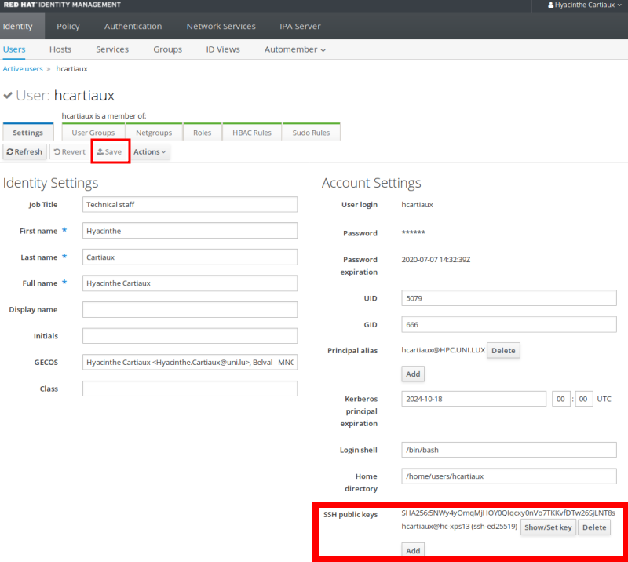

There are several possibilities and usually the error message can give you some hints.

## Your account has expired

Please open a ticket on [ServiceNow](https://hpc.uni.lu/support/)
(HPC &rarr; User access & accounts &rarr; Report issue with cluster access)
or send us an email to <hpc-team@uni.lu> with the current end date of your
contract and we will extend your account accordingly.

## "Access Denied" or "Permission denied (publickey)"

Basically, you are **NOT** able to connect to the access servers until your
SSH public key is configured. There can be several reason that explain the
denied connection message:

* Make sure you are using the **proper ULHPC user name** (and not your local
  username or University/Eduroam login).
     - Check your mail entitled "`[HPC@Uni.lu] Welcome - Account information`"
       to get your ULHPC login
* Log into [IPA](ipa.md) and double check your SSH public key settings.
* [Ensure you have run your SSH agent](ssh.md)
* If you have a **new computer** or for some other reason you have generated
  **new ssh key**, please update your ssh keys on the IPA user portal.
     - See [IPA](ipa.md) for more details
* **You are using (deprecated) DSA/RSA keys**. As per the
  [OpenSSH website](https://www.openssh.com/legacy.html):
  > "OpenSSH 7.0 and greater similarly disable the ssh-dss (DSA) public key algorithm.
  > It too is weak and we recommend against its use". Solution: generate a new RSA keypair
  > (3092 bit or more) and re-upload it on the IPA web portal (use the URL
  > communicated to you by the UL HPC team in your “welcome” mail). For more
  > information on keys, see [this website](https://blog.g3rt.nl/upgrade-your-ssh-keys.html).



* Your public key is corrupted, please verify and re-upload it on the IPA web portal.

* We have taken the cluster down for maintenance and we forgot to activate the
  banner message mentioning this. Please check the calendar, the latest Twitter
  messages (box on the right of this page) and the messages sent on the `hpc-users` mailing list.

If the above steps did not permit to solve your issue, please open a ticket on
[ServiceNow](https://hpc.uni.lu/support/)
(HPC &rarr; User access & accounts &rarr; Report issue with cluster access) or send us an email to <hpc-team@uni.lu>.


## Host identification changed

```
@@@@@@@@@@@@@@@@@@@@@@@@@@@@@@@@@@@@@@@@@@@@@@@@@@@@@@@@@@@
@ WARNING: REMOTE HOST IDENTIFICATION HAS CHANGED! @
@@@@@@@@@@@@@@@@@@@@@@@@@@@@@@@@@@@@@@@@@@@@@@@@@@@@@@@@@@@
IT IS POSSIBLE THAT SOMEONE IS DOING SOMETHING NASTY!
Someone could be eavesdropping on you right now (man-in-the-middle attack)!
It is also possible that a host key has just been changed.
...
```

Ensure that your `~/.ssh/known_hosts` file contains the [correct entries for the ULHPC clusters](ssh.md#host-keys)
and confirm the fingerprints using the [posted fingerprints](ssh.md#host-keys)

1. Open `~/.ssh/known_hosts`
2. Remove any lines referring Iris and Aion and save the file
3. Paste the [specified host key entries](ssh.md#host-keys) (for all clusters) **OR** retry connecting to the host and
   accept the new host key after verify that you have the correct "fingerprint"
   from the [reference list](ssh.md#host-keys).


## Be careful with permission changes to your $HOME

If you change your home directory to be writeable by the group, `ssh` will not let you connect anymore.
It requires **drwxr-xr-x** or **755** (or less) on your `$HOME` and `~/.ssh`, and
**-rw-r--r--** or **644** (or less) on `~/.ssh/authorized_keys`.

File and folder permissions can be verified at any time using `stat $path`, e.g.:

    $> stat $HOME
    $> stat $HOME/.ssh
    $> stat $HOME/.ssh/authorized_keys

Check out the description of [the notation of file permissions](https://en.wikipedia.org/wiki/File_system_permissions#Notation_of_traditional_Unix_permissions)
in both symbolic and numeric mode.

On your local machine, you also need to to have read/write permissions to `~/.ssh/config` for your user only. This can be ensured with the following command:

    chmod 600 ~/.ssh/config

## Open a ticket

If you cannot solve your problem, do not hesitate to open a ticket on the [Service Now portal](https://hpc.uni.lu/support).
