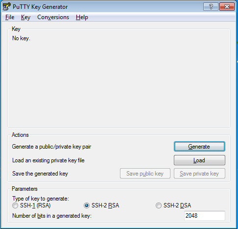
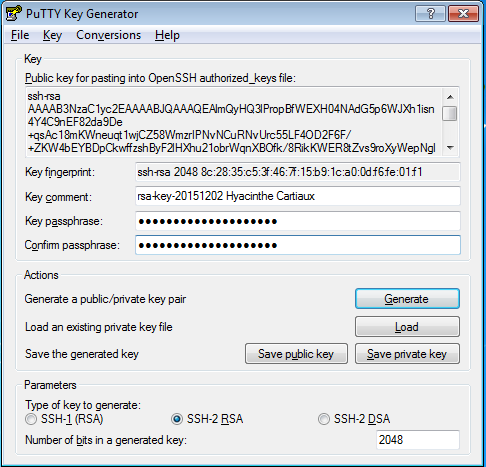

In this page, we cover two different SSH client software: MobaXterm and Putty.
Choose your preferred tool.

## MobaXterm

### Installation notes

The following steps will help you to configure [MobaXterm](http://mobaxterm.mobatek.net/) to access the UL HPC clusters.
You can also check out the [MobaXterm demo](http://mobaxterm.mobatek.net/demo.html) which shows an overview of its features.

First, [download](http://mobaxterm.mobatek.net/download-home-edition.html) and install MobaXterm. Open the application **Start > Program Files > MobaXterm**.

Change the default home directory for a persistent home directory instead of the default Temp directory. Go onto **Settings > Configuration > General > Persistent home directory**. Choose a location for your home directory.

Your local SSH configuration is located in the  `HOME/.ssh/` directory and consists of:

* `HOME/.ssh/id_rsa.pub`: your SSH public key. **This one is the only one SAFE to distribute.**

* `HOME/.ssh/id_rsa`: the associated **private** key. __NEVER EVER TRANSMIT THIS FILE__

* (eventually) the configuration of the SSH client `HOME/.ssh/config`

* `HOME/.ssh/known_hosts`: Contains a list of host keys for all hosts you have logged into that are not already in the system-wide list of known host keys. This permits to detect man-in-the-middle attacks.

### SSH Key Management

Choose the method you prefer: either the graphical interface MobaKeyGen or command line generation of the ssh key.

#### With MobaKeyGen tool

Go onto **Tools > Network > MobaKeyGen (SSH key generator)**. Choose **RSA** as the type of key to generate and change "Number of bits in a generated key" to 4096. Click on the **Generate** button. Move your mouse to generate some randomness.

!!! Warning
    To ensure the security of the platform and your data stored on it, you must protect your SSH keys with a passphrase!
    Additionally, your private key and passphrase should never be transmitted to anybody.

Select a strong passphrase in the **Key passphrase** field for your key. Save the public and private keys as respectively `id_rsa.pub` and `id_rsa.ppk`.
Please keep a copy of the public key, you will have to add this public key into your account, using the IPA user portal (use the URL communicated to you by the UL HPC team in your "welcome" mail).

#### With local terminal

Click on **Start local terminal**. To generate an SSH keys, just use the `ssh-keygen` command, typically as follows:

    $> ssh-keygen -t rsa -b 4096
    Generating public/private rsa key pair.
    Enter file in which to save the key (/home/user/.ssh/id_rsa):
    Enter passphrase (empty for no passphrase):
    Enter same passphrase again:
    Your identification has been saved in /home/user/.ssh/id_rsa.
    Your public key has been saved in /home/user/.ssh/id_rsa.pub.
    The key fingerprint is:
    fe:e8:26:df:38:49:3a:99:d7:85:4e:c3:85:c8:24:5b username@yourworkstation
    The key's randomart image is:
    +---[RSA 4096]----+
    |                 |
    |      . E        |
    |       * . .     |
    |      . o . .    |
    |        S. o     |
    |       .. = .    |
    |       =.= o     |
    |      * ==o      |
    |       B=.o      |
    +-----------------+

!!! Warning
    To ensure the security of the platform and your data stored on it, you must protect your SSH keys with a passphrase!

After the execution of `ssh-keygen` command, the keys are generated and stored in the following files:

* SSH RSA Private key: `HOME/.ssh/id_rsa`. Again, **NEVER EVER TRANSMIT THIS FILE**
* SSH RSA Public key:  `HOME/.ssh/id_rsa.pub`.  **This file is the ONLY one SAFE to distribute**

### Configuration

This part of the documentation comes from [MobaXterm documentation page](http://mobaxterm.mobatek.net/documentation.html#1_1)

MobaXterm allows you to launch remote sessions. You just have to click on the "Sessions" button to start a new session. Select SSH session on the second screen.

 Enter the following parameters:

* Remote host: `access-iris.uni.lu` or `access-aion.uni.lu`
* Check the **Specify username** box
* Username: `yourlogin`
  - as was sent to you in the Welcome e-mail once your HPC account was created
* Port: `8022`

Go in **Advanced SSH settings** and check the **Use private key** box. Select your previously generated key `id_rsa.ppk`.

Click on **Connect**. The following text appears.

    ==================================================================================
     Welcome to access2.iris-cluster.uni.lux
    ==================================================================================
                              _                         ____
                             / \   ___ ___ ___  ___ ___|___ \
                            / _ \ / __/ __/ _ \/ __/ __| __) |
                           / ___ \ (_| (_|  __/\__ \__ \/ __/
                          /_/   \_\___\___\___||___/___/_____|
                   _____      _        ____ _           _          __
                  / /_ _|_ __(_)___   / ___| |_   _ ___| |_ ___ _ _\ \
                 | | | || '__| / __| | |   | | | | / __| __/ _ \ '__| |
                 | | | || |  | \__ \ | |___| | |_| \__ \ ||  __/ |  | |
                 | ||___|_|  |_|___/  \____|_|\__,_|___/\__\___|_|  | |
                  \_\                                              /_/
    ==================================================================================

    === Computing Nodes ========================================= #RAM/n === #Cores ==
     iris-[001-108] 108 Dell C6320 (2 Xeon E5-2680v4@2.4GHz [14c/120W]) 128GB  3024
     iris-[109-168]  60 Dell C6420 (2 Xeon Gold 6132@2.6GHz [14c/140W]) 128GB  1680
     iris-[169-186]  18 Dell C4140 (2 Xeon Gold 6132@2.6GHz [14c/140W]) 768GB   504
                    +72 GPU  (4 Tesla V100 [5120c CUDA + 640c Tensor])   16GB +368640
     iris-[187-190]   4 Dell R840 (4 Xeon Platin.8180M@2.5GHz [28c/205W]) 3TB   448
     iris-[191-196]   6 Dell C4140 (2 Xeon Gold 6132@2.6GHz [14c/140W]) 768GB   168
                    +24 GPU  (4 Tesla V100 [5120c CUDA + 640c Tensor])   32GB +122880
    ==================================================================================
      *** TOTAL: 196 nodes, 5824 cores + 491520 CUDA cores + 61440 Tensor cores ***

     Fast interconnect using InfiniBand EDR 100 Gb/s technology
     Shared Storage (raw capacity): 2180 TB (GPFS) + 1300 TB (Lustre) = 3480 TB

     Support (in this order!)                       Platform notifications
       - User DOC ........ https://hpc.uni.lu/docs    - Twitter: @ULHPC
       - FAQ ............. https://hpc.uni.lu/faq
       - Mailing-list .... hpc-users@uni.lu
       - Bug reports .NEW. https://hpc.uni.lu/support (Service Now)
       - Admins .......... hpc-team@uni.lu (OPEN TICKETS)
    ==================================================================================
     /!\ NEVER COMPILE OR RUN YOUR PROGRAMS FROM THIS FRONTEND !
         First reserve your nodes (using srun/sbatch(1))
    Linux access2.iris-cluster.uni.lux 3.10.0-957.21.3.el7.x86_64 x86_64
     15:51:56 up 6 days,  2:32, 39 users,  load average: 0.59, 0.68, 0.54
    [yourlogin@access2 ~]$

## Putty

### Installation notes

You need to install [Putty](http://www.chiark.greenend.org.uk/~sgtatham/putty/) and the associated tools, more precisely:

* [PuTTY](https://the.earth.li/~sgtatham/putty/latest/w64/putty.exe), the free SSH client

* [Pageant](https://the.earth.li/~sgtatham/putty/latest/w64/pageant.exe), an SSH authentication agent for PuTTY tools

* [PuTTYgen](https://the.earth.li/~sgtatham/putty/latest/w64/puttygen.exe), an RSA key generation utility

* [PSCP](https://the.earth.li/~sgtatham/putty/latest/w64/pscp.exe), an SCP (file transfer) client, i.e. command-line secure file copy

* [WinSCP](http://winscp.net/eng/download.php), SCP/SFTP (file transfer) client with easy-to-use graphical interface

The simplest method is probably to download and run the [latest Putty installer](http://the.earth.li/~sgtatham/putty/latest/x86/putty-0.66-installer.exe) (does not include WinSCP).

The different steps involved in the installation process are illustrated below (**REMEMBER to tick the option "Associate .PPK files (PuTTY Private Key) with Pageant and PuTTYGen"**):

Now you should have all the [Putty](http://www.chiark.greenend.org.uk/~sgtatham/putty/) programs available in `Start / All Programs / Putty `.

### SSH Key Management

Here you can use the [PuTTYgen](http://the.earth.li/~sgtatham/putty/latest/x86/puttygen.exe) utility, an RSA key generation utility.

The main steps for the generation of the keys are illustrated below:

### Configuration

In order to be able to login to the clusters, you will have to add this **public key** into your account, using the IPA user portal (use the URL communicated to you by the UL HPC team in your "welcome" mail).

The port on which the SSH servers are listening is not the default one (*i.e.* 22) but **8022**.
Consequently, if you want to connect to the Iris cluster, open Putty and enter the following settings:

* In _Category:Session_ :
  * Host Name: `access-iris.uni.lu` or `access-aion.uni.lu`
  * Port: `8022`
  * Connection Type: `SSH` (leave as default)
* In _Category:Connection:Data_ :
  * Auto-login username: `yourlogin`
* In _Category:SSH:Auth_ :
  * Upload your private key: `Options controlling SSH authentication`

Click on _Open_ button. If this is the first time connecting to the server from this computer a **Putty Security Alert** will appear. Accept the connection by clicking _Yes_.

Enter your login (username of your HPC account). You are now logged into Iris access server with SSH.

Alternatively, you may want to save the configuration of this connection. Go onto the _Session_ category. Enter the settings you want to save. Enter a name in the _Saved session_ field (for example `Iris` for access to Iris cluster). Click on the _Save_ button. Next time you want to connect to the cluster, click on _Load_ button and _Open_ to open a new connexion.

Now you'll be able to  obtain the welcome banner:

    ==================================================================================
     Welcome to access2.iris-cluster.uni.lux
    ==================================================================================
                              _                         ____
                             / \   ___ ___ ___  ___ ___|___ \
                            / _ \ / __/ __/ _ \/ __/ __| __) |
                           / ___ \ (_| (_|  __/\__ \__ \/ __/
                          /_/   \_\___\___\___||___/___/_____|
                   _____      _        ____ _           _          __
                  / /_ _|_ __(_)___   / ___| |_   _ ___| |_ ___ _ _\ \
                 | | | || '__| / __| | |   | | | | / __| __/ _ \ '__| |
                 | | | || |  | \__ \ | |___| | |_| \__ \ ||  __/ |  | |
                 | ||___|_|  |_|___/  \____|_|\__,_|___/\__\___|_|  | |
                  \_\                                              /_/
    ==================================================================================

    === Computing Nodes ========================================= #RAM/n === #Cores ==
     iris-[001-108] 108 Dell C6320 (2 Xeon E5-2680v4@2.4GHz [14c/120W]) 128GB  3024
     iris-[109-168]  60 Dell C6420 (2 Xeon Gold 6132@2.6GHz [14c/140W]) 128GB  1680
     iris-[169-186]  18 Dell C4140 (2 Xeon Gold 6132@2.6GHz [14c/140W]) 768GB   504
                    +72 GPU  (4 Tesla V100 [5120c CUDA + 640c Tensor])   16GB +368640
     iris-[187-190]   4 Dell R840 (4 Xeon Platin.8180M@2.5GHz [28c/205W]) 3TB   448
     iris-[191-196]   6 Dell C4140 (2 Xeon Gold 6132@2.6GHz [14c/140W]) 768GB   168
                    +24 GPU  (4 Tesla V100 [5120c CUDA + 640c Tensor])   32GB +122880
    ==================================================================================
      *** TOTAL: 196 nodes, 5824 cores + 491520 CUDA cores + 61440 Tensor cores ***

     Fast interconnect using InfiniBand EDR 100 Gb/s technology
     Shared Storage (raw capacity): 2180 TB (GPFS) + 1300 TB (Lustre) = 3480 TB

     Support (in this order!)                       Platform notifications
       - User DOC ........ https://hpc.uni.lu/docs    - Twitter: @ULHPC
       - FAQ ............. https://hpc.uni.lu/faq
       - Mailing-list .... hpc-users@uni.lu
       - Bug reports .NEW. https://hpc.uni.lu/support (Service Now)
       - Admins .......... hpc-team@uni.lu (OPEN TICKETS)
    ==================================================================================
     /!\ NEVER COMPILE OR RUN YOUR PROGRAMS FROM THIS FRONTEND !
         First reserve your nodes (using srun/sbatch(1))

### Activate the SSH agent

To be able to use your SSH key in a public-key authentication scheme, it must be loaded by an **SSH agent**.

You should run [Pageant](http://the.earth.li/~sgtatham/putty/latest/x86/pageant.exe). To load your SSH key in Pageant, just right-click on the pageant icon in the system tray, click on the `Add key` menu item and select the private key file you saved while running puttygen.exe and click on the Open button: a new dialog will pop up and ask for your passphrase. Once your passphrase is entered, your key will be loaded in pageant, enabling you to connect with Putty.

Open `Putty.exe` (connection type: `SSH`)

* In _Category:Session_:
 * Host Name: `access-iris.uni.lu` or `access-aion.uni.lu`
 * Port: 8022
 * Saved session: `Iris`
* In _Category:Connection:Data_:
  * Auto-login username: `yourlogin`
* Go back to _Category:Session_ and click on _Save_
* Click on _Open_

## SSH Resources
* OpenSSH/[Cygwin](http://www.cygwin.com/): OpenSSH is available with Cygwin. You may then find the same features in your SSH client even if you run Windows. Furthermore, Cygwin also embeds many other GNU Un*x like tools, and even a FREE X server for windows.
* [Putty](http://www.chiark.greenend.org.uk/~sgtatham/putty/): Free windowish SSH client
* [ssh.com](http://www.ssh.com/) Free for non commercial use windows client
