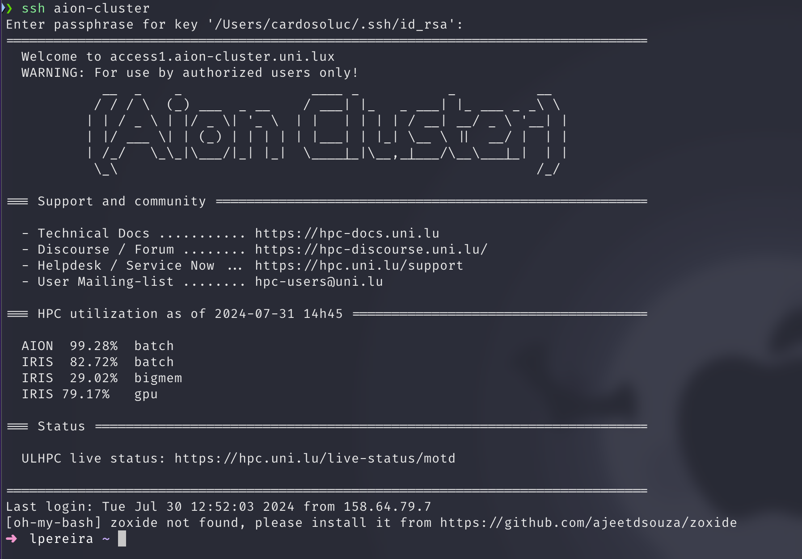

# Working on the HPC

Now that the SSH is setup, you can start working on the HPC. Working on the HPC is done through the command line and its not recommended to use
heavy IDEAS to connect to the HPC. If you want to use an IDE like visual studio code, work on your local machine and use git or scp/rsync to transfer the files to the HPC.

To use rsync, you can add the following line to your `.bashrc` file:
```bash
uploadhpc() {
  rsync --rsh='ssh -p 8022' -avzu $1 aion-cluster:$2
}
```
This will allow you to use the `uploadhpc` command to upload files to the HPC.
To use it, you can run:
```bash
uploadhpc file.txt /path/to/destinationOnHPC
```

If the connection is successful, you should see something like this:


# Connection to HPC

When using a supercomputer, you will usually first connect to a front-end or access node. From this machine, you can check your files, disk quota and computing usage. It is intended to be used by the user to prepare his computing job and scripts and then submit them to the job scheduler.

Because the access node is shared by all the users of the platform, it should not be used to compile and install your software and it should definitely not be used to run any memory or computing-intensive task.

# Linux Command Cheat Sheet

## Basic Commands

- `ls`: List directory contents.
    - `ls -l`: Detailed listing (long format).
    - `ls -a`: List all files, including hidden files.

- `cd [directory]`: Change directory.
    - `cd ..`: Go up one directory level.
    - `cd ~`: Go to the home directory.

- `pwd`: Print the current working directory.

- `mkdir [directory]`: Create a new directory.

- `rmdir [directory]`: Remove an empty directory.

- `rm [file]`: Remove a file.
    - `rm -r [directory]`: Remove a directory and its contents recursively.
    - `rm -f [file]`: Force remove a file.

- `cp [source] [destination]`: Copy files or directories.
    - `cp -r [source] [destination]`: Copy directories recursively.

- `mv [source] [destination]`: Move or rename files or directories.

- `touch [file]`: Create an empty file or update the timestamp of an existing file.

- `cat [file]`: Display the contents of a file.

- `less [file]`: View file contents one screen at a time.

- `head [file]`: Display the first 10 lines of a file.
    - `head -n [number] [file]`: Display the first `n` lines of a file.

- `tail [file]`: Display the last 10 lines of a file.
    - `tail -f [file]`: Follow the end of the file in real-time.

## File Permissions

- `chmod [permissions] [file]`: Change file permissions.
    - Example: `chmod 755 script.sh`

- `chown [user]:[group] [file]`: Change file owner and group.
    - Example: `chown user:group file.txt`

## File Compression

- `tar -czvf [archive.tar.gz] [directory]`: Create a compressed tarball.
- `tar -xzvf [archive.tar.gz]`: Extract a compressed tarball.

- `zip [archive.zip] [file]`: Create a zip file.
- `unzip [archive.zip]`: Extract a zip file.

## Process Management

- `ps`: Display currently running processes.
    - `ps aux`: Detailed information about all running processes.

- `top`: Display a dynamic view of system processes.

- `kill [PID]`: Terminate a process by its PID.
    - `kill -9 [PID]`: Force kill a process.

- `htop`: Enhanced process viewer (requires installation).

## Networking

- `ifconfig`: Display network interfaces and IP addresses.
- `ping [host]`: Check connectivity to a host.
- `ssh [user]@[host]`: Connect to a remote host via SSH.
- `scp [source] [user]@[host]:[destination]`: Secure copy files to/from a remote host.

## Disk Usage

- `df -h`: Display disk space usage.
- `du -sh [directory]`: Display the size of a directory and its contents.

## System Information

- `uname -a`: Display detailed system information.
- `uptime`: Show how long the system has been running.
- `free -h`: Display memory usage.

## Text Processing

- `grep [pattern] [file]`: Search for a pattern in a file.
    - `grep -r [pattern] [directory]`: Recursively search for a pattern in a directory.

- `sed 's/[pattern]/[replacement]/g' [file]`: Replace a pattern in a file.

- `awk '{print $1}' [file]`: Extract specific fields from a file.

## Miscellaneous

- `man [command]`: Display the manual page for a command.
- `echo [text]`: Display a line of text.
- `history`: Show command history.
- `clear`: Clear the terminal screen.
- `alias [name]='[command]'`: Create an alias for a command.


## HPC-Specific Commands

- `squeue`: Display the job queue.
- `sbatch [script.sh]`: Submit a batch script.
- `scancel [jobID]`: Cancel a job by its ID.
- `sinfo`: Display information about the cluster.

More information about the commands can be found in ...

# Text Editors

When working on the HPC, you will need to edit files and scripts. The most common text editors on Linux are `nano`, `vim`, and `emacs`. Here is a brief overview of each:

## Nano

Nano is a simple and user-friendly text editor that is easy to use for beginners. It is a good choice for quick edits and small files.

- Open a file: `nano [file]`
- Save a file: `Ctrl + O`
- Exit nano: `Ctrl + X`

## Vim

Vim is a powerful and highly configurable text editor that is popular among developers and system administrators. It has a steep learning curve but offers advanced features and customization options. It is pre-installed on most Linux systems.

- Open a file: `vim [file]`
- Save a file: `:w`
- Exit vim: `:q`

Vim is different from most text editors in that it has different modes (normal, insert, visual, etc.). To enter insert mode, press `i`. To exit insert mode and return to normal mode, press `Esc`.

In normal mode, you can navigate the file using the arrow keys or `hjkl` (left, down, up, right). You can also use commands like `dd` to delete a line, `yy` to copy a line, and `p` to paste.

It is recommended to learn the basics of Vim also called vim motions to be more productive when working on the HPC.

## Emacs

Emacs is a powerful and extensible text editor that is popular among programmers and power users. It has a steep learning curve but offers advanced features and customization options.

- Open a file: `emacs [file]`
- Save a file: `Ctrl + X, Ctrl + S`
- Exit emacs: `Ctrl + X, Ctrl + C`

Emacs has a wide range of features and modes that can be customized to suit your workflow. It is highly extensible and can be used for programming, writing, and more.

## NeoVim

Nvim is a fork of Vim that aims to improve the user experience and add new features. It is compatible with Vim plugins and configurations but offers additional functionality and performance improvements.

<!--neovin-install-start-->

!!! tip "Install Neovim using Micormamba"
    Neovim is not installed by default on the HPC but you can install it using [Micromamba](../environment/conda.md#Installation).
    
    ```bash
    micromamba create --name editor-env
    micromamba install --name editor-env conda-forge::nvim
    ```
    After installation you can create a alias in your `.bashrc` for easy access:
    ```bash 
    alias nvim='micromamba run --name editor-env nvim'
    ```
<!--neovin-install-end-->

NeoVim is not installed by default on most systems, but you can install it using conda/micromamba.

- Open a file: `nvim [file]`
- Save a file: `:w`
- Exit nvim: `:q`

Nvim is designed to be more user-friendly and modern than Vim while maintaining compatibility with existing Vim configurations. It is a good choice for users who want a more modern text editor with Vim-like keybindings.

It offers a lot of plugins and themes to customize the editor to your liking.
Consider watching videos or reading about it to learn more about the text editors and the many features they offer.

### Recommended Plugins for NeoVim

- `telescope.nvim` for fuzzy file finding and live grep.
- `nvim-treesitter` for syntax highlighting and code analysis.
- `nvim-tree` for file explorer.

#### Not Tested
- `nvim-lspconfig`  for language server protocol support. Most of them will probably not work on the HPC due to npm requirements.


### How to configure NeoVim
There are many ways to configure NeoVim. The most common way is to create a `init.vim` file in the `~/.config/nvim/` directory. This file can contain your custom settings, keybindings, and plugins. It is possible to everything in one file, but it is recommended to split the configuration into multiple files for better organization.
like this:
```bash
.
├── init.lua
├── lazy-lock.json
├── lazyvim.json
├── lua
│   ├── config
│   │   ├── init.lua
│   │   ├── mappings.lua
│   │   ├── options.lua
│   │   ├── pluginlist.lua
│   │   └── plugins.lua
│   └── plugins
│       ├── cmp.lua
│       ├── lsp.lua
│       ├── telescope.lua
│       └── treesitter.lua
```

This makes it easier to manage and update your configuration. Consider using a plugin manager that is popular to make it easier to install and manage plugins like `lazy.nvim`.

Do not install to many plugins as it can slow down the editor and make it harder to maintain. Only install plugins that you need and use regularly. The 3 plugins mentioned above are a good starting point and cover most of the features you will need or want to work on the HPC.

#### NeoVim distributions
There are many distributions of NeoVim that come pre-configured with plugins and settings but they will be limited on the HPC due to the lack of other required software.
Create and maintain your own configuration to have full control over the editor and to learn more about how it works.

# NeoVim Configuration Step by Step
In this section, we will go through the steps to configure NeoVim on the HPC. We will install NeoVim using conda/micromamba and create a basic configuration file to get started. This will allow you to customize the editor to your liking and add plugins and settings as needed. The configuration will be in Lua format, which is the recommended way to configure NeoVim.


1. Install NeoVim using conda/micromamba.
...

2. Create the `~/.config/nvim/` directory.
```bash
mkdir -p ~/.config/nvim
```

3. Create the `init.lua` file in the `~/.config/nvim/` directory.
```bash
touch ~/.config/nvim/init.lua
```

4. Create the `lua` directory in the `~/.config/nvim/` directory.
```bash
mkdir -p ~/.config/nvim/lua
```
Every file in the `lua` directory can be loaded by NeoVim and will be used to configure the editor.

5. Create the `config` directory in the `~/.config/nvim/lua/` directory.
```bash
mkdir -p ~/.config/nvim/lua/config
```
This directory can be called anything you want, but it is recommended to use a descriptive name to organize your configuration files.

6. Create the `init.lua` file in the `~/.config/nvim/lua/config/` directory.
```bash
touch ~/.config/nvim/lua/config/init.lua
```
This file will be automatically loaded by NeoVim and can contain your custom settings and keybindings.

7. Add the following code to the `~/.config/nvim/init.lua` file to load the configuration files.
```lua
require('config')
```
Since the `config` directory is in the `lua` directory and has a `init.lua` file in it, NeoVim will automatically load the `init.lua` file in the `config` directory.
It is not required to have a `init.lua` file in the `config` directory, it is possible to specify the file to load like this:
```lua
require('config.mappings') -- directory/file.lua
```

