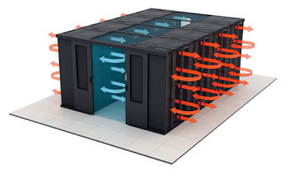

# ULHPC Data Center - Centre de Calcul (CDC)

{: style="width:400px;float: right;margin-right:10px" }

The ULHPC facilities are hosted within the University's "_Centre de Calcul_" (CDC) data center located in the Belval Campus.

## Power and Cooling Capacities

Established over two floors underground (CDC-S01 and CDC-S02) of ~1000~100m2 each, the CDC features five server rooms per level (each of them offering ~100m2 as IT rooms surface).
When the first level CDC-S01 is hosting administrative IT and research equipment, the second floor (__CDC-S02__) is primarily targeting the __hosting of HPC equipment (compute, storage and interconnect)__.

{: style="width:350px;float: left;margin-right:10px" }

A power generation station supplies the HPC floor with up to __3 MW of electrical power, and 3 MW of cold water__ at a 12-18°C regime used for traditional Airflow with In-Row cooling.
A separate hot water circuit (between 30 and 40°C) allow to implement Direct Liquid Cooling (DLC) solutions as for the [Aion](../systems/aion/index.md) supercomputer in two dedicated server rooms.

| __Location__     | __Cooling__ | __Usage__                                                  | __Max Capa.__ |
|------------------|-------------|------------------------------------------------------------|---------------|
| CDC S-02-001     | Airflow     | _Future extension_                                         | 280 kW        |
| CDC S-02-002     | Airflow     | _Future extension_                                         | 280 kW        |
| CDC S-02-003     | DLC         | _Future extension_ - High Density/Energy efficient HPC     | 1050 kW       |
| __CDC S-02-004__ | __DLC__     | __High Density/Energy efficient HPC__: `aion`              | __1050 kW__   |
| __CDC S-02-005__ | __Airflow__ | __Storage / Traditional HPC__: `iris` and common equipment | __300 kW__    |

## Data-Center Cooling technologies

### Airflow with In-Row cooling

{: style="width:200px;float: right;"}
Most server rooms are designed for traditional airflow-based cooling and implement **hot or cold aisle containment**, as well as **In-row cooling systems** work within a row of standard server rack engineered to take up the smallest footprint and offer high-density cooling. Ducting and baffles ensure that the cooling air gets where it needs to go.

[Iris](../systems/iris/index.md) compute, storage and interconnect equipment are hosted in such a configuration

### [Direct] Liquid Cooling

Traditional solutions implemented in most data centers use air as a
medium to remove the heat from the servers and computing equipment
and are not well suited to cutting-edge high-density HPC environments
due to the limited thermal capacity of air. Liquids’ thermal
conductivity is higher than the air, thus concludes the
liquid can absorb (through conductivity) more heat than the air.
The replacement of air with a liquid cooling medium allows to
drastically improve the energy-efficiency as well as the density
of the implemented solution, especially with __Direct Liquid Cooling (DLC)__ where
the heat from the IT components is directly
transferred to a liquid cooling medium through liquid-cooled plates.

The [Aion](../systems/aion/index.md) supercomputer based on the fan-less Atos [BullSequana XH2000](https://atos.net/en/solutions/high-performance-computing-hpc/bullsequana-x-supercomputer) DLC cell design relies on this water-cooled configuration.
