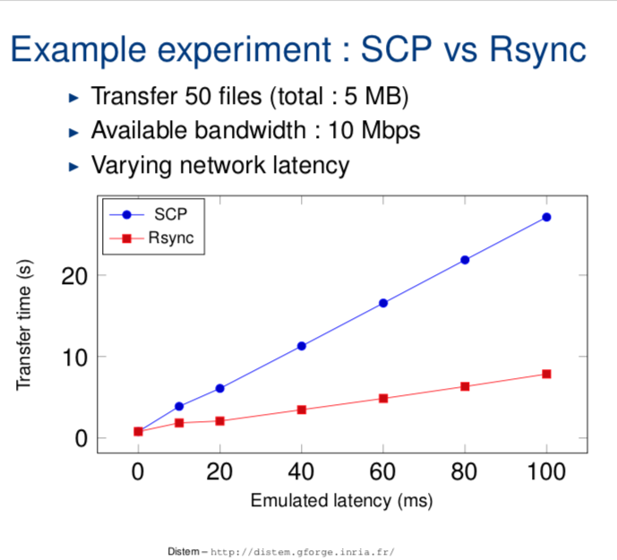

# Data Transfer to/from/within UL HPC Clusters

## Introduction

Directories such as `$HOME`, `$WORK` or `$SCRATCH` are shared among the nodes of the cluster that you are using (including the login node) via shared filesystems (SpectrumScale, Lustre) meaning that:

* every file/directory pushed or created on the login node is available on the computing nodes
* every file/directory pushed or created on the computing nodes is available on the login node

The two most common commands you can use for data transfers over SSH:

* `scp`: for the full transfer of files and directories (only works fine for single files or directories of small/trivial size)
* `rsync`: a software application which synchronizes files and directories from one location to another while minimizing data transfer as only the outdated or inexistent elements are transferred (practically required for lengthy complex transfers, which are more likely to be interrupted in the middle).

!!! danger "scp or rsync?"
    While both ensure a secure transfer of the data within an encrypted tunnel, **`rsync` should be preferred**: as mentionned in the [from openSSH 8.0 release notes](https://www.openssh.com/txt/release-8.0):
    "_The **`scp`** protocol is **outdated**, **inflexible** and **not readily fixed**. We recommend the use of more modern protocols like sftp and rsync for file transfer instead_".

    `scp` is also relatively slow when compared to `rsync` as exhibited for instance in the below sample [Distem](https://distem.gitlabpages.inria.fr/) experience:

    {: style="width:300px;" }

    You will find below notes on `scp` usage, but **kindly prefer to use [rsync](##using-rsync)**.

??? warning "Consider `scp` as deprecated! Click nevertheless to get usage details"
    `scp` (see [scp(1)](https://linux.die.net/man/1/scp) ) or secure copy is probably the easiest of all the methods. The basic syntax is as follows:

        scp [-P 8022] [-Cr] source_path destination_path

    * the `-P` option specifies the SSH port to use (in this case 8022)
    * the `-C` option activates the compression (actually, it passes the -C flag to [ssh(1)](https://linux.die.net/man/1/ssh) to enable compression).
    * the `-r` option states to recursively copy entire directories (in this case, `scp` follows symbolic links encountered in the tree traversal).  Please note that in this case, you must specify the source file as a directory for this to work.

    The syntax for declaring a remote path is as follows on the cluster:
    <br/>
    `yourlogin@iris-cluster:path/from/homedir`

    **Transfer from your local machine to the remote cluster login node**

    For instance, let's assume you have a local directory `~/devel/myproject` you want to transfer to the cluster, in your remote homedir.

    ```bash
    # /!\ ADAPT yourlogin to... your ULHPC login
    $> scp -P 8022 -r ~/devel/myproject yourlogin@iris-cluster:
    ```

    This will transfer recursively your local directory `~/devel/myproject`  on the cluster login node (in your homedir).

    Note that if you configured (as advised elsewhere) the SSH connection in your `~/.ssh/config` file, you can use a much simpler syntax:

    ```bash
    $> scp -r ~/devel/myproject iris-cluster:
    ```

    **Transfer from the remote cluster front-end to your local machine**

    Conversely, let's assume you want to retrieve the files `~/experiments/parallel_run/*`
    ```bash
    $> scp -P 8022 yourlogin@iris-cluster:experiments/parallel_run/* /path/to/local/directory
    ```

    Again, if you configured the SSH connection in your `~/.ssh/config` file, you can use a simpler syntax:

    ```bash
    $> scp iris-cluster:experiments/parallel_run/* /path/to/local/directory
    ```

    See the [scp(1) man page](https://linux.die.net/man/1/scp) or `man scp` for more details.

    !!! danger
        `scp` **SHOULD NOT be used in the following cases:**

        * When you are copying more than a few files, as scp spawns a new process for each file and can be quite slow and resource intensive when copying a large number of files.
        * When using the `-r` switch, scp does not know about symbolic links and will blindly follow them, even if it has already made a copy of the file. That can lead to scp copying an infinite amount of data and can easily fill up your hard disk (or worse, a system shared disk), so be careful.


N.B. There are [many alternative ways](http://moo.nac.uci.edu/~hjm/HOWTO_move_data.html) to transfer files in HPC platforms and you should check your options according to the problem at hand.

Windows and OS X users may wish to transfer files from their systems to the clusters' login nodes with easy-to-use GUI applications such as:

* [WinSCP](http://winscp.net) (Windows only)
* [FileZilla Client](https://filezilla-project.org) (Windows, OS X)
* [Cyberduck](http://cyberduck.ch/) (Windows, OS X)

These applications will need to be configured to connect to the frontends with the same parameters as [discussed on the SSH access page](../connect/ssh.md).


## Using `rsync`

The clever alternative to `scp` is `rsync`, which has the advantage of transferring only the files which differ between the source and the destination. This feature is often referred to as fast incremental file transfer. Additionally, symbolic links can be  preserved.
The typical syntax of `rsync` (see [rsync(1)](https://linux.die.net/man/1/rsync) ) for the cluster is similar to the one of `scp`:

```bash
# /!\ ADAPT </path/to/source> and </path/to/destination>
# From LOCAL directory (/path/to/local/source) toward REMOTE server <hostname>
rsync --rsh='ssh -p 8022' -avzu /path/to/local/source  [user@]hostname:/path/to/destination
# Ex: from REMOTE server <hostname> to LOCAL directory
rsync --rsh='ssh -p 8022' -avzu [user@]hostname:/path/to/source  /path/to/local/destination
```

* the `--rsh` option specifies the connector to use (here SSH on port 8022)
* the `-a` option corresponds to the "Archive" mode. Most likely you should always keep this on as it preserves file permissions and does not follow symlinks.
* the `-v` option enables the verbose mode
* the `-z` option enable compression, this will compress each file as it gets sent over the pipe. This can greatly decrease time, depending on what sort of files you are copying.
* the `-u` option (or `--update`) corresponds to an updating process which skips files that are newer on the receiver. At this level, you may prefer the more dangerous option `--delete` that deletes extraneous files from dest dirs.
Just like `scp`, the syntax for qualifying a remote path is as follows on the cluster: `yourlogin@iris-cluster:path/from/homedir`

### Transfer from your local machine to the remote cluster

Coming back to the previous examples, let's assume you have a local directory `~/devel/myproject` you want to transfer to the cluster, in your remote homedir. In that case:

```bash
# /!\ ADAPT yourlogin to... your ULHPC login
$> rsync --rsh='ssh -p 8022' -avzu ~/devel/myproject yourlogin@access-iris.uni.lu:
```
This will synchronize your local directory `~/devel/myproject`  on the cluster front-end (in your homedir).

!!! info "Transfer to Iris, Aion or both?"
    The above example target the access server of Iris.
    Actually, you could have targetted the access server of Aion: **it doesn't matter** since the storage is **SHARED** between both clusters.

Note that if you configured (as advised above) your SSH connection in your `~/.ssh/config` file with a dedicated SSH entry `{iris,aion}-cluster`, you can use a simpler syntax:

```bash
$> rsync -avzu ~/devel/myproject iris-cluster:
# OR (it doesn't matter)
$> rsync -avzu ~/devel/myproject aion-cluster:
```

### Transfer from your local machine to a project directory on the remote cluster

When transferring data to a project directory you should keep the group and group permissions imposed by the project directory and quota. Therefore you need to add the options `--no-p --no-g` to your rsync command:

```bash
$> rsync -avP --no-p --no-g ~/devel/myproject iris-cluster:/work/projects/myproject/
```

### Transfer from the remote cluster to your local machine

Conversely, let's assume you want to synchronize (retrieve) the remote files `~/experiments/parallel_run/*` on your local machine:

```bash
# /!\ ADAPT yourlogin to... your ULHPC login
$> rsync --rsh='ssh -p 8022' -avzu yourlogin@access-iris.uni.lu:experiments/parallel_run /path/to/local/directory
```

Again, if you configured the SSH connection in your `~/.ssh/config` file, you can use a simpler syntax:

```bash
$> rsync -avzu iris-cluster:experiments/parallel_run /path/to/local/directory
# OR (it doesn't matter)
$> rsync -avzu aion-cluster:experiments/parallel_run /path/to/local/directory
```

As always, see the [man page](https://linux.die.net/man/1/rsync) or `man rsync` for more details.

??? info "Windows Subsystem for Linux (WSL)"
    In WSL, the home directory in Linux virtual machines is not your home directory in Windows. If you want to access the files that you downloaded with `rsync` inside a Linux virtual machine, please consult the [WSL documentation](https://learn.microsoft.com/en-us/windows/wsl/) and the [file system](https://learn.microsoft.com/en-us/windows/wsl/filesystems) section in particular.


### Data Transfer within Project directories

The ULHPC facility features a [Global Project directory `$PROJECTHOME`](../filesystems/gpfs.md#global-project-directory-projecthomeworkprojects) hosted within the [GPFS/SpecrumScale](../filesystems/gpfs.md) file-system.
You have to pay a particular attention when using `rsync` to transfer data within your project directory as depicted below.



??? info "Debugging quota issues"
    Sometimes, when copying files with `rsync` or `scp` commands and you are not careful with the options of these commands, you copy files with incorrect permissions and ownership. If a directory is copied with the wrong permissions and ownership, all files created within the directory may maintain the incorrect permissions and ownership. Typical issues that you may encounter include:

    - If a directory is copied incorrectly _from a project directory to your home directory_, the contents of the directory may continue counting towards the group data instead of your personal data and data usage may be misquoted by the `df-ulphc` utility. Actual data usage takes into account the file group not only its location.
    - If a directory is copied incorrectly _from a personal directory or another machine to a project directory_, you may be unable to create files, since the `clusterusers` group has no quota inside project directories. Note the [group special permission (g+/-s)](https://www.redhat.com/en/blog/suid-sgid-sticky-bit) in directories ensures that all files created in the directory will have the group of the directory instead of the process that creates the file.

    Typical resolutions techniques involve resetting the correct file ownership and permissions:

    === "Files in project directories"
        ```bash
        chown -R <username>:<project name> <path to directory or file>
        find <path to directory or file> -type d | xargs -I % chmod g+s '%'
        ```
    === "Files in user home directories"
        ```bash
        chown -R <username>:clusterusers <path to directory or file>
        find <path to directory or file> -type d | xargs -I % chmod g-s '%'
        ```


## Using MobaXterm (Windows)

If you are under Windows and you have [MobaXterm installed and configured](../connect/ssh.md#ssh-configuration), you probably want to use it to transfer your files to the clusters. Here are the steps to use `rsync` *inside* MobaXterm in Windows.

!!! warning
    Be aware that you **SHOULD enable MobaXterm SSH Agent** -- see [SSH Agent instructions](../connect/ssh.md#ssh-agent) for more instructions.

### Using a local bash, transfer your files

* Open a local "bash" shell. Click on *Start local terminal* on the welcome page of MobaXterm.

* Find the location of the files you want to transfer. They should be located under `/drives/<name of your disk>`. You will have to use the Linux command line to move from one directory to the other. The `cd` command is used to change the current directory and `ls` to list files. For example, if your files are under `C:\\Users\janedoe\Downloads\` you should then go to `/drives/c/Users/janedoe/Downloads/` with this command:

```
cd /drives/c/Users/janedoe/Downloads/
```

Then list the files with `ls` command. You should see the list of your data files.

* When you have retrieved the location of your files, we can begin the transfer with `rsync`. For example `/drives/c/Users/janedoe/Downloads/` (watch out, there is no `/` character at the end of the path, it is important).

* Launch the command `rsync` with this parameters to transfer all the content of the `Downloads` directory to the `/isilon/projects/market_data/` directory on the cluster (the syntax is very important, be careful)

```
rsync -avzpP -e "ssh -p 8022" /drives/c/Users/janedoe/Downloads/ yourlogin@access-iris.uni.lu:/isilon/projects/market_data/
```

* You should see the output of transfer in progress. Wait for it to finish (it can be very long).


### Interrupt and resume a transfer in progress

* If you want to interrupt the transfer to resume it later, press `Ctrl-C` and exit MobaXterm.

* To resume a transfer, go in the right location and execute the `rsync` command again. Only the files that have not been transferred will be transferred again.

## Alternative approaches

You can also consider alternative approaches to synchronize data with the cluster login node:

- rely on a versioning system such as [Git](http://git-scm.com); this approach works well for source code trees;
- mount your remote homedir by [SSHFS](#sshfs):
    - on Mac OS X, you should consider installing [MacFusion](http://macfusionapp.org) for this purpose, where as
    - on Linux, just use the command-line `sshfs` or, `mc`;
- use GUI tools like [FileZilla](https://filezilla-project.org/), [Cyberduck](https://cyberduck.io/), or [WindSCP](https://winscp.net/eng/download.php) (or proprietary options like [ExpanDrive](https://www.expandrive.com/) or [ForkLift 3](https://binarynights.com/)).

### SSHFS

[SSHFS (SSH Filesystem)](https://en.wikipedia.org/wiki/SSHFS) is a file system client that mounts directories located on a remote server onto a local directory over a normal ssh connection. Install the requires packages if they are not already available in your system.

=== "Linux"
    ```bash
    # Debian-like
    sudo apt-get install sshfs
    # RHEL-like
    sudo yum install sshfs
    ```
    You may need to add yourself to the `fuse` group.

=== "Mac OS X"
    ```bash
    # Assuming HomeBrew -- see https://brew.sh
    brew install osxfuse sshfs
    ```
    You can also directly install macFUSE from: <https://osxfuse.github.io/>. You must reboot for the installation of osxfuse to take effect. You can then update to the latest version.

With SSHFS any user can mount their ULHPC home directory onto a local workstation through an ssh connection. The CLI format is as follows:
```
sshfs [user@]host:[dir] mountpoint [options]
```

Proceed as follows (_assuming_ you have a working [SSH connection](../connect/ssh.md)):
```bash
# Create a local directory for the mounting point, e.g. ~/ulhpc
mkdir -p ~/ulhpc
# Mount the remote file system
sshfs iris-cluster: ~/ulhpc -o follow_symlinks,reconnect,dir_cache=no
```
Note the leaving the `[dir]` argument blanck, mounts the user's home directory by default. The options (`-o`) used are:

- `follow_symlinks` presents symbolic links in the remote files system as regular files in the local file system, useful when the symbolic link points outside the mounted directory;
- `reconnect` allows the SSHFS client to automatically reconnect to server if connection is interrupted;
- `dir_cache` enables or disables the directory cache which holds the names of directory entries (can be slow for mounted remote directories with many files).

When you no longer need the mounted remote directory, you **must** unmount your remote file system:

=== "Linux"
    ```bash
    fusermount -u ~/ulhpc
    ```
=== "Mac OS X"
    ```
    diskutil umount ~/ulhpc
    ```

## Transfers between long term storage and the HPC facilities

The university provides **central data storage** services for all employees and students. The data are stored securely on the university campus and are **managed by the IT department**. The storage servers most commonly used at the university are

- Atlas (atlas.uni.lux) for staff members, and
- Poseidon (poseidon.uni.lux) for students.

For more details on the university central storage, you can have a look at

- [Usage of Atlas and Poseidon](https://hpc.uni.lu/accessing_central_university_storage), and
- [Backup of your files on Atlas](https://hpc.uni.lu/moving_files_to_the_central_university_storage).

!!! info "Connecting to central data storage services from a personal machine"
    The examples presented here are targeted to the university HPC machines. To connect to the university central data storage with a (Linux) personal machine from outside of the university network, you need to start first a VPN connection.

The SMB shares exported for directories in the central data storage are meant to be accessed interactively. Transfer your data manually before and after your jobs are run. You can mount directories from the central data storage in the login nodes, and access the central data storage through the interface of `smbclient` from both the compute nodes during interactive jobs and the login nodes.

!!! danger "Never store your password in plain text"
    Unlike mounting with `sshfs`, you will always need to enter your password to access a directory in an SMB share. Avoid, storing your password in any manner that it makes it recoverable from plain text. For instance, **do not** create job scripts that contain your password in plain text just to move data to Atlas within a job.

The following commands target Atlas, but commands for Poseidon are similar.

### Mounting an SMB share to a login node

The UL HPC team provides the `smb-storage` script to mount SMB shares in login nodes.

- There exists an SMB share `users` where all staff member have a directory named after their user name (`name.surname`). To mount your directory in an shell session at a login node execute the command
```bash
smb-storage mount name.surname
```
and your directory will be mounted to the default mount location:
```
~/atlas.uni.lux-users-name.surname
```
- To mount a project share `project_name` in a shell session at a login node execute the command
```bash
smb-storage mount name.surname --project project_name
```
and the share will be mounted in the default mount location:
```
~/atlas.uni.lux-project_name
```
- To unmount any share, simply call the `unmount` subcommand with the mount point path, for instance
```bash
smb-storage unmount ~/atlas.uni.lux-users-name.surname
```
or:
```bash
smb-storage unmount ~/atlas.uni.lux-project_name
```

The `smb-storage` script provides optional flags to modify the default options:

- `--help` prints information about the usage and options of he script;
- `--server <server url>` specifies the server from which the SMB share is mounted (defaults to `--server atlas.uni.lux` if not specified, use `--server poseidon.uni.lux` to mount a share from Poseidon);
- `--project <project name> [<directory in project>]` mounts the share `<project name>` and creates a symbolic link to the optionally provided location `<directory in project>`, or to the project root directory if a location is not provided (defaults to `--project users name.surname` if not specified);
- `--mountpoint <path>` selects the path where the share directory will be available (defaults to `~/<server url>-<project name>-<directory in project>` if nbot specified);
- `--debug` prints details of the operations performed by the mount script.

!!! info "Best practices"
    Mounted SMB shares will be available in the login node, and he mount point will appear as a dead symbolic link in compute nodes. This is be design, you can only mount SMB shares in login nodes because SMB shares are meant to be used in interactive sections.

    Mounted shares will remain available as long as the login session where the share was mounted remains active. You can mount shares in a `tmux` session in a login node, and access the share from any other session in the login node.

??? info "Details of the mounting process"
    There exists an SMB share `users` where all staff member have a directory named after their user name (`name.surname`). All other projects have an SMB share named after the project name (in lowercase characters).

    The `smb-storage` scripts uses `gio mount` to mount SMB shares. Shares are mounted in a specially named mount point in `/run/user/${UID}/gvfs`. Then, `smb-storage` creates a symbolic link to the requested `directory in project` in the path specified in the `--mountpoint` option.

    During unmounting, the symbolic links are deleted by the `smb-storage` script and then the shares mounted in `/run/user/${UID}/gvfs` are unmounted and their mount points are removed using `gio mount --unmount`. **If a session with mounted SMB shares terminates without unmounting the shares**, the shares in `/run/user/${UID}/gvfs` will be unmounted and their mount points deleted, but **the symbolic links created by `smb-storage` must be removed manually**.

### Accessing SMB shares with `smbclient`

The `smbclient` program is available in both login and compute nodes. In compute nodes the only way to access SMB shares is through the client program. With the SMB client one can connect to the `users` share and browse their personal directory with the command:
```
smbclient //atlas.uni.lux/users --directory='name.surname' --user=name.surname@uni.lu
```
Project directories are accessed with the command:
```
smbclient //atlas.uni.lux/project_name --user=name.surname@uni.lu
```

Type `help` to get a list of all available commands or `help (command_name)` to get more information for a specific command. Some useful commands are

- `ls` to list all the files in a directory,
- `mkdir (directory_name)` to create a directory,
- `rm (file_name)` to remove a file,
- `rmdir (directory_name)` to remove a directory,
- `scopy (source_full_path) (destination_full_path)` to move a file _within_ the SMN shared directory,
- `get (file_name) [destination]` to move a file _from_ Atlas to the local machine (placed in the working directory, if the destination is not specified), and
- `put (file_name) [destination]` to move a file _to_ Atlas from the local machine (placed in the working directory, if a full path is not specified),
- `mget (file name pattern) [destination]` to download multiple files, and
- `mput (file name pattern) [destination]` to upload multiple files.

The patterns used in `mget`/`mput` are either normal file names, or globular expressions (e.g. `*.txt`). 

Connecting into an interactive SMB session means that you will have to maintain a shell session dedicated to SMB. However, it saves you from entering your password for every operation. If you would like to perform a single operation and exit, you can avoid maintaining an interactive session with the `--command` flag. For instance,
```
smbclient //atlas.uni.lux/users --directory='name.surname' --user=name.surname@uni.lu --command='get "full path/to/remote file.txt" "full path/to/local file.txt"'
```
copies a file from the SMB directory to the local machine. Notice the use of double quotes to handle file names with spaces. Similarly,
```
smbclient //atlas.uni.lux/users --directory='name.surname' --user=name.surname@uni.lu --command='put "full path/to/local file.txt" "full path/to/remote file.txt"'
```
copies a file from the local machine to the SMB directory.

Moving whole directories is a bit more involved, as it requires setting some state variables for the session, both for interactive and non-interactive sessions. To download a directory for instance, use
```bash
smbclient //atlas.uni.lux/users --directory='name.surname' --user=name.surname@uni.lu --command='recurse ON; prompt OFF; mget "full path/to/remote directory" "full path/to/local directory"'
```
and to upload a directory use
```bash
smbclient //atlas.uni.lux/users --directory='name.surname' --user=name.surname@uni.lu --command='recurse ON; prompt OFF; mput "full path/to/remote local" "full path/to/remote directory"'
```
respectively. The session option

- `recurse ON` enables recursion into directories, and the option
- `prompt OFF` disables prompting for confirmation before moving each file.

_Sources_

- [Cheat-sheet for SMB access from linux](https://www.thegeekdiary.com/smbclient-command-examples-in-linux/)

## Special transfers

Sometimes you may have the case that a lot of files need to go from point A to B over a Wide Area Network (eg. across the Atlantic). Since packet latency and other factors on the network will naturally slow down the transfers, you need to find workarounds, typically with either rsync or tar.
