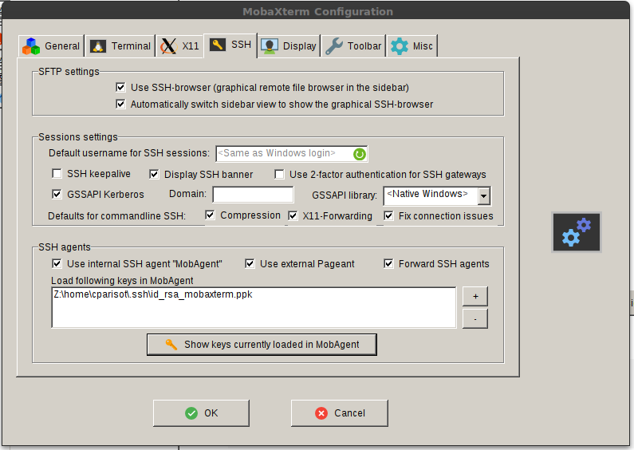
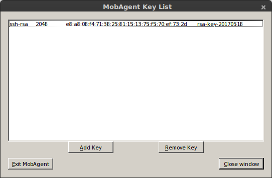

# Data Transfer to/from/within UL HPC Clusters

Directories such as `$HOME`, `$WORK` or `$SCRATCH` are shared among the nodes of the cluster that you are using (including the login node) via shared filesystems (SpectrumScale, Lustre) meaning that:

* every file/directory pushed or created on the login node is available on the computing nodes
* every file/directory pushed or created on the computing nodes is available on the login node

The two most common commands you can use for data transfers over SSH:

* `scp`: for the full transfer of files and directories (only works fine for single files or directories of small/trivial size)
* `rsync`: a software application which synchronizes files and directories from one location to another while minimizing data transfer as only the outdated or inexistent elements are transferred (practically required for lengthy complex transfers, which are more likely to be interrupted in the middle).

!!! danger "scp or rsync?"
    While both ensure a secure transfer of the data within an encrypted tunnel, **`rsync` should be preferred**: as mentionned in the [from openSSH 8.0 release notes](https://www.openssh.com/txt/release-8.0):
    "_The **`scp`** protocol is **outdated**, **inflexible** and **not readily fixed**. We recommend the use of more modern protocols like sftp and rsync for file transfer instead_".

    `scp` is also relatively slow when compared to `rsync` as exhibited for instance in the below sample [Distem](https://distem.gitlabpages.inria.fr/) experience:

    {: style="width:300px;" }

    You will find below notes on `scp` usage, but **kindly prefer to use [rsync](##using-rsync)**.

??? warning "Consider `scp` as deprecated! Click nevertheless to get usage details"
    `scp` (see [scp(1)](https://linux.die.net/man/1/scp) ) or secure copy is probably the easiest of all the methods. The basic syntax is as follows:

        scp [-P 8022] [-Cr] source_path destination_path

    * the `-P` option specifies the SSH port to use (in this case 8022)
    * the `-C` option activates the compression (actually, it passes the -C flag to [ssh(1)](https://linux.die.net/man/1/ssh) to enable compression).
    * the `-r` option states to recursively copy entire directories (in this case, `scp` follows symbolic links encountered in the tree traversal).  Please note that in this case, you must specify the source file as a directory for this to work.

    The syntax for declaring a remote path is as follows on the cluster:
    <br/>
    `yourlogin@iris-cluster:path/from/homedir`

    **Transfer from your local machine to the remote cluster login node**

    For instance, let's assume you have a local directory `~/devel/myproject` you want to transfer to the cluster, in your remote homedir.

    ```bash
    # /!\ ADAPT yourlogin to... your ULHPC login
    $> scp -P 8022 -r ~/devel/myproject yourlogin@iris-cluster:
    ```

    This will transfer recursively your local directory `~/devel/myproject`  on the cluster login node (in your homedir).

    Note that if you configured (as advised elsewhere) the SSH connection in your `~/.ssh/config` file, you can use a much simpler syntax:

    ```bash
    $> scp -r ~/devel/myproject iris-cluster:
    ```

    **Transfer from the remote cluster front-end to your local machine**

    Conversely, let's assume you want to retrieve the files `~/experiments/parallel_run/*`
    ```bash
    $> scp -P 8022 yourlogin@iris-cluster:experiments/parallel_run/* /path/to/local/directory
    ```

    Again, if you configured the SSH connection in your `~/.ssh/config` file, you can use a simpler syntax:

    ```bash
    $> scp iris-cluster:experiments/parallel_run/* /path/to/local/directory
    ```

    See the [scp(1) man page](https://linux.die.net/man/1/scp) or `man scp` for more details.

    !!! danger
        `scp` **SHOULD NOT be used in the following cases:**

        * When you are copying more than a few files, as scp spawns a new process for each file and can be quite slow and resource intensive when copying a large number of files.
        * When using the `-r` switch, scp does not know about symbolic links and will blindly follow them, even if it has already made a copy of the file. That can lead to scp copying an infinite amount of data and can easily fill up your hard disk (or worse, a system shared disk), so be careful.


N.B. There are [many alternative ways](http://moo.nac.uci.edu/~hjm/HOWTO_move_data.html) to transfer files in HPC platforms and you should check your options according to the problem at hand.

Windows and OS X users may wish to transfer files from their systems to the clusters' login nodes with easy-to-use GUI applications such as:

* [WinSCP](http://winscp.net) (Windows only)
* [FileZilla Client](https://filezilla-project.org) (Windows, OS X)
* [Cyberduck](http://cyberduck.ch/) (Windows, OS X)

These applications will need to be configured to connect to the frontends with the same parameters as [discussed on the SSH access page](/connect/ssh.md).


## Using `rsync`

The clever alternative to `scp` is `rsync`, which has the advantage of transferring only the files which differ between the source and the destination. This feature is often referred to as fast incremental file transfer. Additionally, symbolic links can be  preserved.
The typical syntax of `rsync` (see [rsync(1)](https://linux.die.net/man/1/rsync) ) for the cluster is similar to the one of `scp`:

```bash
# /!\ ADAPT </path/to/source> and </path/to/destination>
# From LOCAL directory (/path/to/local/source) toward REMOTE server <hostname>
rsync --rsh='ssh -p 8022' -avzu /path/to/local/source  [user@]hostname:/path/to/destination
# Ex: from REMOTE server <hostname> to LOCAL directory
rsync --rsh='ssh -p 8022' -avzu [user@]hostname:/path/to/source  /path/to/local/destination
```

* the `--rsh` option specifies the connector to use (here SSH on port 8022)
* the `-a` option corresponds to the "Archive" mode. Most likely you should always keep this on as it preserves file permissions and does not follow symlinks.
* the `-v` option enables the verbose mode
* the `-z` option enable compression, this will compress each file as it gets sent over the pipe. This can greatly decrease time, depending on what sort of files you are copying.
* the `-u` option (or `--update`) corresponds to an updating process which skips files that are newer on the receiver. At this level, you may prefer the more dangerous option `--delete` that deletes extraneous files from dest dirs.
Just like `scp`, the syntax for qualifying a remote path is as follows on the cluster: `yourlogin@iris-cluster:path/from/homedir`

### Transfer from your local machine to the remote cluster

Coming back to the previous examples, let's assume you have a local directory `~/devel/myproject` you want to transfer to the cluster, in your remote homedir. In that case:

```bash
# /!\ ADAPT yourlogin to... your ULHPC login
$> rsync --rsh='ssh -p 8022' -avzu ~/devel/myproject yourlogin@access-iris.uni.lu:
```
This will synchronize your local directory `~/devel/myproject`  on the cluster front-end (in your homedir).

!!! info "Transfer to Iris, Aion or both?"
    The above example target the access server of Iris.
    Actually, you could have targetted the access server of Aion: **it doesn't matter** since the storage is **SHARED** between both clusters.

Note that if you configured (as advised above) your SSH connection in your `~/.ssh/config` file with a dedicated SSH entry `{iris,aion}-cluster`, you can use a simpler syntax:

```bash
$> rsync -avzu ~/devel/myproject iris-cluster:
# OR (it doesn't matter)
$> rsync -avzu ~/devel/myproject aion-cluster:
```

### Transfer from your local machine to a project directory on the remote cluster

When transferring data to a project directory you should keep the group and group permissions imposed by the project directory and quota. Therefore you need to add the options `--no-p --no-g` to your rsync command:

```bash
$> rsync -avP --no-p --no-g ~/devel/myproject iris-cluster:/work/projects/myproject/
```

### Transfer from the remote cluster to your local machine

Conversely, let's assume you want to synchronize (retrieve) the remote files `~/experiments/parallel_run/*` on your local machine:

```bash
# /!\ ADAPT yourlogin to... your ULHPC login
$> rsync --rsh='ssh -p 8022' -avzu yourlogin@access-iris.uni.lu:experiments/parallel_run /path/to/local/directory
```

Again, if you configured the SSH connection in your `~/.ssh/config` file, you can use a simpler syntax:

```bash
$> rsync -avzu iris-cluster:experiments/parallel_run /path/to/local/directory
# OR (it doesn't matter)
$> rsync -avzu aion-cluster:experiments/parallel_run /path/to/local/directory
```

As always, see the [man page](https://linux.die.net/man/1/rsync) or `man rsync` for more details.


## Using MobaXterm (Windows)

If you are under Windows and you have MobaXterm installed and configured, you probably want to use it to transfer your files to the clusters. Here are the steps to use `rsync` *inside* MobaXterm in Windows.

### Enable MobaXterm SSH Agent
MobaXterm SSH Agent will manage the SSH keys for you.

* Go in **Settings > SSH Tab**

* In **SSH agents** section, check **Use internal SSH agent "MobAgent"**



* Click on the `+` button on the right

* Select your private key file. If you have several keys, you can add them by doing steps above again.

* Click on "Show keys currently loaded in MobAgent". An advertisement window may appear asking if you want to run MobAgent. Click on "Yes".

* Check that your key(s) appears in the window.



* Close the window.

* Click on `OK`. Restart MobaXterm.

### Using a local bash, transfer your files

* Open a local "bash" shell. Click on *Start local terminal* on the welcome page of MobaXterm.

* Find the location of the files you want to transfer. They should be located under `/drives/<name of your disk>`. You will have to use the Linux command line to move from one directory to the other. The `cd` command is used to change the current directory and `ls` to list files. For example, if your files are under `C:\\Users\janedoe\Downloads\` you should then go to `/drives/c/Users/janedoe/Downloads/` with this command:

```
cd /drives/c/Users/janedoe/Downloads/
```

Then list the files with `ls` command. You should see the list of your data files.

* When you have retrieved the location of your files, we can begin the transfer with `rsync`. For example `/drives/c/Users/janedoe/Downloads/` (watch out, there is no `/` character at the end of the path, it is important).

* Launch the command `rsync` with this parameters to transfer all the content of the `Downloads` directory to the `/isilon/projects/market_data/` directory on the cluster (the syntax is very important, be careful)

```
rsync -avzpP -e "ssh -p 8022" /drives/c/Users/janedoe/Downloads/ yourlogin@access-iris.uni.lu:/isilon/projects/market_data/
```

* You should see the output of transfer in progress. Wait for it to finish (it can be very long).


### Interrupt and resume a transfer in progress

* If you want to interrupt the transfer to resume it later, press `Ctrl-C` and exit MobaXterm.

* To resume a transfer, go in the right location and execute the `rsync` command again. Only the files that have not been transferred will be transferred again.

## Alternative approaches

You can also consider alternative approaches to synchronize data with the cluster login node:

* rely on a versioning system such as [GIT](http://git-scm.com); this approach works well for source code trees.
* mount your remote homedir by [SSHFS](http://en.wikipedia.org/wiki/SSHFS). On Mac OS X, you should consider installing [MacFusion](http://macfusionapp.org) for this purpose - on classical Linux system, just use the command-line `sshfs` or, `mc`.


## Special transfers

Sometimes you may have the case that a lot of files need to go from point A to B over a Wide Area Network (eg. across the Atlantic). Since packet latency and other factors on the network will naturally slow down the transfers, you need to find workarounds, typically with either rsync or tar.
