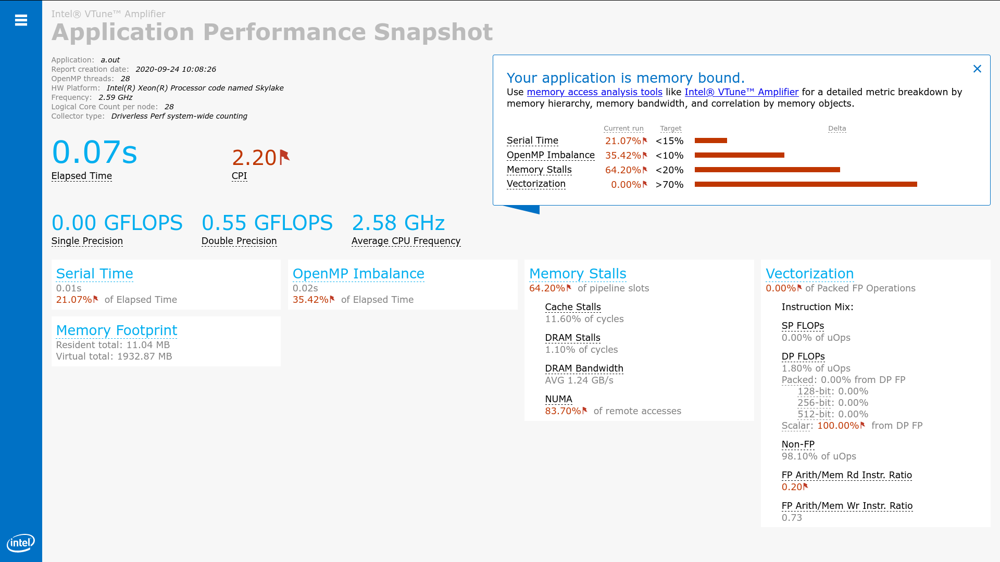
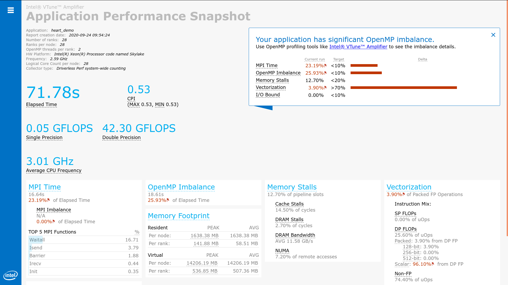

# Application Performance Snapshot (APS)
[{: style="width:300px;float: right;" }](https://software.intel.com/sites/products/snapshots/application-snapshot/)
[Application Performance Snapshot (APS)](https://software.intel.com/sites/products/snapshots/application-snapshot/) is a lightweight open source profiling
tool developed by the Intel VTune developers.
Use Application Performance Snapshot for a quick view into a shared memory or
MPI application's use of available hardware (CPU, FPU, and memory). Application
Performance Snapshot analyzes your application's time spent in MPI, MPI and
OpenMP imbalance, memory access efficiency, FPU usage, and I/O and memory
footprint. After analysis, it displays basic performance enhancement
opportunities for systems using Intel platforms. Use this tool as a first step
in application performance analysis to get a simple snapshot of key
optimization areas and learn about profiling tools that specialize in
particular aspects of application performance.


## Prerequisites

??? tips "Optional Configuration"
    **Optional:** Use the following software to get an advanced metric set when
    running Application Performance Snapshot:

    * Recommended compilers: Intel C/C++ or Fortran Compiler (other compilers can
      be used, but information about OpenMP imbalance is only available from the
      Intel OpenMP library)
    * Use Intel MPI library version 2017 or later. Other MPICH-based MPI
      implementations can be used, but information about MPI imbalance is only
      available from the Intel MPI library. There is no support for OpenMPI.

    **Optional:** Enable system-wide monitoring to reduce collection overhead and
    collect memory bandwidth measurements. Use one of these options to enable
    system-wide monitoring:

    * Set the `/proc/sys/kernel/perf_event_paranoid` value to 0 (or less), or
    * Install the Intel VTune Amplifier drivers. Driver sources are available in
      `<APS_install_dir>/internal/sepdk/src`. Installation instructions are
      available online at
      https://software.intel.com/en-us/vtune-amplifier-help-building-and-installing-the-sampling-drivers-for-linux-targets.

Before running the tool, set up your environment appropriately:

```bash
module purge
module load swenv/default-env/v1.2-20191021-production
module load tools/VTune/2019_update4
module load toolchain/intel/2019a
```

## Analyzing Shared Memory Applications

Run the following commands (interactive mode):

```bash
# Compilation
$ icc -qopenmp example.c

# Code execution
aps --collection-mode=all -r report_output ./a.out
```

`aps -help` will list out `--collection-mode=<mode>` available in APS.

```bash
# To create a .html file
aps-report -g report_output

# To open an APS results in the browser
firefox report_output_<postfix>.html
```
The below figure shows the example of result can be seen in the browser:



```
# To see the command line output
$ aps-report <result_dir>
```

Example for the batch script:
```bash
#!/bin/bash -l
#SBATCH -J APS
#SBATCH -N 1
###SBATCH -A <project_name>
#SBATCH -c 28
#SBATCH --time=00:10:00
#SBATCH -p batch
#SBATCH --nodelist=node0xx

module purge
module load swenv/default-env/v1.2-20191021-production
module load tools/VTune/2019_update4
module load toolchain/intel/2019a

export OMP_NUM_THREADS=16
aps --collection-mode=all -r report_output ./a.out
```

## Analyzing MPI Applications
To compile just `MPI` application run `$ mpiicc example.c` and for `MPI+OpenMP` run `$ mpiicc -qopenmp example.c`

Example for the batch script:
```bash
#!/bin/bash -l
#SBATCH -J APS
#SBATCH -N 2
###SBATCH -A <project_name>
#SBATCH --ntasks-per-node=14
#SBATCH -c 2
#SBATCH --time=00:10:00
#SBATCH -p batch
#SBATCH --reservation=<name>

module purge
module load swenv/default-env/v1.2-20191021-production
module load tools/VTune/2019_update4
module load toolchain/intel/2019a

# To collect all the results
export MPS_STAT_LEVEL=${SLURM_CPUS_PER_TASK:-1}
# An option for the OpenMP+MPI application
export OMP_NUM_THREADS=${SLURM_CPUS_PER_TASK:-1}
srun -n ${SLURM_NTASKS} aps --collection-mode=mpi -r result_output ./a.out
```

The below figure shows the hybrid(MPI+OpenMP) programming analysis results:


## Next Steps

* [Intel Trace Analyzer and Collector](https://software.intel.com/en-us/intel-trace-analyzer)
  is a graphical tool for understanding MPI application behavior, quickly
  identifying bottlenecks, improving correctness, and achieving high
  performance for parallel cluster applications running on Intel architecture.
  Improve weak and strong scaling for applications.
  [Get started](https://software.intel.com/en-us/get-started-with-itac-for-linux).
* [Intel VTune Amplifier](https://software.intel.com/en-us/intel-vtune-amplifier-xe)
  provides a deep insight into node-level performance including algorithmic
  hotspot analysis, OpenMP threading, general exploration microarchitecture
  analysis, memory access efficiency, and more. It supports C/C++, Fortran,
  Java, Python, and profiling in containers.
  [Get started](https://software.intel.com/en-us/get-started-with-vtune-linux-os).
* [Intel Advisor](https://software.intel.com/en-us/intel-advisor-xe) provides
  two tools to help ensure your Fortran, C, and C++ applications realize full
  performance potential on modern processors.
  [Get started](https://software.intel.com/en-us/get-started-with-advisor).
    - Vectorization Advisor is an optimization tool to identify loops that will
      benefit most from vectorization, analyze what is blocking effective
      vectorization, and forecast the benefit of alternative data
      reorganizations
    - Threading Advisor is a threading design and prototyping tool to analyze,
      design, tune, and check threading design options without disrupting a
      regular environment

??? info "Quick Metrics Reference"
    The following metrics are collected with Application Performance Snapshot.
    Additional detail about each of these metrics is available in the
    [Intel VTune Amplifier online help](https://software.intel.com/en-us/vtune-amplifier-help-cpu-metrics-reference).

    **Elapsed Time**: Execution time of specified application in seconds.

    **SP GFLOPS**: Number of single precision giga-floating point operations
    calculated per second. All double operations are converted to two single
    operations. SP GFLOPS metrics are only available for 3rd Generation Intel Core
    processors, 5th Generation Intel processors, and 6th Generation Intel
    processors.

    **Cycles per Instruction Retired (CPI)**: The amount of time each executed
    instruction took measured by cycles. A CPI of 1 is considered acceptable for
    high performance computing (HPC) applications, but different application
    domains will have varied expected values. The CPI value tends to be greater
    when there is long-latency memory, floating-point, or SIMD operations,
    non-retired instructions due to branch mispredictions, or instruction
    starvation at the front end.

    **MPI Time**: Average time per process spent in MPI calls. This metric does not
    include the time spent in `MPI_Finalize`. High values could be caused by high
    wait times inside the library, active communications, or sub-optimal settings
    of the MPI library. The metric is available for MPICH-based MPIs.

    **MPI Imbalance**: CPU time spent by ranks spinning in waits on communication
    operations. A high value can be caused by application workload imbalance
    between ranks, or non-optimal communication schema or MPI library settings.
    This metric is available only for Intel MPI Library version 2017 and later.

    **OpenMP Imbalance**: Percentage of elapsed time that your application wastes
    at OpenMP synchronization barriers because of load imbalance. This metric is
    only available for the Intel OpenMP Runtime Library.

    **CPU Utilization**: Estimate of the utilization of all logical CPU cores on
    the system by your application. Use this metric to help evaluate the parallel
    efficiency of your application. A utilization of 100% means that your
    application keeps all of the logical CPU cores busy for the entire time that it
    runs. Note that the metric does not distinguish between useful application work
    and the time that is spent in parallel runtimes.

    **Memory Stalls**: Indicates how memory subsystem issues affect application
    performance. This metric measures a fraction of slots where pipeline could be
    stalled due to demand load or store instructions. If the metric value is high,
    review the Cache and DRAM Stalls and the percent of remote accesses metrics to
    understand the nature of memory-related performance bottlenecks. If the average
    memory bandwidth numbers are close to the system bandwidth limit, optimization
    techniques for memory bound applications may be required to avoid memory
    stalls.

    **FPU Utilization**: The effective FPU usage while the application was running.
    Use the FPU Utilization value to evaluate the vector efficiency of your
    application. The value is calculated by estimating the percentage of operations
    that are performed by the FPU. A value of 100% means that the FPU is fully
    loaded. Any value over 50% requires additional analysis. FPU metrics are only
    available for 3rd Generation Intel Core processors, 5th Generation Intel
    processors, and 6th Generation Intel processors.

    **I/O Operations**: The time spent by the application while reading data from
    the disk or writing data to the disk. **Read** and **Write** values denote mean
    and maximum amounts of data read and written during the elapsed time. This
    metric is only available for MPI applications.

    **Memory Footprint**: Average per-rank and per-node consumption of both virtual
    and resident memory.

## Documentation and Resources

* [Intel Performance Snapshot User Forum](https://software.intel.com/en-us/forums/intel-performance-snapshot):
  User forum dedicated to all Intel Performance Snapshot tools, including
  Application Performance Snapshot
* [Application Performance Snapshot](https://software.intel.com/sites/products/snapshots/application-snapshot/):
  Application Performance Snapshot product page, see this page for support and
  online documentation
* [Application Performance Snapshot User's Guide](https://software.intel.com/en-us/application-snapshot-user-guide):
  Learn more about Application Performance Snapshot, including details on specific metrics and best practices for application optimization

!!! tip
    If you find some issues with the instructions above,
    please report it to us using [support ticket](https://hpc.uni.lu/support).
