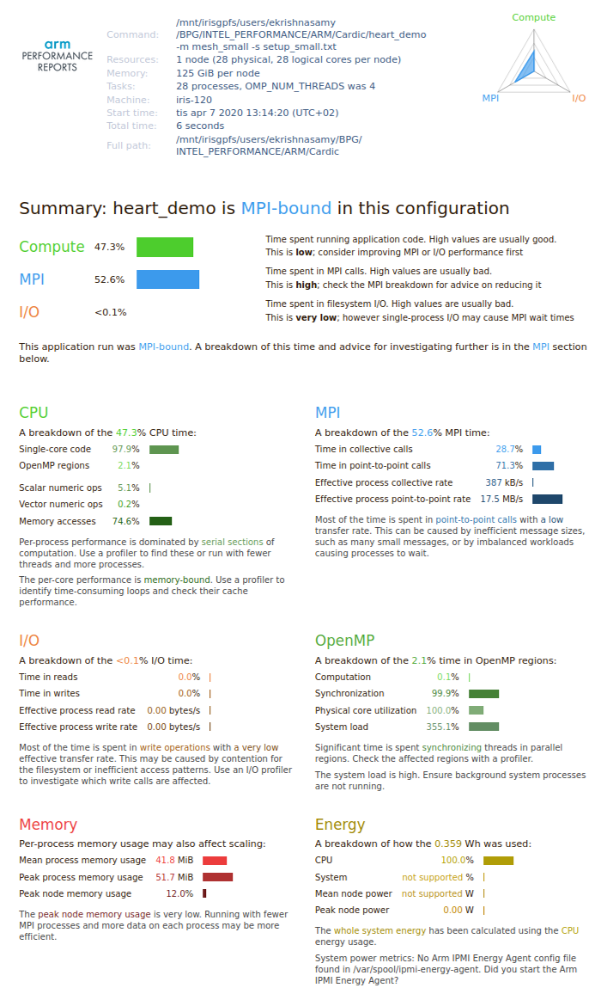

[Arm Forge](https://developer.arm.com/tools-and-software/server-and-hpc/debug-and-profile/arm-forge) is
the leading server and HPC development tool suite in research,
industry, and academia for C, C++, Fortran, and Python high performance code on Linux.  
Arm Forge includes Arm DDT, the best debugger for time-saving high performance application
debugging, Arm MAP, the trusted performance profiler for invaluable optimization advice,
and Arm Performance Reports to help you analyze your HPC application runs.

## Environmental models for Arm Forge in ULHPC
```bash
module purge
module load swenv/default-env/v1.2-20191021-production
module load toolchain/intel/2019a
module load tools/ArmForge/19.1
module load tools/ArmReports/19.1
```

## Interactive Mode

To compile
```bash
$ icc -qopenmp example.c
```
For debugging, profiling and analysing
```bash
# for debugging
$ ddt ./a .out

# for profiling
$ map ./a .out

# for analysis
$ perf-report ./a .out
```

## Batch Mode
### Shared memory programming model (OpenMP)

Example for the batch script:

```bash
#!/bin/bash -l
#SBATCH -J ArmForge
#SBATCH -N 1
#SBATCH -c 16
#SBATCH --time=00:10:00
#SBATCH -p batch

module purge
module load swenv/default-env/v1.2-20191021-production
module load toolchain/intel/2019a
module load tools/ArmForge/19.1
module load tools/ArmReports/19.1

export OMP_NUM_THREADS=16

# for debugging
$ ddt ./a .out

# for profiling
$ map ./a .out

# for analysis
$ perf-report ./a .out
```

### Distributed memory programming model (MPI)
Example for the batch script:

```bash
#!/bin/bash -l
#SBATCH -J ArmForge
#SBATCH -N 2
#SBATCH -c 56
#SBATCH --time=00:10:00
#SBATCH -p batch

module purge
module load swenv/default-env/v1.2-20191021-production
module load toolchain/intel/2019a
module load tools/ArmForge/19.1
module load tools/ArmReports/19.1

# for debugging
$ ddt srun -n 56 ./a .out

# for profiling
$ map srun -n 56 ./a .out

# for analysis
$ perf-report srun -n 56 ./a .out
```
To see the result


!!! tip
    If you find some issues with the instructions above,
    please file a [support ticket](https://hpc.uni.lu/support).
