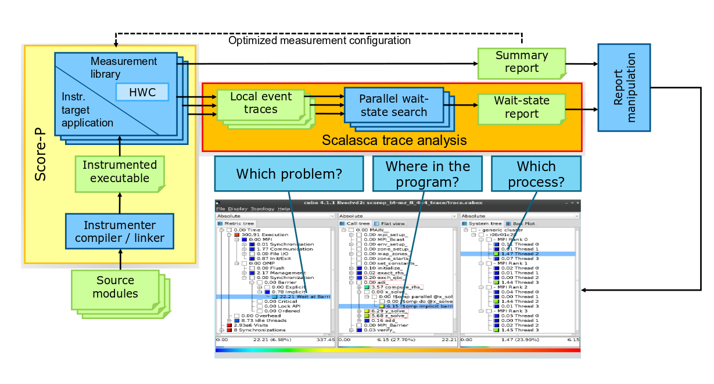

[{: style="width:300px;float: right;" }](https://www.scalasca.org/)
[Scalasca](https://www.scalasca.org/) is a performance analysis tool that supports large-scale systems,
including IBM Blue Gene and CrayXT and small systems.
The Scalasca provides information about the communication and synchronization among
the processors. This information will help to do the performance analysis, optimization,
and tunning of scientificcodes. Scalasca supports OpenMP, MPI, and hybrid programming model,
and a analysis can be done by using the GUI which can be seen in below figure.



## Environmental models for Scalasca on ULHPC
```bash
module load purge
module load swenv/default-env/v1.1-20180716-production
module load toolchain/foss/2018a
module load perf/Scalasca/2.3.1-foss-2018a
module load perf/Score-P/3.1-foss-2018a
```

## Interactive Mode
Work flow:
```bash
# instrument
$ scorep mpicxx example.cc

# analyze
scalasca -analyze mpirun -n 28 ./a.out

# examine
$ scalasca -examine -s scorep_a_28_sum
INFO: Post-processing runtime summarization report...
INFO: Score report written to ./scorep_a_28_sum/scorep.score

# graphical visualization
$ scalasca -examine result_folder
```

## Batch mode
### Shared memory programming (OpenMP)
```bash
#!/bin/bash -l
#SBATCH -J Scalasca
###SBATCH -A <project_name>
#SBATCH -N 1
#SBATCH -c 16
#SBATCH --time=00:10:00
#SBATCH -p batch

module load purge
module load swenv/default-env/v1.1-20180716-production
module load toolchain/foss/2018a
module load perf/Scalasca/2.3.1-foss-2018a
module load perf/Score-P/3.1-foss-2018a

export OMP_NUM_THREADS=16

# analyze
scalasca -analyze ./a.out
```
Report collection and visualization
```bash
# examine
$ scalasca -examine -s scorep_a_28_sum
INFO: Post-processing runtime summarization report...
INFO: Score report written to ./scorep_a_28_sum/scorep.score

# graphical visualization
$ scalasca -examine result_folder
```

### Distributed memory programming (MPI)
```bash
#!/bin/bash -l
#SBATCH -J Scalasca
###SBATCH -A <project_name>
#SBATCH -N 2
#SBATCH --ntasks-per-node=28
#SBATCH --time=00:10:00
#SBATCH -p batch

module load purge
module load swenv/default-env/v1.1-20180716-production
module load toolchain/foss/2018a
module load perf/Scalasca/2.3.1-foss-2018a
module load perf/Score-P/3.1-foss-2018a

scalasca -analyze srun -n ${SLURM_NTASKS} ./a.out
```

Report collection and visualization
```bash
# examine
$ scalasca -examine -s scorep_a_56_sum
INFO: Post-processing runtime summarization report...
INFO: Score report written to ./scorep_a_56_sum/scorep.score

# graphical visualization
$ scalasca -examine result_folder
```
!!! tip
    If you find some issues with the instructions above,
    please report it to us using [support ticket](https://hpc.uni.lu/support).
