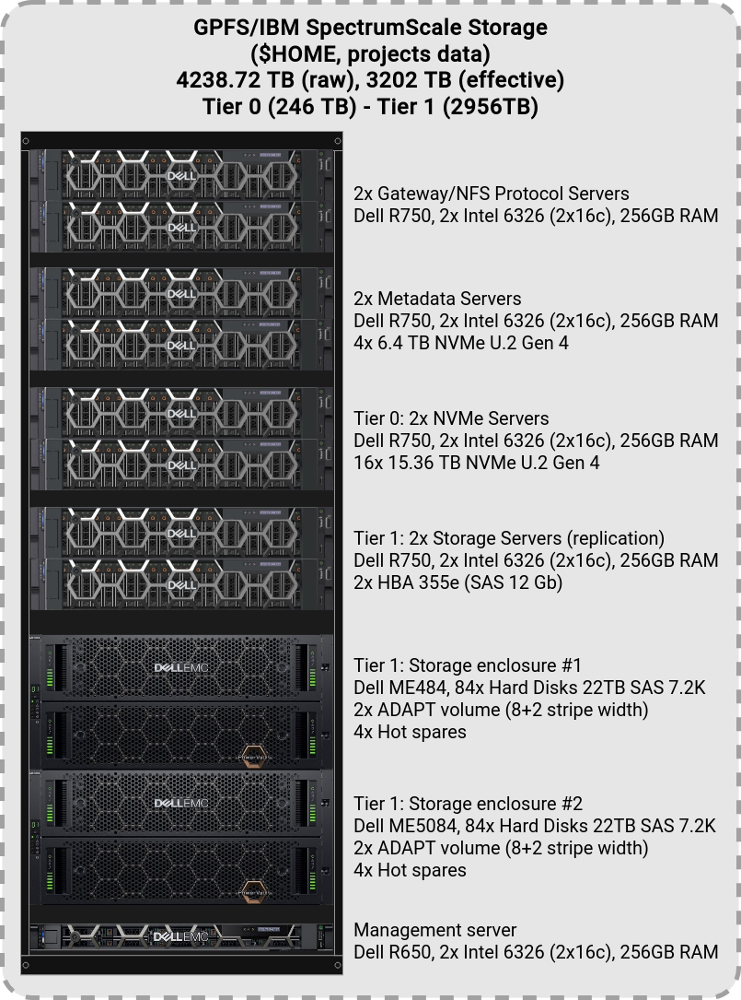

# GPFS/SpectrumScale (`$HOME`, project)

{: style="width:350px; float: right;"}

## Introduction

[IBM Spectrum Scale](https://www.ibm.com/products/scale-out-file-and-object-storage), formerly known as the General Parallel File System (GPFS), is global _high_-performance clustered file system available on all ULHPC computational systems through a [DDN GridScaler/GS7K](https://www.ddn.com/products/sfa7990x-hybrid-flash-storage-appliance/) system.

It allows sharing **homedirs and project data** between users, systems, and eventually (i.e. if needed) with the "outside world".
In terms of raw storage capacities, it represents more than **4PB** of raw space (more than **3PB** of usable space).

The filesystem is composed of two tiers, homedirs are stored on the **Tier 0** (Flash-based, 246TB) while project directories are stored on the **Tier 1** (Disk-based, 2956TB). The placement policy can be adjusted, in example, for publicly shared datasets.

* [Live status](https://hpc.uni.lu/live-status/motd/)


!!! note "`$HOME` quotas and backup policies"
    See [quotas](quotas.md) for detailed information about inode,
    space quotas, and file system purge policies.
    Your HOME is backuped weekly, according to the policy detailed in the [ULHPC backup policies](../data/backups.md).





## Storage System Implementation

The way the ULHPC GPFS file system is implemented is depicted on the below figure.

{: style="width:600px;"}

It is composed of:

* Two gateway NFS servers (see [below](#gatewaynfs-servers))
* Two metadata servers (Dell R750 containing 4x 6.4TB NVMe each)
* Two Tier 0 servers (Dell R750 containing 16x 15.36TB NVMe each), configured as replicas
* Two Tier 1 servers (Dell R750, attached to the disk enclosures below)
* One ME484 disk enclosure, containing 84x SAS hard disks of 22TB, configured in 2x [ADAPT volumes](https://www.delltechnologies.com/asset/en-gb/products/storage/industry-market/dell-powervault-me5-adapt-software-wp.pdf) plus 4x hot spares
* One ME5084 disk enclosure, containing 84x SAS hard disks of 22TB, configured in 2x [ADAPT volumes](https://www.delltechnologies.com/asset/en-gb/products/storage/industry-market/dell-powervault-me5-adapt-software-wp.pdf) plus 4x hot spares

There is no single point of failure within the storage solution and the setup is fully redundant.
The data paths from the storage to the NSD servers are redundant and providing one link from each of the servers to each controller in the storage unit. There are redundant power supplies, redundant fans, redundant storage controller with mirrored cache and battery backup to secure the cache data when power is lost completely. The data paths to the enclosures are redundant so that links can fail, and the system will still be fully operational.

??? note "(Obsolete) Initial DDN-Based GPFS infrastructure"
    Our DDN-based GPFS infrastructure has unfortunately reach End-of-Life and could not be supported anymore. It has been replaced in 2024 by the new Dell-based infrastructure described above. For the record, the following section describes the now decommissioned DDN system:

    {: style="width:600px;"}

    * Two NAS protocol servers (see [below](#nasnfs-servers)
    * One DDN GridScaler 7K system acquired [as part of RFP 160019](../systems/iris/timeline.md) deployed in 2017 and later extended, composed of
        - 1x DDN GS7K enclosure (~11GB/s IO throughput)
        - 4x SS8460 disk expansion enclosures
        - 350x HGST disks (7.2K RPM HDD, 6TB, Self Encrypted Disks (SED) configured over 35 RAID6 (8+2) pools
        - 28x Sandisk SSD 400GB disks
    * Another DDN GridScaler 7K system acquired [as part of RFP 190027](../systems/aion/timeline.md) deployed in 2020 as part of Aion  and later extended.
        - 1x DDN GS7990-EDR embedded storage
        - 4x SS9012 disk expansion enclosures
        - 360x NL-SAS HDDs (6TB, Self Encrypted Disks (SED)) configured over 36 RAID6 (8+2) pools
        - 10x 3.2TB SED SAS-SSD for metadata.

## Filesystem Performance

The performance of the storage infrastructure via native GPFS and RDMA based data transport for the HPC filesystem is expected to be:

* on Tier 0, in the range of **23GB/s** for sequential reads, and **55GB/s** for sequential writes
* on Tier 1, in the range of **10GB/s** for large sequential reads and writes
Performance measurement by [IOR](https://github.com/hpc/ior), a synthetic benchmark for testing the performance of distributed filesystems, has been performed prior to the acceptance of the storage solution.

??? info "The [IOR](https://github.com/hpc/ior) benchmark"
    [IOR](https://github.com/hpc/ior) is a parallel IO benchmark that can be used to test the performance of parallel storage systems using various interfaces and access patterns. It supports a variety of different APIs to simulate IO load and is nowadays considered as a reference Parallel filesystem I/O benchmark. It recently embedded another well-known benchmark suite called MDTest, a synthetic MPI parallel benchmark for testing the metadata performance of filesystems (such as Lustre or Spectrum Scale GPFS) where each thread is operating its own working set (to create directory/files, read files, delete files or directory tree).

## Gateway/NFS Servers

Two Gateway servers are available, each connected via 2 x IB HDR200 links to the IB fabric and exporting the filesystem via NFS and SMB over 2 x 10GE links into the Ethernet network.
