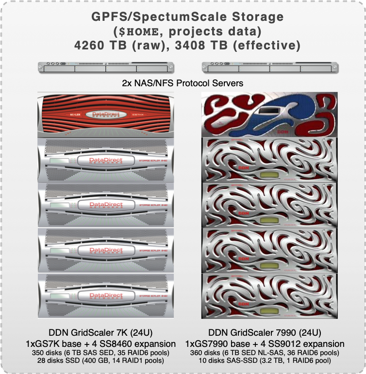

# GPFS/SpectrumScale (`$HOME`, project)

{: style="width:350px; float: right;"}

## Introduction

[IBM Spectrum Scale](https://www.ibm.com/products/scale-out-file-and-object-storage), formerly known as the General Parallel File System (GPFS), is global _high_-performance clustered file system available on all ULHPC computational systems through a [DDN GridScaler/GS7K](https://www.ddn.com/products/sfa7990x-hybrid-flash-storage-appliance/) system.

It allows sharing **homedirs and project data** between users, systems, and eventually (i.e. if needed) with the "outside world".
In terms of raw storage capacities, it represents more than **4PB**.

* [Live status](https://hpc.uni.lu/live-status/motd/)


!!! note "`$HOME` quotas and backup policies"
    See [quotas](quotas.md) for detailed information about inode,
    space quotas, and file system purge policies.
    Your HOME is daily backuped, according to the policy detailed in the [ULHPC backup policies](../data/backups.md).



!!! note "Global Project quotas and backup policies"
    See [quotas](quotas.md) for detailed information about inode,
    space quotas, and file system purge policies.
    Your global projects are daily backuped, according to the policy detailed in the [ULHPC backup policies](../data/backups.md).

!!! danger "Access rights to project directory: Quota for `clusterusers` group in project directories is 0 !!!"
    When a project `<name>` is created, a group of the same name (`<name>`) is also created and researchers allowed to collaborate on the project are made members of this group,which grant them access to the project directory.

    Be aware that your _default_ group as a user is `clusterusers` which has (_on purpose_) __a quota in project directories set to 0__.
    You thus need to ensure you always **write** data in your project directory using the `<name>` group (instead of yoru default one.).
    This can be achieved by ensuring the [setgid bit](https://en.wikipedia.org/wiki/Setuid) is set on all folders in the project directories: `chmod g+s [...]`

    When using `rsync` to transfer file toward the project directory `/work/projects/<name>` as destination, be aware that rsync will **not** use the correct permissions when copying files into your project directory. As indicated in the [Data transfer](data/transfer.md) section, you also need to:

    * give new files the destination-default permissions with `--no-p` (`--no-perms`), and
    * use the default group `<name>` of the destination dir with `--no-g` (`--no-group`)
    * (eventually) instruct rsync to preserve whatever executable permissions existed on the source file and aren't masked at the destination using `--chmod=ug=rwX`

    Your full `rsync` command becomes (adapt accordingly):

          rsync -avz {--update | --delete} --no-p --no-g [--chmod=ug=rwX] <source> /work/projects/<name>/[...]

## Storage System Implementation

The way the ULHPC GPFS file system is implemented is depicted on the below figure.

{: style="width:600px;"}

It is composed of:

* Two NAS protocol servers (see [below](#nasnfs-servers)
* One DDN GridScaler 7K system acquired [as part of RFP 160019](../systems/iris/timeline.md) deployed in 2017 and later extended, composed of
    - 1x DDN GS7K enclosure (~11GB/s IO throughput)
    - 4x SS8460 disk expansion enclosures
    - 350x HGST disks (7.2K RPM HDD, 6TB, Self Encrypted Disks (SED) configured over 35 RAID6 (8+2) pools
    - 28x Sandisk SSD 400GB disks
* Another DDN GridScaler 7K system acquired [as part of RFP 190027](../systems/aion/timeline.md) deployed in 2020 as part of Aion  and later extended.
    - 1x DDN GS7990-EDR embedded storage
    - 4x SS9012 disk expansion enclosures
    - 360x NL-SAS HDDs (6TB, Self Encrypted Disks (SED)) configured over 36 RAID6 (8+2) pools
    - 10x 3.2TB SED SAS-SSD for metadata.

There is no single point of failure within the storage solution and the setup is fully redundant.
The data paths from the storage to the NSD servers are redundant and providing one link from each of the servers to each controller in the storage unit. There are redundant power supplies, redundant fans, redundant storage controller with mirrored cache and battery backup to secure the cache data when power is lost completely. The data paths to the enclosures are redundant so that links can fail, and the system will still be fully operational.

## Filesystem Performance

The performance of the GS7990 storage system via native GPFS and RDMA based data transport for the HPC filesystem is expected to be in the range of at least **20GB/s** for large sequential read and writes, using a filesystem block size of 16MB and scatter or cluster allocation.
Performance measurement by [IOR](https://github.com/hpc/ior), a synthetic benchmark for testing the performance of distributed filesystems is planned upon finalization of the installation.

??? info "The [IOR](https://github.com/hpc/ior) benchmark"
    [IOR](https://github.com/hpc/ior) is a parallel IO benchmark that can be used to test the performance of parallel storage systems using various interfaces and access patterns. It supports a variety of different APIs to simulate IO load and is nowadays considered as a reference Parallel filesystem I/O benchmark. It recently embedded another well-known benchmark suite called MDTest, a synthetic MPI parallel benchmark for testing the metadata performance of filesystems (such as Lustre or Spectrum Scale GPFS) where each thread is operating its own working set (to create directory/files, read files, delete files or directory tree).

In complement to IOR, the [IO-500](https://www.vi4io.org/std/io500/) benchmarking suite (see also the white paper "[Establishing the IO-500 Benchmark](https://www.vi4io.org/_media/io500/about/io500-establishing.pdf)") will be performed.
IO-500 aims at capturing user-experienced performance with measured performance representative for:

* applications with well optimised I/O patterns;
* applications with random-like workloads;
* workloads involving metadata small/objects.

## NAS/NFS Servers

Two NAS protocol servers are available, each connected via 2 x IB EDR links to the IB fabric and exporting the filesystem via NFS and SMB over 2 x 10GE links into the Ethernet network.
