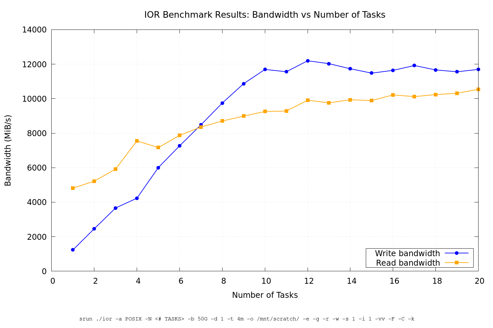
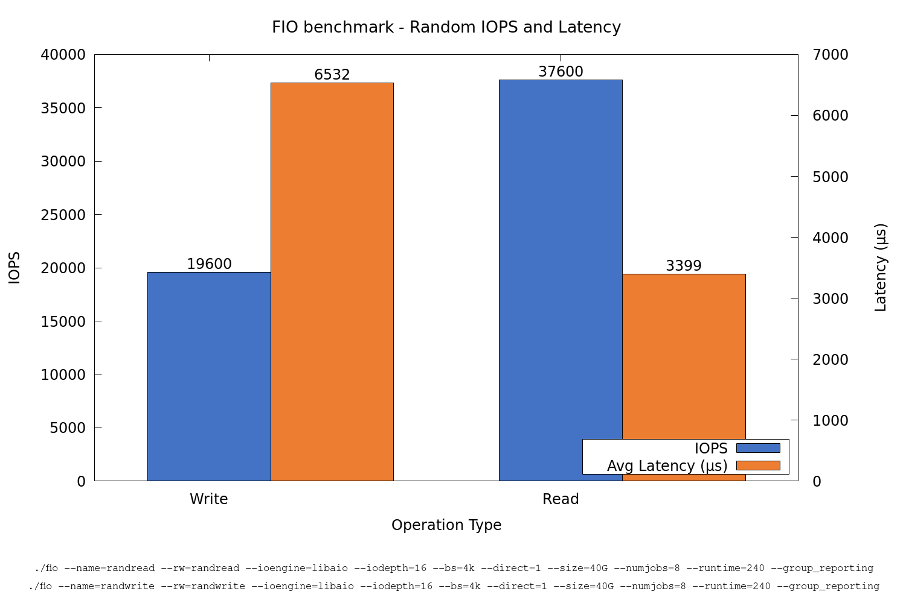
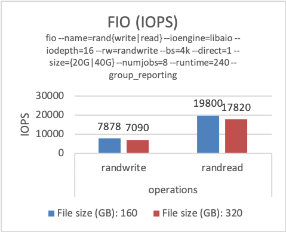

# Lustre (`$SCRATCH`)

{: style="width:350px; float: right;"}

## Introduction

The [Lustre](http://lustre.org/) file system is an open-source, parallel file system that supports many requirements of leadership class HPC simulation environments.

It is available as a global _high_-performance file system on all ULHPC computational systems through a [DDN ExaScaler](https://www.ddn.com/products/lustre-file-system-exascaler/) system.

It is meant to host **temporary scratch data** within your jobs. In terms of raw storage capacities, it represents more than **2PB**.

## Scratch directory `($SCRATCH)`

<!--scratch-mount-start-->

The _scratch_ area is a [Lustre](http://lustre.org/)-based file system that provides high performance temporary storage of large files and is accessible across all cluster nodes. Use scratch to store working files and temporary large data files.

- The scratch file system is not fully redundant, so do not use scratch to store files that cannot be recreated. For instance store only simulation output that can be recalculated.

!!! warning "Small file and random I/O"
    The scratch is best used to write large files in a continuous manner. Even though the Lustre file system can handle small file and random I/O better that our GPFS system, it still slows down considerably as the number of I/O operations increases. Typical example of operations with a lot random and small file I/O operations in the parallel compilation of large projects.

    Prefer the locally mounted file system in `/tmp` for small file and random I/O.

??? info "Origin of the term scratch"
    The term scratch originates from [scratch data tapes](https://en.wikipedia.org/wiki/Scratch_tape). People uses scratch tapes to write and read data that did not fit into the main memory, and since it was a tape, it could only perform continuous I/O. The term scratch is a bit abused in modern times as most storage systems nowadays support random access. In the case of the lustre system in UL HPC, the terms scratch serves as a reminder that the file system is best used for contiguous I/O, even though it supports random access quite well.

The environment variable `${SCRATCH}` (which expands to `/scratch/users/$(whoami)`) points to a users scratch directory. The absolute path may change, but the value of `${SCRATCH}` will always be correct.

<!--scratch-mount-end-->

!!! warning "ULHPC `$SCRATCH` quotas and backup"
    Extended ACLs are provided for sharing data with other users using fine-grained control. See [quotas](quotas.md) for detailed information about inode, space quotas, and file system policies. In particular, your `$SCRATCH` directory is [**NOT** backuped](../data/backups.md) according to the policy detailed in the [ULHPC backup policies](../data/backups.md).

## General Architecture

A Lustre file system consists of three major functional units:

- One or more MetaData Server (MDS) nodes (typically two in high-availability configurations) that host one or more MetaData Target (MDT) devices per Lustre filesystem. These store namespace metadata, such as filenames, directories, access permissions, and file layouts. The MDT data is stored in a local disk filesystem. Unlike block-based distributed filesystems (such as GPFS/SpectrumScale and PanFS) where the metadata server controls all block allocation,
  the Lustre metadata server is only involved in pathname and permission checks. It is not involved in file I/O operations, which avoids I/O scalability bottlenecks on the metadata server.

- One or more Object Storage Server (OSS) nodes that store file data on one or more Object Storage Target (OST) devices. The capacity of a Lustre file system is the sum of the capacities provided by the OSTs.

- Client(s) that access and use the data. Lustre presents all clients with a unified namespace for all files and data in the filesystem, using standard POSIX semantics, and allows concurrent and coherent read/write access.

??? info "Lustre general features and numbers"
    Lustre utilizes a modern architecture within an object-based file system with the following features:

    - **Adaptable:** Supports a wide range of networks and storage hardware.
    - **Scalable:** Distributed file object handling for 100,000 clients or more.
    - **Stability:** Production-quality stability and failover capabilities.
    - **Modular:** Interfaces allow for easy adaptation.
    - **Highly Available:** No single point of failure when configured with HA software.
    - **Big and Expandable:** Allows for multiple PBs (proven >700 PB) in a single namespace.
    - **Open-source:** Community-driven development.

    Lustre provides a POSIX-compliant layer supported on most Linux flavors. In terms of raw capabilities, Lustre supports:

    - **Max system size:** > 700 PB (Production), ~16 EB (Theoretical)
    - **Max file size:** 16EB
    - **Max number of files**: Per Metadata Target (MDT): 256 trillion files, up to 128 MDTs per filesystem.

??? warning "When to use Lustre?"
    - Lustre is optimized for:
      - Large files
      - Sequential throughput
      - Parallel applications writing to different parts of a file
    - Lustre will not perform well for:
      - Lots of small files
      - High volume of metadata requests (though this has improved in newer versions with DNE and DoM)
      - Inefficient storage usage on the OSTs (due to stripe overhead on small files)

## Storage System Implementation

The way the ULHPC Lustre file system is implemented is depicted on the below figure.

{: style="width:800px;"}

Acquired [as part of RFP 190027](../systems/aion/timeline.md), the ULHPC configuration has been converted to Lustre in 2025. It is based upon:

- 1x DDN EXAScaler Lustre building block that consist of:
  - 1x DDN ES7990 base enclosure and its controller pair with 4x EDR ports
  - 1x DDN SS9012 disk expansion enclosure (84-slot drive enclosures)
- 365x HGST hard disks (7.2K RPM SAS HDD, 6TB, Self Encrypted Disks (SED))
  - including 11x hard disks configured as hot spares
- 11x Western Digital SSDs (3.2TB SAS SSD, Self Encrypted Disks (SED))
  - including 1x SSD configured as hot spare
- 8x Lustre OSTs (composed each of a single pool of 44 hard disks), 4x OSTs per controller
- 2x Lustre MDTs (one pool of 10 SSDs, split in two), 1x MDT per controller

Each ES7990 controller hosts a VM which takes simultaneously the role of MDS and OSS.

## Filesystem Performance

The performance of the ULHPC Lustre filesystem is expected to be in the range of **12GB/s** for large sequential read and writes.

### IOR

Upon release of the system, performance measurement by [IOR](https://github.com/hpc/ior), a synthetic benchmark for testing the performance of distributed filesystems, was run for an increasing number of clients.



As can be seen, aggregated writes and reads exceed 10 GB/s (depending on the test).

### FIO

Random IOPS benchmark was performed using [FIO](http://freecode.com/projects/fio) with 40 GB file size over 8 jobs, leading to the following total size of 320 GB

- 320 GB is > 2$\times$ RAM size of the OSS nodes (128 GB RAM)



### MDTEST

[Mdtest](https://github.com/hpc/ior) (based on commit `8ab8f69`) was used to benchmark the metadata capabilities of the delivered system.

- **Command:** `srun ./src/mdtest -I 10 -i 2 -z 5 -b 5 -d /mnt/scratch`
- **Total Files/Directories:** 781,200
- **Iterations:** 2

!!! note "Performance Summary (ops/sec)"
    | Operation | Max | Min | Mean | Std Dev |
    |-----------|-----|-----|------|---------|
    | **Directory creation** | 56,112.297 | 47,185.542 | 51,648.919 | 6,312.169 |
    | **Directory stat** | 112,792.868 | 108,292.666 | 110,542.767 | 3,182.123 |
    | **Directory rename** | 11,140.224 | 10,873.192 | 11,006.708 | 188.820 |
    | **Directory removal** | 43,603.447 | 42,018.133 | 42,810.790 | 1,120.986 |
    | **File creation** | 29,460.234 | 29,213.145 | 29,336.689 | 174.719 |
    | **File stat** | 63,632.394 | 25,981.892 | 44,807.143 | 26,622.926 |
    | **File read** | 54,625.837 | 52,404.959 | 53,515.398 | 1,570.398 |
    | **File removal** | 36,589.845 | 30,940.332 | 33,765.088 | 3,994.809 |
    | **Tree creation** | 4,213.393 | 3,825.638 | 4,019.515 | 274.184 |
    | **Tree removal** | 1,654.506 | 1,524.128 | 1,589.317 | 92.191 |
  
## Lustre Usage



??? note "(Obsolete) Initial ExaScaler infrastructure ([as part of RFP 170035](../systems/iris/timeline.md#october-2017))"

    Until end of 2025, the Iris and Aion cluster used a different DDN ExaScaler infrastructure.
    Due to the end of support and warranty, we have migrated all the data to the new system described above.
    For the record, this is a description of the old system.

    {: style="width:800px;"}

    - a set of 2x EXAScaler Lustre building blocks that _each_ consist of:
      - 1x DDN SS7700 base enclosure and its controller pair with 4x FDR ports
      - 1x DDN SS8460 disk expansion enclosure (84-slot drive enclosures)
    - OSTs: 160x SEAGATE disks (7.2K RPM HDD, 8TB, Self Encrypted Disks (SED))
      - configured over 16 RAID6 (8+2) pools and extra disks in spare pools
    - MDTs: 18x  HGST disks (10K RPM HDD, 1.8TB,  Self Encrypted Disks (SED))
      - configured over 8 RAID1 pools and extra disks in spare pools
    - Two redundant MDS servers
      - Dell R630,   2x Intel Xeon E5-2667v4 @ 3.20GHz [8c], 128GB RAM
    - Two redundant OSS servers
      - Dell R630XL, 2x Intel Xeon E5-2640v4 @ 2.40GHz [10c], 128GB RAM

    | Criteria        | Value  |
    |-----------------|--------|
    | Power (nominal) | 6.8 KW |
    | Power (idle)    | 5.5 KW |
    | Weight          | 432 kg |
    | Rack Height     | 22U    |

    
    
    

    ```bash
    $ lfs df -h
    UUID                       bytes        Used   Available Use% Mounted on
    lscratch-MDT0000_UUID        3.2T       16.3G        3.1T   1% /mnt/lscratch[MDT:0]
    lscratch-MDT0001_UUID        3.2T       12.1G        3.1T   1% /mnt/lscratch[MDT:1]
    lscratch-OST0000_UUID       57.4T       27.4T       29.4T  49% /mnt/lscratch[OST:0]
    lscratch-OST0001_UUID       57.4T       25.7T       31.2T  46% /mnt/lscratch[OST:1]
    lscratch-OST0002_UUID       57.4T       25.4T       31.5T  45% /mnt/lscratch[OST:2]
    lscratch-OST0003_UUID       57.4T       23.7T       33.2T  42% /mnt/lscratch[OST:3]
    lscratch-OST0004_UUID       57.4T       27.7T       29.2T  49% /mnt/lscratch[OST:4]
    lscratch-OST0005_UUID       57.4T       29.2T       27.6T  52% /mnt/lscratch[OST:5]
    lscratch-OST0006_UUID       57.4T       26.1T       30.7T  46% /mnt/lscratch[OST:6]
    lscratch-OST0007_UUID       57.4T       25.7T       31.2T  46% /mnt/lscratch[OST:7]
    lscratch-OST0008_UUID       57.4T       25.5T       31.4T  45% /mnt/lscratch[OST:8]
    lscratch-OST0009_UUID       57.4T       25.6T       31.3T  45% /mnt/lscratch[OST:9]
    lscratch-OST000a_UUID       57.4T       26.0T       30.8T  46% /mnt/lscratch[OST:10]
    lscratch-OST000b_UUID       57.4T       25.0T       31.9T  44% /mnt/lscratch[OST:11]
    lscratch-OST000c_UUID       57.4T       25.2T       31.6T  45% /mnt/lscratch[OST:12]
    lscratch-OST000d_UUID       57.4T       24.8T       32.0T  44% /mnt/lscratch[OST:13]
    lscratch-OST000e_UUID       57.4T       24.3T       32.6T  43% /mnt/lscratch[OST:14]
    lscratch-OST000f_UUID       57.4T       25.2T       31.6T  45% /mnt/lscratch[OST:15]

    filesystem_summary:       919.0T      412.4T      497.3T  46% /mnt/lscratch
    ```
