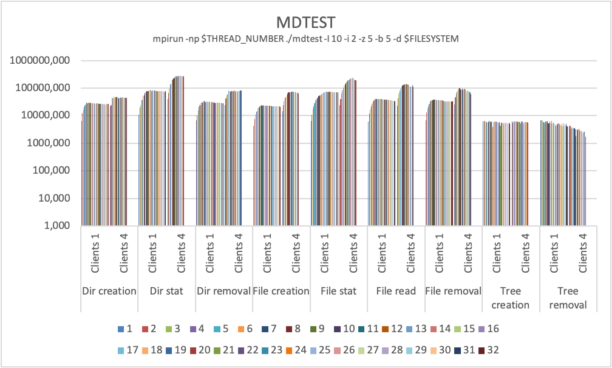

# Lustre (`$SCRATCH`)

{: style="width:350px; float: right;"}

## Introduction

The [Lustre](http://lustre.org/) file system is an open-source, parallel file system that supports many requirements of leadership class HPC simulation environments.

It is available as a global _high_-performance file system on all ULHPC computational systems through a [DDN ExaScaler](https://www.ddn.com/products/lustre-file-system-exascaler/) system.

It is meant to host **temporary scratch data** within your jobs.
In terms of raw storage capacities, it represents more than **1.6PB**.

## Scratch directory `(${SCRATCH})`

<!--scratch-mount-start-->

The _scratch_ area is a [Lustre](http://lustre.org/)-based file system that provides high performance temporary storage of large files and is accessible across all cluster nodes. Use scratch to store working files and temporary large data files.

- The scratch file system is not fully redundant, so do not use scratch to store files that cannot be recreated. For instance store only simulation output that can be recalculated.

!!! warning "Small file and random I/O"

    The scratch is best used to write large files in a continuous manner. Even though the Lustre file system can handle small file and random I/O better that our GPFS system, it still slows down considerably as the number of I/O operations increases. Typical example of operations with a lot random and small file I/O operations in the parallel compilation of large projects.

    Prefer the locally mounted file system in `/tmp` for small file and random I/O.

??? info "Origin of the term scratch"

    The term scratch originates from [scratch data tapes](https://en.wikipedia.org/wiki/Scratch_tape). People uses scratch tapes to write and read data that did not fit into the main memory, and since it was a tape, it could only perform continuous I/O. The term scratch is a bit abused in modern times as most storage systems nowadays support random access. In the case of the lustre system in UL HPC, the terms scratch serves as a reminder that the file system is best used for contiguous I/O, even though it supports random access quite well.

The environment variable `${SCRATCH}` (which expands to `/scratch/users/$(whoami)`) points to a users scratch directory. The absolute path may change, but the value of `${SCRATCH}` will always be correct.

<!--scratch-mount-end-->

!!! warning "ULHPC `$SCRATCH` quotas and backup"
    Extended ACLs are provided for sharing data with other users using fine-grained control.
    See [quotas](quotas.md) for detailed information about inode, space quotas, and file system policies.
    In particular, your SCRATCH directory is [**NOT** backuped](../data/backups.md) according to the policy detailed in the [ULHPC backup policies](../data/backups.md).

??? info "A short history of Lustre"
    [Lustre](http://lustre.org/) was initiated & funded by the U.S. Department of Energy Office of Science & National Nuclear Security Administration laboratories in mid 2000s. Developments continue through the Cluster File Systems (ClusterFS) company founded in 2001.
    Sun Microsystems acquired ClusterFS in 2007 with the intent to bring Lustre technologies to Sun's ZFS file system and the Solaris operating system. In 2010, Oracle bought Sun and began to manage and release Lustre, however the company was not known for HPC.
    In December 2010, Oracle announced that they would cease Lustre 2.x development and place Lustre 1.8 into maintenance-only support, creating uncertainty around the future development of the file system. Following this announcement, several new organizations sprang up to provide support and development in an open community development model, including [Whamcloud](https://whamcloud.com/), Open Scalable File Systems  ([OpenSFS](http://www.opensfs.org/),  a nonprofit organization promoting the Lustre file system to ensure Lustre remains vendor-neutral, open, and free), Xyratex or DDN.
    By the end of 2010, most Lustre developers had left Oracle.

    WhamCloud was bought by Intel in 2011 and Xyratex took over the Lustre trade mark, logo, related assets (support) from Oracle.
    In June 2018, the Lustre team and assets were acquired from Intel by DDN.
    DDN organized the new acquisition as an independent division, reviving the Whamcloud name for the new division.

## General Architecture

A Lustre file system has three major functional units:

* One or more __MetaData Servers (MDS)__ nodes (here two) that have one or more _MetaData Target (MDT)_ devices per Lustre filesystem that stores namespace metadata, such as filenames, directories, access permissions, and file layout. The MDT data is stored in a local disk filesystem. However, unlike block-based distributed filesystems, such as GPFS/SpectrumScale and PanFS, where the metadata server controls all of the block allocation, the Lustre metadata server is only involved in pathname and permission checks, and is not involved in any file I/O operations, avoiding I/O scalability bottlenecks on the metadata server.
* One or more __Object Storage Server (OSS)__ nodes that store file data on one or more _Object Storage Target (OST)_ devices.
     - The capacity of a Lustre file system is the sum of the capacities provided by the OSTs.
     - OSSs do most of the work and thus require as much RAM as possible
         * Rule of thumb: ~2 GB base memory + 1 GB / OST
         * Failover configurations: ~2 GB / OST
     - OSSs should have as much CPUs as possible, but it is not as much critical as on MDS
* Client(s) that access and use the data. Lustre presents all clients with a _unified_ namespace for all of the files and data in the filesystem, using standard POSIX semantics, and allows concurrent and coherent read and write access to the files in the filesystem.

??? info "Lustre general features and numbers"
    [Lustre](http://lustre.org/) brings a modern architecture within an Object based file system with the following features:

    * _Adaptable_: supports wide range of networks and storage hardware
    * _Scalable_: Distributed file object handling for 100.000 clients and more
    * _Stability_: production-quality stability and failover
    * _Modular_: interfaces for easy adaption
    * _Highly Available_: no single point of failure when configured with HA software
    * _BIG_ and _exapandable_: allow for multiple PB in one namespace
    * _Open-source_ and community driven.

    Lustre provides a POSIX compliant layer supported on most Linux flavours.
    In terms of raw number capabilities for the Lustre:

    * Max system size: about 64PB
    * Max number of OSTs: 8150
    * Max number of MDTs: multiple per filesystem supported since Lustre 2.4
    * Files per directory: 25 Millions (**don't run `ls -al`)
    * Max stripes: 2000 since Lustre 2.2
    * Stripe size: Min 64kB -- Max 2TB
    * Max object size: 16TB(`ldiskfs`) 256PB (ZFS)
    * Max file size: 31.35PB (`ldiskfs`) 8EB (ZFS)

??? warning "When to use Lustre?"
    * Lustre is **optimized for**:
        - Large files
        - Sequential throughput
        - Parallel applications writing to different parts of a file
    * Lustre will **not** perform well for
        - Lots of small files
        - High number of meta data requests, improved on new versions
        - Waste of space on the OSTs

* [Understanding the Lustre Filesystems](#lustre-usage)

## Storage System Implementation

The way the ULHPC Lustre file system is implemented is depicted on the below figure.

{: style="width:800px;"}

Acquired [as part of RFP 170035](../systems/iris/timeline.md#october-2017), the ULHPC configuration is based upon:

* a set of 2x EXAScaler Lustre building blocks that _each_ consist of:
    - 1x DDN SS7700 base enclosure and its controller pair with 4x FDR ports
    - 1x DDN SS8460 disk expansion enclosure (84-slot drive enclosures)
* OSTs: 160x SEAGATE disks (7.2K RPM HDD, 8TB, Self Encrypted Disks (SED))
    - configured over 16 RAID6 (8+2) pools and extra disks in spare pools
* MDTs: 18x  HGST disks (10K RPM HDD, 1.8TB,  Self Encrypted Disks (SED))
    - configured over 8 RAID1 pools and extra disks in spare pools
* Two redundant MDS servers
    - Dell R630,   2x Intel Xeon E5-2667v4 @ 3.20GHz [8c], 128GB RAM
* Two redundant OSS servers
    - Dell R630XL, 2x Intel Xeon E5-2640v4 @ 2.40GHz [10c], 128GB RAM

| Criteria        | Value  |
|-----------------|--------|
| Power (nominal) | 6.8 KW |
| Power (idle)    | 5.5 KW |
| Weight          | 432 kg |
| Rack Height     | 22U    |

LNet is configured to be performed with OST based balancing.

## Filesystem Performance

The performance of the ULHPC Lustre filesystem is expected to be in the range of at least **15GB/s** for large sequential read and writes.

### IOR

Upon release of the system, performance measurement by [IOR](https://github.com/hpc/ior), a synthetic benchmark for testing the performance of distributed filesystems, was run for an increasing number of clients as well as with 1kiB, 4kiB, 1MiB and 4MiB transfer sizes.

As can be seen, aggregated writes and reads exceed 15 GB/s (depending on the test) which meets the minimum requirement.

### FIO

Random IOPS benchmark was performed using [FIO](http://freecode.com/projects/fio) with 20 and 40 GB file size over 8 jobs, leading to the following total size of 160GB and 320 GB

* 320 GB is > 2$\times$ RAM size of the OSS node (128 GB RAM)
* 160 GB is > 1$\times$ RAM size of the OSS node (128 GB RAM)

### MDTEST

[Mdtest](https://github.com/MDTEST-LANL/mdtest.git) (based on the `7c0ec41` on September 11 , 2017 (based on v1.9.3)) was used to benchmark the metadata capabilities of the delivered system.
HT was turned on to be able to run 32 threads.

Mind the logarithmic Y-Axis.
Tests on 4 clients with up to 20 threads have been included as well to show the scalability of the system.

## Lustre Usage


