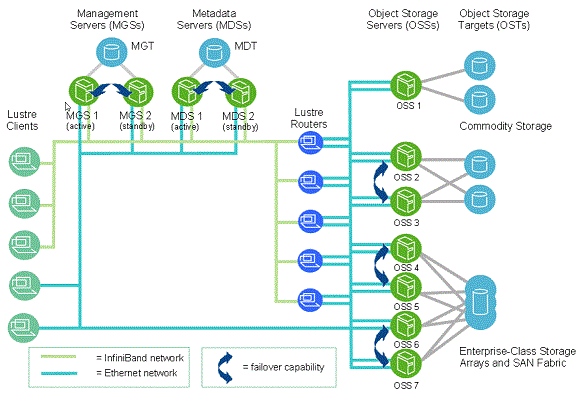

# Quotas 

## Overview

<!--overview-start-->

Users and project groups are assigned a fixed amount of storage. There are quota limits in terms of storage space and number of files (inodes). When a quota limit is reached writes to the relevant directories will fail. The storage limits are described below.

!!! info "Quota limits in cluster file systems"

    | Directory                             | Default space quota            | Default inode quota | 
    |---------------------------------------|--------------------------------|---------------------|
    | `${HOME}`                             | 500 GB                         | 1 M                 |
    | `${SCRATCH}`                          | 10 TB                          | 1 M                 |
    | `${PROJECTHOME}/<project name>`       | 1 TB<sup>[1]</sup>             | 1 M<sup>[1]</sup>   |
    | `/mnt/isilon/projects/<project name>` | 1.14 PB globally<sup>[2]</sup> | -                   |

    1. This is the default and free of charge allocation for projects; requests for more space may incur charges.
    2. On Isilon all projects share one global quota limit and the HPC Platform team sets up individual project quotas. Unfortunately it is not currently possible for users to see the quota status on Isilon.

??? info "Why `inodes` are limited in cluster file systems"

    In Unix-style disk file systems, [inodes](https://en.wikipedia.org/wiki/Inode) (index node) is a data structure that contains basic information about each file, such as where the data contained in the file is stored. In conventional file systems inodes stored on the disk together with the data are sufficient to direct the data access. Cluster file systems such as Lustre however, have a more complex architecture (building on top of conventional file systems) to accelerate data access.

    - Data is stored in Object Storage Target (OST) devices, with each OST managing a single local disk filesystem.
    - Data in OST is accessed through Object Storage Servers (OSS), with a typically OSS serving between two and eight OSTs.
    - Inodes in the Lustre file system are stored in Metadata Storage Target (MDT) devices, and point to one or more OST objects associated with the file (rather than the underlying file data blocks on the local disk file systems).
    - Data in MDT devices are access through MetaData Servers (MDSs).

    Clients connect to MDSs, access Lustre inodes for the files they need to access, and then connect to OSSs to retrieve the file data.

    {width="400" style="display: block; margin: 0 auto"}

    The critical restriction in the data access pattern is that the storage in MDT devices is limited. MDT devices are typically based on high throughput and IOPS, and low latency SSD devices. For instance TLC SSDs are used in MDTs where as QLC SSDs or even HDDs are used in OSTs. At the same time, MDS have limited capacity to support MDTs per server, and as they support [fast interconnect](/interconnect/ib/) MDSs are also expensive.

    _Thus, the overall MDS capacity and therefore the number of inodes is limited by the cost of fast metadata storage._

<!--overview-end-->

## Storage usage information

The UL HPC systems provide the `df-ulhpc` command on the cluster login nodes, which displays current usage, soft quota, hard quota and grace period. Any directories that have exceeded the quota will be highlighted in red.

- Check current space quota status:
  ```
  df-ulhpc
  ```
- Check current inode quota status:
  ```
  df-ulhpc -i
  ```

Quota limits are applied over 2 time periods. Once you reach the soft quota you can still write data until the grace period expires (7 days) or you reach the hard quota. After you reach the end of the grace period or the hard quota, you have to reduce your usage to below the soft quota to be able to write data again.

!!! warning

    Do not forget that inodes are also limited! If you are not exceeding the space quota limits according to the output of `df-ulhpc` and you cannot write files, try `df-ulhpc -i` to check is you exceed the inode limits.

!!! info "Quota on Isilon"

    On Isilon all projects share one global quota limit and the HPC Platform team sets up individual project quotas. Unfortunately it is not currently possible for users to see the quota status on Isilon with the `df-ulhpc` command.

    If you notice that writes on directories stored on Isilon fail, this is probably due to storage exceeding the assigned quota. Contact the UL HPC team for further instructions.

### Detail information about storage usage

Quite often you exceed the quota limits, but you don't know exactly which files and directories contribute more towards the quota numbers. To detect the exact source of storage and inode usage, you can use the `du` command.

- To print information about space usage:
  ```bash
  du --max-depth=<depth> --human-readable <directory>
  ```
- To print information about inode usage:
  ```bash
  du --max-depth=<depth> --human-readable --inodes <directory>
  ```

The flag options and the arguments used are:

- _depth_: the resource (space or inodes) usage for any file from _depth_ and bellow is summed in the report for the directory at level _depth_ in which the file belongs, and
- _directory_: the directory for which the analysis is curried out; leaving empty performs the analysis in the current working directory.

For a more graphical approach, use `ncdu`. With the `c` option `ncdu` displays the aggregate inode number for the directories in the current working directory.

### Information about global storage usage

Sometimes it may be useful to inspect the global file system usage. For instance, the `${SCRATCH}` space is over subscribed, and you may experience a slowdown if the storage is reaching its limits.

- Check free space on all file systems:
  ```
  df -h
  ```
- Check free space on the file system containing a given path:
  ```
  df -h <path>
  ```

## Increasing quota

Quotas for `${HOME}` and `${SCRATCH}` are fixed on a per user and cannot change.

If your project needs additional space or inodes for a specific project directory you may request it via [ServiceNow](https://hpc.uni.lu/support/) (HPC &rarr; Storage & projects &rarr; Extend quota).

## Troubleshooting

The quotas on project directories are based on the group. Be aware that the quota for the default user group `clusterusers` is 0. If you get a quota error, but `df-ulhpc` and `df-ulhpc -i` confirm that the quota is not expired, you are most likely trying to write a file with the group `clusterusers` instead of the project group.

To avoid this issue, check out the `newgrp` command or set the `s` mode bit ("set group ID") on the directory with `chmod g+s <directory>`. The `s` bit means that any file or folder created below will inherit the group.

To transfer data with `rsync` into a project directory, please check the [data transfer documentation](/data/transfer/#transfer-from-your-local-machine-to-a-project-directory-on-the-remote-cluster).
