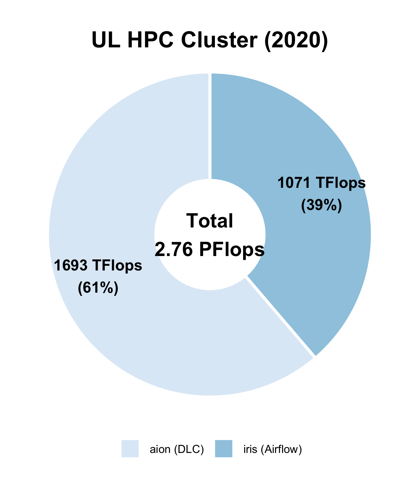

# Getting Started on ULHPC Facilities

Welcome to the High Performance Computing (HPC) Facility of the University of Luxembourg (ULHPC)!

!!! success "About this page"
	This document will guide you through the basics of using ULHPC's
	supercomputers, storage systems, and services.

## What is ULHPC ?

HPC is crucial in academic environments to achieve high-quality results in all application areas.
All world-class universities require this type of facility to accelerate its research and ensure cutting-edge results in time to face the global competition.

??? info "What is High Performance Computing?"
    If you're new to all of this, this is probably the first question you have in mind. Here is a possible definition:

    "_High Performance Computing (HPC) most generally refers to the practice of aggregating computing power in a way that delivers much higher performance than one could get out of a typical desktop computer or workstation in order to solve large problems in science, engineering, or business._"

    Indeed, with the advent of the technological revolution and the digital transformation that made all scientific disciplines becoming computational nowadays, High-Performance Computing (HPC) is increasingly identified as a **strategic asset** and enabler to **accelerate** the research performed in all areas requiring intensive computing and large-scale Big Data analytic capabilities. Tasks which would typically require several years or centuries to be computed on a typical desktop computer may only require a couple of hours, days or weeks over an HPC system.

    For more details, you may want to refer to this [Inside HPC article](https://insidehpc.com/hpc-basic-training/what-is-hpc/).

Since 2007, the [University of Luxembourg](https://www.uni.lu) (UL) has invested tens of millions of euro into its own HPC facilities to responds to the growing needs for increased computing and storage.
[ULHPC](https://hpc.uni.lu) (sometimes referred to as Uni.lu HPC) is the entity  providing High Performance Computing and Big Data Storage services and support for UL researchers and its external partners.
Led by Dr. [Sébastien Varrette](https://varrette.gforge.uni.lu), the [ULHPC](https://hpc.uni.lu) facilities are located on the [Belval campus](https://wwwen.uni.lu/contact/campus_de_belval), offering a **cutting-edge research infrastructure to Luxembourg public research** while serving as _edge_ access to the Euro-HPC Luxembourg supercomputer "MeluXina" operated by [LuxProvide S.A](https://lxp.lu), the National HPC center.

!!! warning
    In particular, the [ULHPC](https://hpc.uni.lu) is **NOT** the national HPC center of Luxembourg, but simply one of its strategic partner operating the second largest HPC facility of the country.

The HPC facility is one element of the extensive digital research infrastructure and expertise developed by the University over the last years. It also supports the University’s ambitious digital strategy and in particular the creation of a Facility for Data and HPC Sciences. This facility aims to provide a world-class user-driven digital infrastructure and services for fostering the development of collaborative activities related to frontier research and teaching in the fields of Computational and Data Sciences, including High Performance Computing, Data Analytics, Big Data Applications, Artificial Intelligence and Machine Learning.

--------------------------------------------------------
## Supercomputing and Storage Resources at a glance

[ULHPC](https://hpc.uni.lu) is a strategic asset of the university and an important factor for the scientific and therefore also economic competitiveness of the Grand Duchy of Luxembourg.
We provide a key research infrastructure featuring state-of-the-art computing and storage resources serving the UL HPC community primarily composed by UL researchers.

The UL HPC platform has kept growing over time thanks to the continuous efforts of the core HPC team (Dr. S. Varrette, S. Peter, H. Cartiaux, Dr. F. Pinel, Dr. E. Kieffer, Dr. E. Krishnasamy, T. Valette, A. Olloh) - contact: [hpc-team@uni.lu](mailto:hpc-team@uni.lu), recently completed with the [EuroHPC Competence Center](https://www.eurocc-project.eu/) Task force (A. Vandeventer (Project Manager), L. Koutsantonis).

!!! info "ULHPC Computing and Storage Capacity (2021)"
    Installed in the premises of the University’s _Centre de Calcul_ (CDC), the UL HPC facilities provides a total computing capacity of __2.76 PetaFlops__ and a shared storage capacity of around **10 PetaBytes**.

??? question "How big is 1 PetaFlops? 1 PetaByte?"
    * 1 PetaFlops = 1015 floating-point operations per second (PFlops or PF for short), corresponds to the cumulative performance of more than 3510 Macbook Pro 13" laptops [^1], or 7420 iPhone XS [^2]
    * 1 PetaByte = 1015 bytes = 8*1015 bits, corresponding to the cumulative raw capacity of more than 975 SSDs 512GB.

{: style="width:325px;"}
{: style="width:325px;"}

This places the HPC center of the University of Luxembourg as one of the major actors in HPC and Big Data for the Greater Region Saar-Lor-Lux.

In practice, the UL HPC Facility features 3 types of computing resources:

* "__regular__" nodes: Dual CPU, no accelerators, 128 to 256 GB of RAM
* "__gpu__" nodes:     Dual CPU, 4 Nvidia accelerators, 768 GB RAM
* "__bigmem__" nodes:  Quad-CPU, no accelerators, 3072 GB RAM

These resources can be reserved and allocated for the execution of jobs scheduled on the platform thanks to a Resource and Job Management Systems (RJMS) - [Slurm](https://slurm.schedmd.com/documentation.html) in practice. This tool allows for a fine-grain analysis and accounting of the used resources, facilitating the generation of activity reports for a given time period.

[^1]: The best MacBook Pro 13" in 2020 is equiped with Ice Lake 2 GHz Intel Quad-Core i5 processors with an estimated computing performance of 284.3 Gflops as measured by the [Geekbench 4 multi-core benchmarks platform, with SGEMM](https://browser.geekbench.com/v4/cpu/15611876)

[^2]: Apple A12 Bionic, the 64-bit ARM-based system on a chip (SoC) proposed on the iPhone XS has an estimated performance of 134.7 GFlops as measured by the [Geekbench 4 multi-core benchmarks platform, with SGEMM](https://browser.geekbench.com/v4/cpu/15612041)

### Iris

[`iris`](systems/iris/index.md), in production since June 2017, is a Dell/Intel supercomputer with a theoretical peak performance of **1082 TFlop/s**, featuring 196 computing nodes (totalling 5824 computing cores) and 96 GPU accelerators (NVidia V100).

* [Detailed system specifications](systems/iris/index.md)
* [Live status](https://hpc.uni.lu/live-status/motd/)

### Aion

[`aion`](systems/aion/index.md), in production since October 2020, is a [Bull Sequana XH2000](https://atos.net/en/solutions/high-performance-computing-hpc/bullsequana-x-supercomputers)/AMD supercomputer offering a peak performance of **1692 TFlop/s**, featuring 318 compute nodes (totalling 40704 computing cores).

* [Detailed system specifications](systems/aion/index.md)
* [Live status](https://hpc.uni.lu/live-status/motd/)

### GPFS/SpectrumScale File System (`$HOME`, project)

[IBM Spectrum Scale](https://www.ibm.com/products/scale-out-file-and-object-storage), formerly known as the General Parallel File System (GPFS), is global _high_-performance clustered file system available on all ULHPC computational systems through a [DDN GridScaler/GS7K](https://www.ddn.com/products/sfa7990x-hybrid-flash-storage-appliance/) system.

It allows sharing **homedirs and project data** between users, systems, and eventually (i.e. if needed) with the "outside world".

* [Detailed specifications](filesystems/gpfs.md)
* [Live status](https://hpc.uni.lu/live-status/motd/)

### Lustre File System (`$SCRATCH`)

The [Lustre](http://lustre.org/) file system is an open-source, parallel file system that supports many requirements of leadership class HPC simulation environments. It is available as a global _high_-performance file system on all ULHPC computational systems through a [DDN ExaScaler](https://www.ddn.com/products/lustre-file-system-exascaler/)
and is meant to host **temporary scratch data**.

* [Detailed specifications](filesystems/lustre.md)
* [Live status](https://hpc.uni.lu/live-status/motd/)

### OneFS File System (project, backup, archival)

In 2014, the SIU, the UL HPC and the LCSB join their forces (and their funding) to acquire a scalable and modular NAS solution able to sustain the need for an internal big data storage, i.e. provides space for centralized data and backups of all devices used by the UL staff and all research-related data, including the one proceed on the UL HPC platform.
A global _low_-performance [Dell/EMC Isilon](https://www.dellemc.com/en-us/collaterals/unauth/data-sheets/products/storage/h10717-isilon-onefs-ds.pdf) system is available on all ULHPC computational systems. It is intended for long term storage of data that is not frequently accessed.

* [Detailed specifications](filesystems/isilon.md)
* [Live status](https://hpc.uni.lu/live-status/motd/)

## Acceptable Use Policy (AUP)

There are a number of policies which apply to ULHPC users.

!!! danger "Important"
    All users of UL HPC resources and PIs must abide by the [UL HPC Acceptable Use Policy (AUP)](https://hpc.uni.lu/download/documents/Uni.lu-HPC-Facilities_Acceptable-Use-Policy_v2.0.pdf).

<button type="button" class="btn btn-light"><a href="https://hpc.uni.lu/download/documents/Uni.lu-HPC-Facilities_Acceptable-Use-Policy_v2.0.pdf">UL HPC Acceptable Use Policy (AUP) [pdf]</a></button>

## ULHPC Accounts

In order to use the ULHPC facilities, you need to have a user account with an associated user login name (also called username) placed under an account hierarchy.

* [Get a ULHPC account](accounts/index.md)
* [Understanding account hierarchy and accounting rules](accounts/hierarchy.md)
* [ULHPC Identity Management (IPA portal)](connect/ipa.md)
* [Password policy](policies/passwords.md)

## Connecting to ULHPC supercomputers

!!! check "MFA is *strongly encouraged* for all ULHPC users"
    It will be soon become mandatory

* [Multi-Factor Authentication (MFA)](connect/mfa.md)
* [SSH](connect/ssh.md)
* [Open On Demand Portal](connect/ood.md)
* [ULHPC Login/Access servers](connect/access.md)
* [Troubleshooting connection problems](./connect/troubleshooting.md)
* [Live status](https://hpc.uni.lu/live-status/motd/)

## Transferring Data

ULHPC provides several ways to transfer data both inside and outside
of ULHPC.

* [Transferring data](data/transfer.md): Tools and recommendations.

## User Environment

!!! info
	`$HOME`, Project and `$SCRATCH` directories are shared
	across all ULHPC systems, meaning that

    * every file/directory pushed or created on the front-end is available on the computing nodes
    * every file/directory pushed or created on the computing nodes is available on the front-end

* [Understanding and customizing your environment](environment/index.md)
* [ULHPC Modules Environment](environment/modules.md)

## ULHPC User Software Management

The ULHPC Team supplies a large variety of HPC utilities, scientific applications and programming libraries to its user community.
The user software environment is generated using [Easybuild](https://easybuild.readthedocs.io) (EB) and is made available as environment modules through [LMod](https://lmod.readthedocs.io/). We have developped a specific tool named [RESIF](software/resif.md)

* [ULHPC Supported Software List](./software/index.md).
    - Available [modules](./environment/modules.md) are reachable **from the compute nodes only** via `module avail`
* [RESIF Architecture-at-a-glance](software/resif.md)
* [Software Sets, compilers and toolchains at ULHPC](software/swsets.md)
* [Compiling/building software](development/software/index.md)
    - [Building missing software with Easybuild](development/software/easybuild.md)
* [Running Containers](containers/index.md)
* [Contributing to the ULHPC User Software](development/software/contributing.md)

!!! question "Software building support"
	If you need help to build / develop software, kindly [submit a request](https://hpc-tracker.uni.lu) and
	we will evaluate the cost and effort required.

## Running Jobs

Typical usage of the ULHPC supercomputers involves the reservation and allocation of computing resources for the execution of jobs (submitted via _launcher scripts_) and scheduled on the platform thanks to a Resource and Job Management Systems (RJMS) - [Slurm](https://slurm.schedmd.com/documentation.html) in our case.

* [Slurm overview](slurm/index.md)
* [Convenient Slurm Commands](slurm/commands.md)
* [Rich set of launcher scripts examples](slurm/launchers.md)
* [Fairshare and Job Accounting](slurm/accounting.md)

## Interactive Computing

ULHPC also supports interactive computing.

* [Interactive jobs](slurm/interactive.md)
* [Jupyter Notebook](services/jupyter.md)
* [Interactive Big Data Analytics with Spark](bigdata/spark.md)

## Getting Help

ULHPC places a very strong emphasis on enabling science and providing
user-oriented systems and services.

### Documentation

We have always maintained an extensive [documentation](https://docs.hpc.uni.lu).

!!! tip "The ULHPC Team welcomes your contributions"
	These pages are hosted from a
	[git repository](https://gitlab.uni.lu/www/ulhpc-docs) and
	[contributions](https://gitlab.uni.lu/www/ulhpc-docs/docs/contributing)
	are welcome!
	[Fork this repo](https://gitlab.uni.lu/www/ulhpc-docs-/forks/new)

* [ULHPC Technical Documentation](https://docs.hpc.uni.lu): [docs.hpc.uni.lu](https://docs.hpc.uni.lu)
* [ULHPC Tutorials](https://ulhpc-tutorials.readthedocs.io/) - HPC tutorials covering many (many) topics: [ulhpc-tutorials.readthedocs.io](https://ulhpc-tutorials.readthedocs.io/)
* [Helpdesk / Ticket Portal](https://hpc-tracker.uni.lu) - new and past tickets, may contain detailed instructions to solve past issues.

### Support

* [ULHPC Support Overview](support/index.md)
* [Helpdesk - HPC Ticketing Service](https://hpc-tracker.uni.lu) (preferred, login required)
* [ULHPC Team Email](mailto:hpc-team@uni.lu) (if you cannot login): [`hpc-team@uni.lu`](mailto:hpc-team@uni.lu)
* HPC User community mailing list: (moderated): [`hpc-users@uni.lu`](mailto:hpc-users@uni.lu)

!!! info "Availability and Response Time"
    HPC support is provided on a volunteer basis by UL HPC staff and associated UL experts working at normal business hours. We offer **no guarantee** on response time except with paid support contracts.

### Consulting

Expert-level service and support can be provided by the University HPC staff in the form of pools of 4-hour specialized help, at 480€ VAT excluded (equivalent to 120€ per hour expert rate EA).
Service and support activities include but are not limited to HPC training on facilities utilization, software installation, HPC workflow development.

* [ULHPC Consulting Services](support/professional-services.md)
