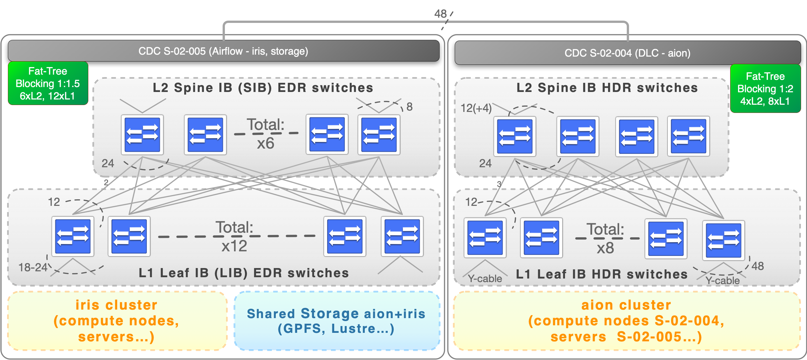

# Fast Local Interconnect Network

High Performance Computing (HPC) encompasses advanced computation over parallel processing, enabling faster execution of highly compute intensive tasks.
The execution time of a given simulation depends upon many factors, such as the number of CPU/GPU cores and their utilisation factor and the interconnect performance, efficiency, and scalability.
HPC interconnect technologies can be nowadays divided into three categories: Ethernet, InfiniBand, and vendor specific interconnects. While Ethernet is established as the dominant interconnect standard for mainstream commercial computing requirements, the underlying protocol has inherent limitations preventing low-latency deployments expected in real HPC environment.
When in need of high-bandwidth and low-latency as required in efficient high performance computing systems, better options have emerged and are considered:

* [InfiniBand](https://en.wikipedia.org/wiki/InfiniBand) technologies[^1]. See [Introduction to
High-Speed InfiniBand Interconnect](https://www.hpcadvisorycouncil.com/pdf/Intro_to_InfiniBand.pdf).
* Vendor specific interconnects, which currently correspond to the technology provided by three main HPC vendors: [Cray/HPC Slingshot](https://www.hpe.com/us/en/compute/hpc/slingshot-interconnect.html), Intel's EOL Omni-Path Architecture (OPA)  or, to a minor measure, [Bull BXI](https://atos.net/en/solutions/high-performance-computing-hpc/bxi-bull-exascale-interconnect).

[^1]: Originated in 1999 to specifically address workload requirements that were not adequately addressed by Ethernet and designed for scalability, using a switched fabric network topology together with Remote Direct Memory Access (RDMA) to reduce CPU overhead. Although InfiniBand is backed by a standards organisation ([InfiniBand Trade Association](https://www.infinibandta.org/) with formal and open multi-vendor processes, the InfiniBand market is currently dominated by a single significant vendor [Mellanox](https://www.mellanox.com/) recently acquired by [NVidia](https://www.nvidia.com/), which also dominates the non-Ethernet market segment across HPC deployments.

Within the ULHPC facility, the [InfiniBand](https://en.wikipedia.org/wiki/InfiniBand) solution was preferred as the predominant interconnect technology in the HPC market, tested against the largest set of HPC workloads.
In practice:

* [Iris](../systems/iris/interconnect.md) relies on a **EDR** Infiniband (IB) Fabric in a **Fat-Tree** Topology
* [Aion](../systems/iris/interconnect.md) relies on a **HDR100** Infiniband (IB) Fabric in a **Fat-Tree** Topology

!!! important "ACM PEARC'22 article"
    If you are interested to understand the architecture and the solutions designed upon Aion acquisition to expand and consolidate the previously existing IB networks beyond its seminal capacity limits (while keeping at best their Bisection bandwidth), you can refer to the following article published to the [ACM PEARC'22](https://orbilu.uni.lu/handle/10993/51828) conference (Practice and Experience in Advanced Research Computing) in Boston, USA on July 13, 2022.
    > __ACM Reference Format__ | [ORBilu entry](https://orbilu.uni.lu/handle/10993/51828) | [OpenAccess](https://dl.acm.org/doi/10.1145/3491418.3535159) | [slides](https://hpc-docs.uni.lu/interconnect/2022-07-13-ACM-PEARC22.pdf)  
    > Sebastien Varrette, Hyacinthe Cartiaux, Teddy Valette, and Abatcha Olloh. 2022. Aggregating and Consolidating two High Performant Network Topologies: The ULHPC Experience. _In Practice and Experience in Advanced Research Computing (PEARC '22)_. Association for Computing Machinery, New York, NY, USA, Article 61, 1–6. https://doi.org/10.1145/3491418.3535159

## ULHPC IB Topology

One of the most significant differentiators between HPC systems and lesser performing systems is, apart from the interconnect technology deployed, the supporting topology. There are several topologies commonly used in large-scale HPC deployments ([Fat-Tree](https://clusterdesign.org/fat-trees/), [3D-Torus](https://clusterdesign.org/torus/), Dragonfly+ etc.).
Fat-tree remains the widely used topology in HPC clusters due to its versatility, high bisection bandwidth and well understood routing.
For this reason, each production clusters of the ULHPC facility rely on Fat-Tree topology.

To minimize the number of switches per nodes while keeping a good Bisection bandwidth and allowing to interconnect Iris and Aion IB networks, the following configuration has been implemented:

For more details:
[:fontawesome-solid-sign-in-alt: Iris IB Interconnect](../systems/iris/interconnect.md){: .md-button .md-button--link }
[:fontawesome-solid-sign-in-alt: Aion IB Interconnect](../systems/aion/interconnect.md){: .md-button .md-button--link }

The tight integration of I/O and compute in the ULHPC supercomputer architecture gives a very robust, time critical production systems. The [selected routing algorithms](https://community.mellanox.com/s/article/understanding-up-down-infiniband-routing-algorithm) also provides a dedicated and fast path to the IO targets, avoiding congestion on the high-speed network and mitigating the risk of runtime "jitter" for time critical jobs.

## IB Fabric Diagnostic Utilities

An InfiniBand fabric is composed of switches and channel adapter (HCA/Connect-X cards) devices.
To identify devices in a fabric (or even in one switch system), each device is given a GUID (a MAC address equivalent).
Since a GUID is a non-user-friendly string of characters, we alias it to a meaningful, user-given name.
There are a few IB diagnostic tools (typically installed by the `infiniband-diags` package) using these names.
The ULHPC team is using them to diagnose Infiniband Fabric Information[^2] -- see also [InfiniBand Guide by Atos/Bull (PDF)](http://support.bull.com/documentation/byproduct/infra/sw-extremcomp/sw-extremcomp-com/g/86Y242FD01/86A242FD01.pdf)

| Tools           | Description                                                                                                          |
|-----------------|----------------------------------------------------------------------------------------------------------------------|
| `ibnodes`       | Show Infiniband nodes in topology                                                                                    |
| `ibhosts`       | Show InfiniBand host nodes in topology                                                                               |
| `ibswitches`    | Show InfiniBand switch nodes in topology                                                                             |
| `ibnetdiscover` | Discover InfiniBand topology                                                                                         |
| `ibdiag`        | Scans the fabric using directed route packets and extracts all the available information (connectivity, devices) |
| `perfquery`     | find errors on a particular or number of HCA’s and switch ports                                                      |
| `sminfo`        | Get InfiniBand Subnet Manager Info                                                                                   |

[^2]: Most require priviledged (root) right and thus are not available for ULHPC end users.

## Mellanox Equipment FW Update

An InfiniBand fabric is composed of switches and channel adapter (HCA/Connect-X cards) devices. Both should be kept up-to-date to mitigate potential security issues.

### Mellanox ConnectX HCA cards

The Mellanox HCA firmware updater tool: `mlxup`, can be downloaded from [mellanox.com](http://www.mellanox.com/downloads/firmware/mlxup/4.13.0/SFX/linux_x64/mlxup). 
A Typical workflow applied within the ULHPC team to update the firmware of the Connect-X cards :

1. Query specific device or all devices (if no device were supplied)

        mlxup --query

2. Go to <https://support.mellanox.com/s/downloads-center> then click on `Adapter > ConnectX-<N> > All downloads` (select any OS, it will redirect you to the same page)
    - Click on "Firmware" tab and enter the PSID number obtained from `mlxup --query`
    - Download the latest firmware version

        wget http://content.mellanox.com/firmware/fw-ConnectX[...].bin.zip

3. Unzip the downloaded file: `unzip [...]`
4. Burn device with latest firmware

        mlxup -d <PCI-device-name> -i <unzipped-image-file>.bin

5. Reboot

### Mellanox IB Switches

* [Reference documentation](https://community.mellanox.com/s/article/howto-upgrade-switch-os-software-o
n-mellanox-switch-systems)
    - You need to download from [Mellanox Download Center](https://support.mellanox.com/s/downloads-center)
         * **BEWARE of the processor architecture (X86 vs. PPC) when selecting the images**
    - select the switch model and download the proposed images -- Pay attention to the download path
