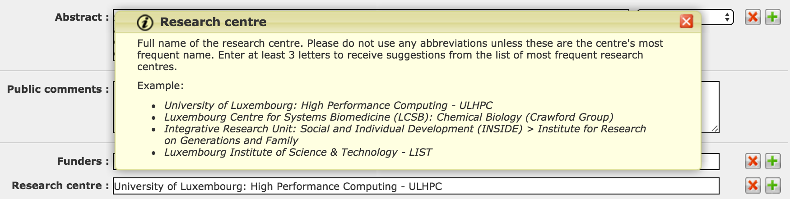

# Acceptable Use Policy (AUP) 2.1

The University of Luxembourg operates since 2007 a large academic HPC facility which remains the reference implementation within the country, offering a cutting-edge research infrastructure to Luxembourg public research while serving as edge access to the upcoming Euro-HPC Luxembourg supercomputer.
The University extends access to its HPC resources (including facilities, services and HPC experts) to its students, staff, research partners (including scientific staff of national public organizations and external partners for the duration of joint research projects) and to industrial partners.

## UL HPC AUP

<!--intro-start-->
There are a number of policies which apply to ULHPC users.

[:fontawesome-solid-download: UL HPC Acceptable Use Policy (AUP) [pdf] ](https://hpc-docs.uni.lu/policies/Uni.lu-HPC-Facilities_Acceptable-Use-Policy_v2.1.pdf){: .md-button .md-button--link }

!!! danger "Important"
    **All** users of UL HPC resources and PIs must abide by the [UL HPC Acceptable Use Policy (AUP)](https://hpc-docs.uni.lu/policies/Uni.lu-HPC-Facilities_Acceptable-Use-Policy_v2.1.pdf).
    You should read and keep a signed copy of this document before using the facility.

    Access and/or usage of any ULHPC system assumes the tacit acknowledgement to this policy.

<!--intro-end-->

The purpose of this document is to define the rules and terms governing acceptable use of resources (core hours, license hours, data storage capacity as well as network connectivity and technical support), including access, utilization and security of the resources and data.

## Crediting ULHPC in your research

One of the requirements stemming from the [AUP](https://hpc-docs.uni.lu/policies/Uni.lu-HPC-Facilities_Acceptable-Use-Policy_v2.1.pdf), is to credit and acknowledge the usage of the University of Luxembourg HPC facility for **ALL** publications and contributions having results and/or contents obtained or derived from that usage.

## Publication tagging

You are also requested to tag the publication(s) you have produced thanks to the usage of the UL HPC platform upon their registration on [Orbilu](https://orbilu.uni.lu):

* Login on [MyOrbiLu](https://orbilu.uni.lu/login)
* Select your publication entry and click on the "Edit" button
* Select the "2. Enrich" category at the top of the page
* In the "Research center" field, enter "ulhpc" and select the proposition

!!! important ""
    This tag is a very important indicator for us to quantify the concrete impact of the HPC facility on the research performed at the University.

[:fontawesome-solid-sign-in-alt:  List of publications generated thanks to the UL HPC Platform](https://orbilu.uni.lu/simple-search?query=researchcenter_authority%3A%28ORG_30%29){: .md-button .md-button--link }
