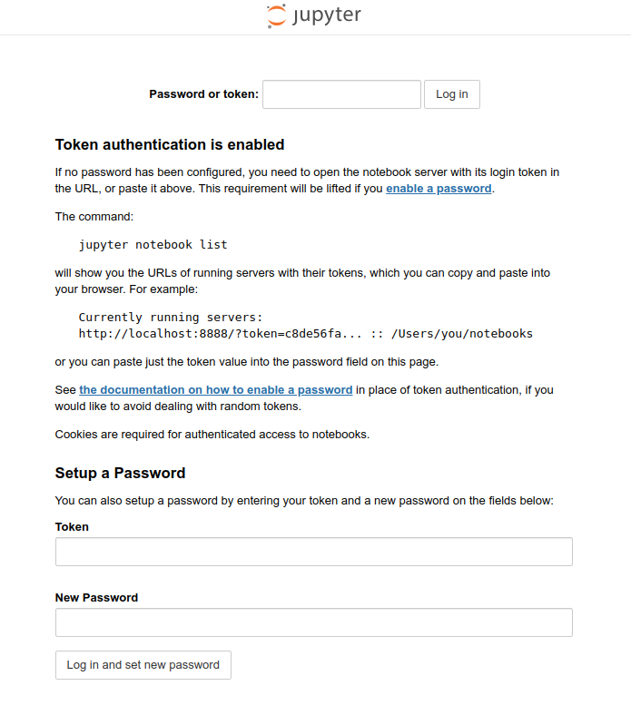

# Jupyter Notebook

{: style="width:300px;float: right;"}


[JupyterLab](https://jupyterlab.readthedocs.io/en/stable/) is a flexible, popular literate-computing web application for creating notebooks containing code, equations, visualization, and text. Notebooks are documents that contain both computer code and rich text elements (paragraphs, equations, figures, widgets, links). They are human-readable documents containing analysis descriptions and results but are also executable data analytics artifacts. Notebooks are associated with kernels, processes that actually execute code. Notebooks can be shared or converted into static HTML documents. They are a powerful tool for reproducible research and teaching.


## Install Jupyter

While JupyterLab runs code in Jupyter notebooks for many programming languages, Python is a requirement (Python 3.3 or greater, or Python 2.7) for installing the JupyterLab. New users may wish to install JupyterLab in a Conda environment. Hereafter, the `pip` package manager will be used to install JupyterLab.

We strongly recommend to use the Python module provided by the ULHPC and installing `jupyter` inside a Python virtual environment after upgrading `pip`.

```shell
$ si
$ module load lang/Python #Loading default Python
$ python -m venv ~/environments/jupyter_env
$ source ~/environments/jupyter_env/bin/activate
$ python -m pip install --upgrade pip
$ python -m pip install jupyterlab
```

!!! warning
    Modules are not allowed on the access servers. To test interactively Singularity, remember to ask for an [interactive job](/jobs/interactive) first using  for instance the `si` tool.

Once JupyterLab is installed along with , you can start to configure your installation setting the environment variables corresponding to your needs:

- `JUPYTER_CONFIG_DIR`: Set this environment variable to use a particular directory, other than the default, for Jupyter config files
- `JUPYTER_PATH`: Set this environment variable to provide extra directories for the data search path. `JUPYTER_PATH` should contain a series of directories, separated by os.pathsep(; on Windows, : on Unix). Directories given in JUPYTER_PATH are searched before other locations. This is used in addition to other entries, rather than replacing any
- `JUPYTER_DATA_DIR`: Set this environment variable to use a particular directory, other than the default, as the user data directory
- `JUPYTER_RUNTIME_DIR`: Set this to override where Jupyter stores runtime files
- `IPYTHONDIR`: If set, this environment variable should be the path to a directory, which IPython will use for user data. IPython will create it if it does not exist.

JupyterLab is now installed and ready.

??? info "Installing the classic Notebook"
    JupyterLab (`jupyterlab`) is a new package which automates many task that where performed manually in the traditional Jupyter package (`jupyter`). If you prefer to install the classic notebook, you also need to install the [IPython](https://ipython.readthedocs.io/en/stable/index.html) manually as well, replacing
    ```bash
    python -m pip install jupyterlab
    ```
    with:
    ```bash
    python -m pip install jupyter ipykernel
    ```

### Providing access to kernels of other environments

JupyterLab makes sure that a default [IPython kernel](https://ipython.readthedocs.io/en/stable/install/kernel_install.html#) is available, with the environment (and the Python version) with which the lab was created. Other environments can export a _kernel_ to a JupyterLab instance, allowing the instance to launch interactive session inside environments others from the environment where JupyterLab is installed.

You can [setup kernels with different environments on the same notebook](https://ipython.readthedocs.io/en/stable/install/kernel_install.html). Create the environment with the Python version and the packages you require, and then register the kernel in any environment with Jupyter (lab or classic notebook) installed. For instance, if we have installed Jupyter in `~/environments/jupyter_env`:
```shell
source ~/environments/other_python_venv/bin/activate
python -m pip install ipykernel
python -m ipykernel install --prefix=${HOME}/environments/jupyter_env --name other_python_env --display-name "Other Python env"
deactivate
```
Then all kernels and their associated environment can be started from the same Jupyter instance in the `~/environments/jupyter_env` Python venv.

You can also use the flag `--user` instead of `--prefix` to install the kernel in the default system location available to all Jupyter environments for a user.

### Kernels for Conda environments

If you would like to install a kernel in a Conda environment, install the `ipykernel` from the `conda-forge` channel. For instance,
```bash
micromamba install --name conda_env conda-forge::ipykernel
micromamba run --name conda_env python -m ipykernel install --prefix=${HOME}/environments/jupyter_env --name other_python_env --display-name "Other Python env"
```
will make your conda environment, `conda_env`, available in the kernel launched from the `~/environments/jupyter_env` Python venv.

## Starting a Jupyter Notebook

Jupyter notebooks must be started as [slurm jobs](/jobs/submit). The following script is a template for Jupyter submission scripts that will rarely need modifications. Most often you will need to modify the session duration (`--time` SBATCH option).

!!! example "Slurm Launcher script for Jupyter Notebook"
    ```slurm
    #!/usr/bin/bash --login
    #SBATCH --job-name=Jupyter
    #SBATCH --nodes=1
    #SBATCH --ntasks-per-node=1
    #SBATCH --cpus-per-task=2   # Change accordingly, note that ~1.7GB RAM is proivisioned per core
    #SBATCH --partition=batch
    #SBATCH --qos=normal
    #SBATCH --output=%x_%j.out  # Print messages to 'Jupyter_<job id>.out
    #SBATCH --error=%x_%j.err   # Print debug messages to 'Jupyter_<job id>.err
    #SBATCH --time=0-01:00:00   # Change maximum allowable jupyter server uptime here

    print_error_and_exit() { echo "***ERROR*** $*"; exit 1; }
    module purge || print_error_and_exit "No 'module' command"
    
    # Load the default Python 3 module
    module load lang/Python
    source "${HOME}/environments/jupyter_env/bin/activate"

    declare loopback_device="127.0.0.1"
    declare port="8888"
    declare connection_instructions="connection_instructions.log"

    jupyter lab --ip=${loopback_device} --port=${port} --no-browser &
    declare lab_pid=$!

    # Add connection instruction
    echo "# Connection instructions" > "${connection_instructions}"
    echo "" >> "${connection_instructions}"
    echo "To access the jupyter notebook execute on your personal machine:" >> "${connection_instructions}"
    echo "ssh -J ${USER}@access-${ULHPC_CLUSTER}.uni.lu:8022 -L ${port}:${loopback_device}:${port} ${USER}@$(hostname -i)" >> "${connection_instructions}"
    echo "" >> "${connection_instructions}"
    echo "To access the jupyter notebook if you have setup a special key (e.g ulhpc_id_ed25519) to connect to cluster nodes execute on your personal machine:" >> "${connection_instructions}"
    echo "ssh -i ~/.ssh/hpc_id_ed25519 -J ${USER}@access-${ULHPC_CLUSTER}.uni.lu:8022 -L ${port}:${loopback_device}:${port} ${USER}@$(hostname -i)" >> "${connection_instructions}"
    echo "" >> "${connection_instructions}"
    echo "Then navigate to:" >> "${connection_instructions}"

    # Wait for the server to start
    sleep 2s
    # Wait and check that the landing page is available
    curl \
        --connect-timeout 10 \
        --retry 5 \
        --retry-delay 1 \
        --retry-connrefused \
        --silent --show-error --fail \
        "http://${loopback_device}:${port}" > /dev/null
    # Note down the URL
    jupyter lab list 2>&1 \
        | grep -E '\?token=' \
        | awk 'BEGIN {FS="::"} {gsub("[ \t]*","",$1); print $1}' \
        | sed -r 's/([0-9]{1,3}\.){3}[0-9]{1,3}/127\.0\.0\.1/g' \
        >> "${connection_instructions}"

    # Save some debug information
    echo -e '\n===\n'

    echo "AVAILABLE LABS"
    echo ""
    jupyter lab list
    
    echo -e '\n===\n'

    echo "CONFIGURATION PATHS"
    echo ""
    jupyter --paths

    echo -e '\n===\n'

    echo "KERNEL SPECIFICATIONS"
    echo ""
    jupyter kernelspec list

    # Wait for the user to terminate the lab
    wait ${lab_pid}
    ```

Once your job is running (see [Joining/monitoring running jobs](/jobs/submit#joiningmonitoring-running-jobs)), you can combine 

- [`ssh` forwarding](/connect/ssh#ssh-port-forwarding), and
- an [`ssh` jump](/connect/ssh#port-forwarding-over-ssh-jumps) through the login node,

to connect to the notebook from your laptop. Open a terminal on your laptop and copy-paste the ssh command contained in the file `connection_instructions.log`, and then navigate to the webpage link provided.

!!! example "Example content  of `connection_instructions.log`"
    ```shell
    > cat connection_instructions.log
    # Connection instructions
    
    To access the jupyter notebook execute on your personal machine:
    ssh -J gkafanas@access-aion.uni.lu:8022 -L 8888:127.0.0.1:8888 gkafanas@172.21.12.29
    
    To access the jupyter notebook if you have setup a special key (e.g ulhpc_id_ed25519) to connect to cluster nodes execute on your personal machine:
    ssh -i ~/.ssh/ulhpc_id_ed25519 -J gkafanas@access-aion.uni.lu:8022 -L 8888:127.0.0.1:8888 gkafanas@172.21.12.29
    
    Then navigate to:
    http://127.0.0.1:8888/?token=b7cf9d71d5c89627250e9a73d4f28cb649cd3d9ff662e7e2
    ```

As the instructions suggest, you access the jupyter lab server in the compute node by calling
```shell
ssh -J gkafanas@access-aion.uni.lu:8022 -L 8888:127.0.0.1:8888 gkafanas@172.21.12.29
```
an SSH command that

- opens a connection to your allocated cluster node jumping through the login node (`-J gkafanas@access-aion.uni.lu:8022 gkafanas@172.21.12.29`), and
- exports the port to the jupyter server in the local machine (`-L 8888:127.0.0.1:8888`).

Then, open the connection to the browser in your local machine by following the given link:
```
http://127.0.0.1:8888/?token=b7cf9d71d5c89627250e9a73d4f28cb649cd3d9ff662e7e2
```

The link provides the access token, so you should be able to login without a password.

!!! warning
    Do not forget to click on the `quit` button when finished to stop the Jupyter server and release the resources. Note that in the last line of the submission script the job waits for your Jupyter service to finish. 

If you encounter any issues, have a look in the debug output in `Jupyter_<job id>.err`. Generic information about the setup of your system is printed in `Jupyter_<job id>.out`.

??? example "Typical content of `Jupyter_<job id>.err`"
    ```shell
    > cat Jupyter_3664038.err 
    [I 2024-11-13 23:19:52.538 ServerApp] jupyter_lsp | extension was successfully linked.
    [I 2024-11-13 23:19:52.543 ServerApp] jupyter_server_terminals | extension was successfully linked.
    [I 2024-11-13 23:19:52.547 ServerApp] jupyterlab | extension was successfully linked.
    [I 2024-11-13 23:19:52.766 ServerApp] notebook_shim | extension was successfully linked.
    [I 2024-11-13 23:19:52.808 ServerApp] notebook_shim | extension was successfully loaded.
    [I 2024-11-13 23:19:52.812 ServerApp] jupyter_lsp | extension was successfully loaded.
    [I 2024-11-13 23:19:52.813 ServerApp] jupyter_server_terminals | extension was successfully loaded.
    [I 2024-11-13 23:19:52.814 LabApp] JupyterLab extension loaded from /home/users/gkafanas/environments/jupyter_env/lib/python3.11/site-packages/jupyterlab
    [I 2024-11-13 23:19:52.814 LabApp] JupyterLab application directory is /mnt/aiongpfs/users/gkafanas/environments/jupyter_env/share/jupyter/lab
    [I 2024-11-13 23:19:52.815 LabApp] Extension Manager is 'pypi'.
    [I 2024-11-13 23:19:52.826 ServerApp] jupyterlab | extension was successfully loaded.
    [I 2024-11-13 23:19:52.827 ServerApp] Serving notebooks from local directory: /mnt/aiongpfs/users/gkafanas/support/jupyter
    [I 2024-11-13 23:19:52.827 ServerApp] Jupyter Server 2.14.2 is running at:
    [I 2024-11-13 23:19:52.827 ServerApp] http://127.0.0.1:8888/lab?token=fe665f90872927f5f84be627f54cf9056908c34b3765e17d
    [I 2024-11-13 23:19:52.827 ServerApp]     http://127.0.0.1:8888/lab?token=fe665f90872927f5f84be627f54cf9056908c34b3765e17d
    [I 2024-11-13 23:19:52.827 ServerApp] Use Control-C to stop this server and shut down all kernels (twice to skip confirmation).
    [C 2024-11-13 23:19:52.830 ServerApp] 
        
        To access the server, open this file in a browser:
            file:///home/users/gkafanas/.local/share/jupyter/runtime/jpserver-2253096-open.html
        Or copy and paste one of these URLs:
            http://127.0.0.1:8888/lab?token=fe665f90872927f5f84be627f54cf9056908c34b3765e17d
            http://127.0.0.1:8888/lab?token=fe665f90872927f5f84be627f54cf9056908c34b3765e17d
    [I 2024-11-13 23:19:52.845 ServerApp] Skipped non-installed server(s): bash-language-server, dockerfile-language-server-nodejs, javascript-typescript-langserver, jedi-language-server, julia-language-server, pyright, python-language-server, python-lsp-server, r-languageserver, sql-language-server, texlab, typescript-language-server, unified-language-server, vscode-css-languageserver-bin, vscode-html-languageserver-bin, vscode-json-languageserver-bin, yaml-language-server
    [I 2024-11-13 23:19:53.824 ServerApp] 302 GET / (@127.0.0.1) 0.47ms
    ```

??? example "Typical content of `Jupyter_<job id>.err`"
    ```shell
    > cat Jupyter_3664038.out
    
    ===
    
    AVAILABLE LABS
    
    Currently running servers:
    http://127.0.0.1:8888/?token=fe665f90872927f5f84be627f54cf9056908c34b3765e17d :: /mnt/aiongpfs/users/gkafanas/support/jupyter
    
    ===
    
    CONFIGURATION PATHS
    
    config:
        /home/users/gkafanas/environments/jupyter_env/etc/jupyter
        /mnt/aiongpfs/users/gkafanas/.jupyter
        /usr/local/etc/jupyter
        /etc/jupyter
    data:
        /home/users/gkafanas/environments/jupyter_env/share/jupyter
        /home/users/gkafanas/.local/share/jupyter
        /usr/local/share/jupyter
        /usr/share/jupyter
    runtime:
        /home/users/gkafanas/.local/share/jupyter/runtime
    
    ===
    
    KERNEL SPECIFICATIONS
    
    Available kernels:
      other_python_env    /home/users/gkafanas/environments/jupyter_env/share/jupyter/kernels/other_python_env
      python3             /home/users/gkafanas/environments/jupyter_env/share/jupyter/kernels/python3 
    ```

### Password protected access

You can also set a password when launching the jupyter lab as detailed in the [Jupyter official documentation](https://jupyter-notebook.readthedocs.io/en/stable/public_server.html). In that case, simply direct you browser to the URL `http://127.0.0.1:8888/` and provide your password. You can see bellow an example of the login page.

??? example "Typical content of a password protected login page"
    


