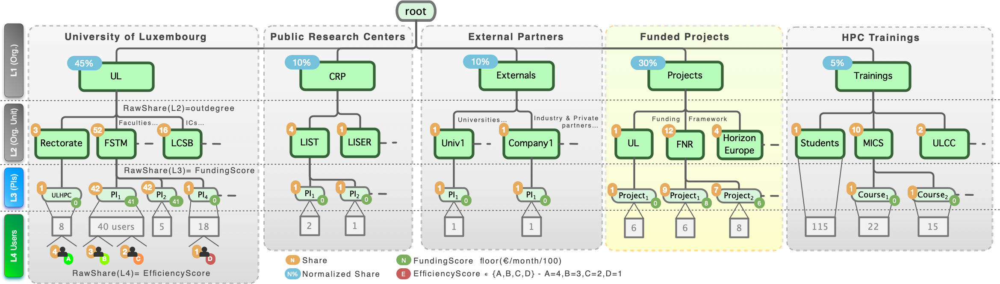

# Slurm Account Hierarchy

The ULHPC resources can be reserved and allocated for the execution of jobs scheduled on the platform thanks to a Resource and Job Management Systems (RJMS) - [Slurm](https://slurm.schedmd.com/documentation.html) in practice.
This tool is configured to collect accounting information for every job and job step executed -- see [SchedMD accounting documentation](https://slurm.schedmd.com/accounting.html).


??? info "ULHPC account (login) vs. Slurm [meta-]account"
    - Your [ULHPC account](index.md) defines the UNIX **user** you can use to connect to the facility and make you known to our systems. They are managed by [IPA](../connect/ipa.md) and define your `login`.

    - _Slurm accounts_, refered to as **meta-account** in the sequel, are more loosely defined [in Slurm](https://slurm.schedmd.com/accounting.html), and should be seen as something similar to a UNIX group: it may contain other (set of) slurm account(s), multiple users, or just a single user. **A user may belong to multiple slurm accounts, but MUST have a DefaultAccount**, which is set to your line manager or principal investigator meta-account.

## ULHPC Account Tree Hierarchy

Every user job runs under a _group_ account, granting access to specific QOS levels.
Such an account is **unique** within the account hierarchy.
Accounting records are organized as a hierarchical tree according to 3 layers (slurm accounts) as depicted in the below figure (_click to enlarge_).
At the leaf hierarchy stands the End user `<login>` from the IPA IdM database, bringing a total of 4 levels.

[](../images/slurm_account_hierarchy.pdf)

| Level  | Account Type | Description                                                              | Example                                           |
|--------|--------------|--------------------------------------------------------------------------|---------------------------------------------------|
| __L1__ | meta-account | Top-level structure / organizations                                      | UL, CRP, Externals, Projects, Trainings           |
| __L2__ | meta-account | Organizational Unit (Faculty, ICs, External partner, Funding program...) | FSTM, LCSB, LIST...                               |
| __L3__ | meta-account | Principal investigators (PIs), project, courses/lectures                 | `<firstname>.<lastname>`, `<acronym>`, `<course>` |
| __L4__ | login        | End-users (staff, student):  your [ULHPC/IPA login](../accounts/index.md)              | `yourlogin`                                       |


!!! info "Extracting your association tree"
    By default, you will be able to see only the account hierarchy you belongs too through the association(s) set with your login.
    You can extract it with:

    ```console
    $ sacctmgr show association where parent=root format="account,user%20,Share,QOS%50" withsubaccounts
       Account                 User     Share                                                QOS
    ---------------------- -------- ----------- --------------------------------------------------
                     <top>            <L1share>                   besteffort,debug,long,low,normal
                 <orgunit>            <L2share>                   besteffort,debug,long,low,normal
    <firstname>.<lastname>            <L3share>                   besteffort,debug,long,low,normal
    <firstname>.<lastname>  <login>   <L4share>                   besteffort,debug,long,low,normal
    ```

??? info "(_Admins_) Extract the full hierarchy"
    The below commands assumes you have supervision rights on the `root` account.

    To list available **L1** accounts (Top-level structure / organizations), use
    ```bash
    sacctmgr show association where parent=root format="cluster,account,Share,QOS%50"
    ```
    To list **L2** accounts:

    === "Under Uni.lu (UL)"
        ```bash
        sacctmgr show association where parent=UL format="cluster,account,Share,QOS%50"
        ```
    === "Under CRP"
        ```bash
        sacctmgr show association where parent=CRP format="cluster,account,Share,QOS%50"
        ```
    === "Under Externals"
        ```bash
        sacctmgr show association where parent=externals format="cluster,account,Share,QOS%50"
        ```
    === "Under Projects"
        ```bash
        sacctmgr show association where parent=projects format="cluster,account,Share,QOS%50"
        ```
    === "Under Trainings"
        ```bash
        sacctmgr show association where parent=trainings format="cluster,account,Share,QOS%50"
        ```

    To quickly list **L3** accounts and its subaccounts: `sassoc <account>`, or
    ```console
    sacctmgr show association where accounts=<L3account> format="account%20,user%20,Share,QOS%50"
    ```
    To quickly list **End User (L4)** associations, use `sassoc <login>`, or
    ```console
    sacctmgr show association where users=<login> format="account%20,user%20,Share,QOS%50"
    ```

!!! Important "Default account vs. multiple associations"
    **A given user `<login>` can be _associated_ to multiple accounts**, but have a _single_ `DefaultAccount` (a meta-account at L3 level reflecting your line manager (Format: `<firstname>.<lastname>`).

To get information about your account information in the hierarchy, use the custom [`acct` helper function](https://github.com/ULHPC/tools/blob/master/slurm/profile.d/slurm.sh), typically as `acct $USER`.

!!! example "Get ULHPC account information with `acct <login>`"
    ```bash
    # /!\ ADAPT <login> accordingly
    $ acct <login>
    # sacctmgr show user where name="<login>" format=user,account%20,DefaultAccount%20,share,qos%50 withassoc
         User                Account             Def Acct       Share                                     QOS
      ------- ----------------------- ----------------------  ------- ---------------------------------------
      <login>         project_<name1> <firstname>.<lastname>        1        besteffort,debug,long,low,normal
      <login>         project_<name2> <firstname>.<lastname>        1   besteffort,debug,high,long,low,normal
      <login>  <firstname>.<lastname> <firstname>.<lastname>        1        besteffort,debug,long,low,normal
    # ==> <login> Default account: <firstname>.<lastname>
    ```
    In the above example, the user `<login>` is associated to 3 meta-accounts at the L3 level of the hierarchy (his PI `<firstname>.<lastname>` and two projects account), each granting access to potentially different [QOS](../slurm/qos.md).
    The account used upon job submission can be set with the `-A <account>` option. With the above example:
    ```bash
    $ sbatch|srun|... [...]                     # Use default account: <firstname>.<lastname>
    $ sbatch|srun|... -A project_<name1> [...]  # Use account project_<name1>
    $ sbatch|srun|... -A project_<name2> --qos high [...] # Use account project_<name2>, granting access to high QOS
    $ sbatch|srun|... -A anotheraccount [...]   # Error: non-existing association between <login> and anotheraccount
    ```

To list all associations for a given user or meta-account, use the [`sassoc` helper function](https://github.com/ULHPC/tools/blob/master/slurm/profile.d/slurm.sh):
```bash
# /!\ ADAPT <login> accordingly
$ sassoc <login>
```
You may use more classically the [`sacctmgr show [...]`](https://slurm.schedmd.com/sacctmgr.html) command:

* User information: `sacctmgr show user where name=<login> [withassoc]` (use the `withassoc` attribute to list all associations).
* Default account:  `sacctmgr show user where name="<login>" format=DefaultAccount -P -n`
* Get the parent account: `sacctmgr show account where name=ulhpc format=Org -n -P`

To get the current association _tree_: add `withsubaccounts` to see ALL sub accounts

```bash
# L1,L2 or L3 account /!\ ADAPT <name> accordingly
sacctmgr show association tree where accounts=<name> format=account,share
# End user (L4)
sacctmgr show association where users=$USER  format=account,User,share,Partition,QOS
```

??? warning "No association, no job!"
    It is mandatory to have your login registered within at least one _association_ toward a meta-account (PI, project name) to be able to schedule jobs on the


## Impact on FairSharing and Job Accounting

Every node in the above-mentioned tree hierarchy is associated with a weight defining its **Raw Share** in the [FairSharing](../slurm/fairsharing.md) mechanism in place.
<!--share-rule-per-level-start-->
Different rules are applied to define these weights/shares depending on the level in the hierarchy:

* __L1__ (Organizational Unit): arbitrary shares to dedicate at least 85% of the platform to serve UL needs and projects
* __L2__: function of the out-degree of the tree nodes, reflecting also the past year funding
* __L3__: a function reflecting the budget contribution of the PI/project (normalized on a per-month basis) for the year in exercise.
* __L4__ (ULHPC/IPA login): efficiency score, giving incentives for a more efficient usage of the platform.

<!--share-rule-per-level-end-->
More details are given [on this page](../slurm/fairsharing.md).


## Default vs. Project accounts

Default account associations are defined as follows:

* For UL staff or external partners: your direct Line Manager `firstname.lastname` within the institution (Faculty, IC, Company) you belong too.
* For students: the lecture/course they are registered too
    - Guest student/training accounts are associated to the `Students` meta-account.

In addition, your user account (ULHPC login) may be associated to other meta-accounts such as projects or specific training events.

To establish job accounting against these extra specific accounts, use:

```
{sbatch|srun} -A project_<name> [...]
```

For more details, see [Project accounts](../accounts/projects.md).


[^1]: restrictions applies and do not permit to reveal all information for other accounts than yours.
