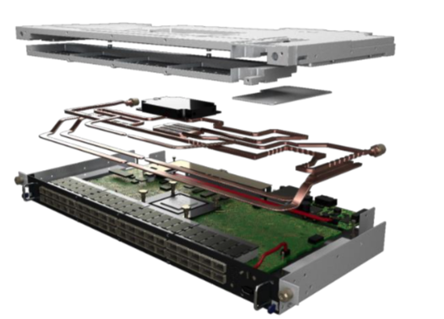

# Fast Local Interconnect Network

The Fast _local_ interconnect network implemented within Aion relies on the [Mellanox](https://www.mellanox.com/) **[Infiniband (IB) HDR](https://en.wikipedia.org/wiki/InfiniBand)[^1]** technology.
For more details, see [Introduction to
High-Speed InfiniBand Interconnect](https://www.hpcadvisorycouncil.com/pdf/Intro_to_InfiniBand.pdf).

[^1]: High Data Rate (HDR) – 200 Gb/s throughput with a very low latency, typically below 0,6$\mu$s. The HDR100 technology allows one 200Gbps HDR port (aggregation 4x 50Gbps) to be divided into 2 HDR100 ports with 100Gbps (2x 50Gbps) bandwidth using an [optical] ["_splitter_" cable](https://www.mellanox.com/related-docs/prod_cables/PB_MFS1S50-HxxxE_200Gbps_QSFP56_to_2x100Gbps_QSFP56_AOC.pdf).

## IB Network Topology

One of the most significant differentiators between HPC systems and lesser performing systems is, apart from the interconnect technology deployed, the supporting topology. There are several topologies commonly used in large-scale HPC deployments ([Fat-Tree](https://clusterdesign.org/fat-trees/), [3D-Torus](https://clusterdesign.org/torus/), Dragonfly+ etc.).

{: style="width:200px;float: left;margin-right:10px"}
Aion (like [Iris](../iris/index.md)) is part of an _Island_ which employs a "[Fat-Tree](https://clusterdesign.org/fat-trees/)" Topology[^2] which remains the widely used topology in HPC clusters due to its versatility, high bisection bandwidth and well understood routing.

Aion IB HDR switched fabric relies on [Mellanox WH40 DLC Quantum Switches](https://www.mellanox.com/products/infiniband-switches-ic/quantum) located at the back of each BullSequana XH2000 racks.
Each DLC cooled (see splitted view on the right) HDR switch has the following characteristics:

{: style="width:300px;float: right;" }

* 80 X HDR100 100Gb/s ports in a 1U switch (40 X HDR 200Gb/s ports if used in full HDR mode)
* 16Tb/s aggregate switch throughput
* Up to 15.8 billion messages-per-second
* 90ns switch latency

Aion 2-Level 1:2 Fat-Tree  is composed of:

* 12x Infiniband HDR[^1] switches (40 HDR ports / 80 HDR100 ports)
    - 8x Leaf  IB (LIB) switches (L1), each with 12 HDR L1-L2 interlinks (2 on each rack)
    - 4x Spine IB (SIB) switches (L2), with up to 16 HDR100 uplinks (12 used, total: 48 links) used for the interconnexion with the Iris Cluster
* Up to 48 compute nodes HDR100 connection per L1 switch using 24 HDR ports with Y-cable
    - 4 available HDR connections for Service, Access or Gateway node per L1 switch

[^2]: with blocking factor 1:2.

The following illustration show HDRtopology within the BullSequana XH2000 cell schematically:

For more details:
[:fontawesome-solid-sign-in-alt: ULHPC Fast IB Interconnect](../../interconnect/ib.md#ulhpc-ib-topology){: .md-button .md-button--link }

## Routing Algorithm

The IB Subnet Managers in Aion are configured with the [Up/Down](https://community.mellanox.com/s/article/understanding-up-down-infiniband-routing-algorithm) InfiniBand Routing Algorithm
Up-Down is a super-set of Fat-Tree with a tracker mode that allow each node to have dedicated route. This is well adapted to IO traffic patterns, and would be used within Aion for Gateway nodes, [Lustre](../../filesystems/lustre.md) OSS, and [GPFS/SpectrumScale](../../filesystems/gpfs.md) NSD servers.

For more details:
[:fontawesome-solid-sign-in-alt: Understanding Up/Down InfiniBand Routing Algorithm](https://community.mellanox.com/s/article/understanding-up-down-infiniband-routing-algorithm){: .md-button .md-button--link }
