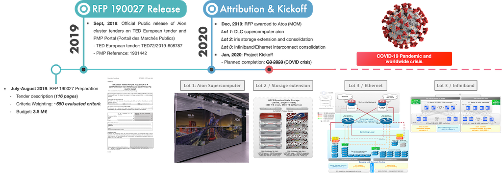
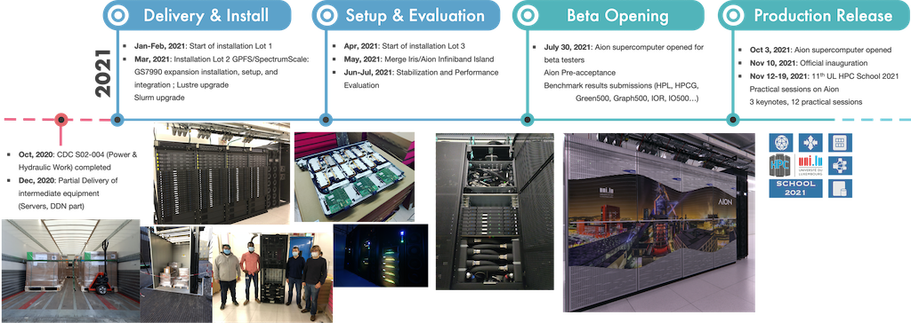

# Aion Timeline

This page records a brief timeline of significant events and user environment changes on Aion.

Details are provided below.

## 2019

### September 2019

* Official Public release of Aion  cluster tenders on [TED](https://ted.europa.eu/udl?uri=TED:NOTICE:425803-2019:TEXT:EN:HTML&src0=) European tender and [PMP Portal](https://pmp.b2g.etat.lu/?page=entreprise.EntrepriseAdvancedSearch&searchAnnCons&keyWord=190027) (Portail des Marchés Publics) on Sept 11, 2019
    - __RFP 190027__: Tender for the acquisition of a **Complementary High Performance Computing (HPC) cluster 'Aion'** for the University of Luxembourg.
        * TED Reference: [TED72/2019-608787](https://ted.europa.eu/udl?uri=TED:NOTICE:425803-2019:TEXT:EN:HTML&src0=)
        * PMP Reference: 1901442

> The RFP is composed of the following Lots:

> *  __Lot 1__:   DLC Computing cluster `aion`.
     - includes cabinets, cooling units (together with any and all required piping and cooling fluids), compute node enclosures and compute nodes blades (dual- socket, relying on x86_64 processor architecture), interconnect elements (Ethernet and InfiniBand) and management servers for the HPC services (including but not limited to operational lifecycle management, Operating System and services deployment, monitoring) tied to this new cluster
     - implementation within one of the University Computer Centre (CDC) server rooms (CDC S-02-004), adjacent to the server room hosting the Iris cluster and its associated storage system), specialized for hosting compute equipment supporting direct liquid cooling through a separate high temperature water circuit, thus guaranteeing unprecedented energy efficiency and equipment density. In the first phase of operation, the system will be connected to the existing cold-water circuit and must be able to operate under these conditions
     - [...]
* __Lot 2__: Adaptation and extension of the existing High-Performance Storage systems
     - includes extension of the existing primary high-performance storage solution featuring a SpectrumScale/GPFS filesystem (based on a DDN GridScaler solution installed as per attribution of the RFP 160019) hosting the user home and project directories, to enable the utilisation of the GPFS filesystem from both existing Iris and new Aion clusters while
     - enabling access to the Lustre-based SCRATCH filesystem (based on a DDN ExaScaler solution installed as per attribution of the RFP 170035) from the new compute cluster is considered a plus. Enhancing and adapting the InfiniBand interconnection to guarantee current performance characteristics while under load from all clients (existing and new compute clusters) is considered a plus.
     - [...]
* __Lot 3__: Adaptation of the network (Ethernet and IB)
     - integration of the new cluster within the existing Ethernet-based data and management networks, which involves the extension and consolidation of the actual Ethernet topology
     - adaptation and extension of the existing InfiniBand (IB) topology to allow for bridging the two networks (Iris "island" and Aion "island")
     - [...]

### October-November 2019

* Bids Opening for both RFPs on October 29, 2019.
    - Starting offers analysis by the ULHPC team, together with the procurement and legal department of the University

### December 2019

* Awarding notification to the vendors
    -  __RFP 190027__ attributed to the **Atos** to provide:
       * _Lot 1_: the new DLC `aion` supercomputer, composed by 318 AMD compute nodes hosted within a compute cell made of 4 BullSequana XH2000 adjacent racks
          - Fast Interconnect: HDR Infiniband Fabric in a Fat tree topology (2:1 blocking)
          - Associated servers and management stack
       * _Lot 2_: Adaptation and extension of the existing High-Performance Storage systems.
           - In particular, the usable storage capacity of the existing primary high-performance storage solution (SpectrumScale/GPFS filesystem) will be extended by 1720TB/1560TiB to reach a total of 4.41 PB
       * _Lot 3_:Adaptation of the network (Ethernet and IB)

See also [:fontawesome-solid-sign-in-alt: Atos Press Release](https://atos.net/en/2020/press-release_2020_01_07/atos-empowers-researchers-at-the-university-of-luxembourg-with-its-bullsequana-xh2000-supercomputer?utm_campaign=G+-+PR+-+BullSequana+XH2000+Uni+of+Luxembourg+&utm_content=&utm_medium=twitter&utm_source=social){: .md-button .md-button--link }
[:fontawesome-solid-sign-in-alt: Aion Supercomputer Overview](index.md){: .md-button .md-button--link }

## 2020

### January 2020

* Kickoff meeting -- see [UL Newsletter](https://wwwen.uni.lu/university/news/latest_news/university_of_luxembourg_strengthens_its_computing_capacities)
    - planning for a production release of the new cluster in May 2020

### February-March 2020: Start of global COVID-19 crisis

* COVID-19 Impact on HPC Activities
    - all operations tied to the preparation and installation of the new `aion` cluster are postponed
    - ULHPC systems remain operational, technical and non-technical staff are working remotely from home
    - Global worldwide delays on hardware equipment production and shipment

### July 2020

* Start Phase 3 of the deconfinement as per UL policy
    - Preparation work within the CDC server room by the UL external partners _slowly_ restarted
        * target finalization of the CDC-S02-004 server room by end of September
    - Assembly and factory Burn tests completed
       *_Lot 1_: DLC ready for shipment to University
          - Target date: Sept 14, 2020 in practice postponed above Oct 19, 2020 to allow for the CDC preparation work to be completed by the University and its patners.
    - ULHPC maintenance with physical intervention of external expert support team by DDN
        * preparation work for iris storage (HW upgrade, GPFS/SpectrumScale Metadata pool extension, Lustre upgrade)

    - Start and complete the first Statement of Work for DDN Lot 2 installation

### Aug 2020

* Consolidated work by ULHPC team on Slurm configuration
    - Updated model for Fairshare, Account Hierarchy and limits

* Pre-shipment of [Part of] Ethernet network equipment (Lot 3)

### Sept - Oct 2020

* Delivery Lot 1 (Aion DLC) and Lot 3 (Ethernet) equipment
    - Ethernet network installation done by ULHPC between Sept 3 - 24, 2020

*  CDC S02-004 preparation work (hydraulic part)
    - supposed to be completed by Sept 15, 2020 has been delayed and was finally completed on Oct 19, 2020

### Nov 2020

* Partial Delivery of equipment (servers, core switches)
    - Service servers and remaining network equipments were racked by ULHPC team

### Dec 2020

* Confinement restriction lifted in France, allowing for a french team from Atos to come onsite
* Delivery of remaining equipment (incl. Lot 1 sequana racks and compute nodes)
* Compute rack (Lot 1 DLC) installation start

## 2021

### Jan - Feb 2021

* The 4 DDN expansion enclosure shipped with the lifting tools and pressure tools

    * _Lot 1_: Sequana racks and compute nodes finally postionned and internal Infiniband cabling done

    * _Lot 2_: DDN disk enclosure racked
        - the rack was adapted to be able to close the rear door

    * _Lot 3_: Ethernet and IB Network
        - ULHPC cables were used to cable service servers to make progress on the software configuration

* Service servers and compute nodes deployment start remotely

### Mar - Apr 2021

* Start GS7990 and NAS server installation (Lot 2)
* Start installtion of Lot 3 (ethernet side)

### May - June 2021

* IB EDR cables delivered and installed
* Merge of the Iris/Aion Infiniband island

### Jul - Aug - Sept 2021

* Slurm Federation between both clusters `Iris` and `Aion`
* Benchmark performance results submitted (HPL, HPCG, Green500, Graph500, IOR, IO500)
* Pre-Acceptance validated and **release of the Aion supercomputer for beta testers**

### Oct - Nov 2021

* Official production release of Aion supercomputer
* [Inauguration](https://www.uni.lu/en/news/university-of-luxembourg-strengthens-its-computing-capacities/) of Aion Supercomputer

* 11th ULHPC School 2021
    - relies in Aion for its practical sessions
