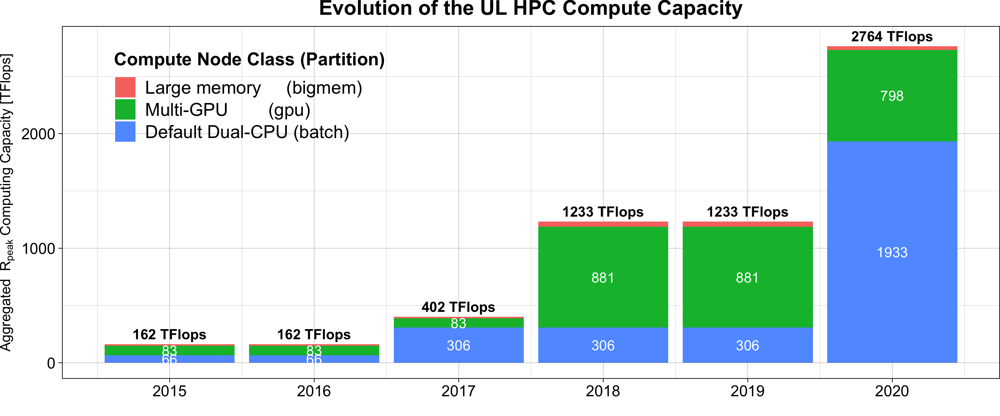
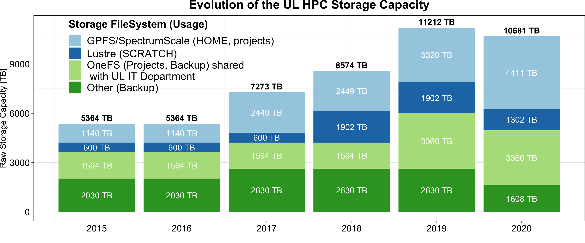

# HPC @ Uni.lu

{: style="width:300px;"}
{: style="width:300px;"}

For more details, see the [reference ULHPC Article](https://orbilu.uni.lu/handle/10993/51857):

> __ACM Reference Format__ | [ORBilu entry](https://orbilu.uni.lu/handle/10993/51857) | [slides](https://hpc-docs.uni.lu/systems/2022-07-10-ACM-HPCCT22.pdf): 
> Sebastien Varrette, Hyacinthe Cartiaux, Sarah Peter, Emmanuel Kieffer, Teddy Valette, and Abatcha Olloh. 2022. Management of an Academic HPC & Research Computing Facility: The ULHPC Experience 2.0. In 6th High Performance Computing and Cluster Technologies Conference (HPCCT 2022), July 08-10, 2022, Fuzhou, China. ACM, New York, NY, USA, 14 pages.
> https://doi.org/10.1145/3560442.3560445

## Chronological Evolution

With the advent of the technological revolution and the digital transformation that made all scientific disciplines becoming computational nowadays, High-Performance Computing (HPC) is increasingly identified as a strategic asset and enabler to accelerate the research performed in all areas requiring intensive computing and large-scale Big Data analytic capabilities.

**The [University of Luxembourg](https://hpc.uni.lu/) (UL) operates since 2007 a large academic HPC facility** that remained the **reference HPC implementation** within the country until 2021, offering a **cutting-edge research infrastructure** to Luxembourg public research while serving as edge access to the Euro-HPC Luxembourg supercomputer operated by [LuxProvide](http://www.lxp.lu) and more focused at serving the private sector.
Special focus was laid for the ULHPC facility on the development of large computing power combined with huge data storage capacity to accelerate the research performed in intensive computing and large-scale data analytic (Big Data).
This was made possible through an ambitious funding strategy enabled from the early stage of the HPC developments, which was supported at the rectorate level to establish the HPC strategy as transversal to all research domains.

For more details: [:fontawesome-solid-sign-in-alt: hpc.uni.lu](https://hpc.uni.lu){: .md-button .md-button--link }

## Capacity evolution

The historically first production system installed in 2007 has been Chaos with a final theoretical peak performance of 14.5 TFlop/s.
Gaia was then launched in 2011 as a replacement to reach a theoretical peak performance of 145.5 TFlops. It was the first computing cluster introducing GPU accelerators to our users.
Both systems were kept running until their decommissioning in 2019.

!!! info
    Currently, **[Iris](iris/index.md)** ($R_\text{peak}$=1071 TFlops) **and [Aion](aion/index.md)** ($R_\text{peak}$=1693 TFlops) are our production systems sharing the same High Performance Storage solutions.

The below figures illustrates the evolution of the computing and storage capacity of the ULHPC facility over the last years.

## Experimental systems

We maintain (or used to maintain) several experimental systems in parallel (`nyx`, a testing cluster, `pyro`, an OpenStack-based cluster, `viridis`, a low-power ARM-based cluster). As of now, only our experimental [Grid'5000](https://www.grid5000.fr/) clusters are still maintained.

## Usage

The below figure outline the cumulative usage (in CPU Years) of the production clusters within the ULHPC facility for the time period 2015-2019.

* During their lifetime, Gaia and Chaos processed respectively **4.5 million and 1.7 million jobs**, cumulating **13835 Years of CPU Time usage**.

## Naming conventions

Our clusters and supercomputers are named from [Greek primordial deities](https://en.wikipedia.org/wiki/Greek_primordial_deities) or [Greek mythology](https://en.wikipedia.org/wiki/Greek_mythology) while keeping a name as short as possible.

* [chaos](https://en.wikipedia.org/wiki/Chaos_(cosmogony)#Greco-Roman_tradition) was, according to Hesiod's Theogony, the first thing to exist and thus looked as appropriate.  "_Hesiod's Chaos has been interpreted as either "the gaping void above the Earth created when Earth and Sky are separated from their primordial unity_"
* [gaia](https://en.wikipedia.org/wiki/Gaia) is the personification of the Earth and the ancestral mother of all life. It sounded pertinent for our first system installed in Belval to serve the growing life-science community and the newly created LCSB system bio-medicine Interdisciplinary center.
* [iris](https://en.wikipedia.org/wiki/Iris_(mythology)) is the personification and goddess of the rainbow and messenger of the gods.
* [aion](https://en.wikipedia.org/wiki/Aion_(deity)) is a Hellenistic deity associated with time, the orb or circle encompassing the universe, and the zodiac.
