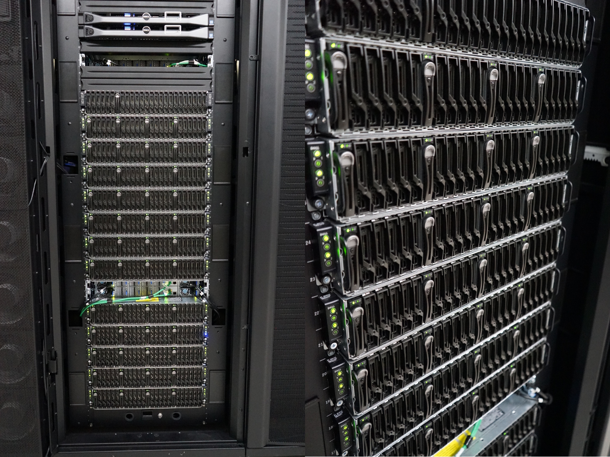

# Iris Compute Nodes

Iris is a cluster of x86-64 Intel-based compute nodes.
More precisely, Iris consists of 196 computational nodes named `iris-[001-196]` and features 3 types of computing resources:

* 168 "_regular_" nodes, Dual Intel Xeon [Broadwell](https://en.wikipedia.org/wiki/Broadwell_(microarchitecture)) or [Skylake](https://en.wikipedia.org/wiki/Skylake_(microarchitecture)) CPU (28 cores), 128 GB of RAM
* 24 "_gpu_" nodes, Dual Intel Xeon [Skylake](https://en.wikipedia.org/wiki/Skylake_(microarchitecture)) CPU (28 cores), 4 [Nvidia Tesla V100](https://www.nvidia.com/en-us/data-center/v100/) SXM2 GPU accelerators (16 or 32 GB), 768 GB RAM
* 4 "_bigmem_" nodes:  Quad-Intel Xeon [Skylake](https://en.wikipedia.org/wiki/Skylake_(microarchitecture)) CPU (112 cores), 3072 GB RAM

| Hostname        (#Nodes) | Node type                           | Processor                                                         | RAM     |
|--------------------------|-------------------------------------|-------------------------------------------------------------------|---------|
| `iris-[001-108]` (108)   | Regular <small>Broadwell</small>    | 2 Xeon E5-2680v4 @ 2.4GHz [14c/120W]                              | 128 GB  |
| `iris-[109-168]` (60)    | Regular <small>Skylake</small>      | 2 Xeon Gold 6132 @ 2.6GHz [14c/140W]                              | 128 GB  |
| `iris-[169-186]` (18)    | Multi-GPU<br/><small>Skylake</small> | 2 Xeon Gold 6132 @ 2.6GHz [14c/140W] <br/> 4x Tesla V100 SXM2 16G | 768 GB  |
| `iris-[191-196]` (6)     | Multi-GPU<br/><small>Skylake</small> | 2 Xeon Gold 6132 @ 2.6GHz [14c/140W] <br/> 4x Tesla V100 SXM2 32G | 768 GB  |
| `iris-[187-190]` (4)     | Large Memory<br/><small>Skylake</small> | 4 Xeon Platinum 8180M @ 2.5GHz [28c/205W]                         | 3072 GB |


## Processors Performance

Each Iris node rely on an Intel x86_64 processor architecture with the following performance:

| Processor Model                                                                                                                                                                                        | #core | TDP(*) | CPU Freq.<br/>(<small>AVX-512 T.Freq.</small>) | $R_\text{peak}$<br/><small>[TFlops]</small> | $R_\text{max}$<br/><small>[TFlops]</small> |
|--------------------------------------------------------------------------------------------------------------------------------------------------------------------------------------------------------|-------|--------|------------------------------------------------|---------------------------------------------|--------------------------------------------|
| [Xeon E5-2680v4](https://ark.intel.com/content/www/us/en/ark/products/92986/intel-xeon-processor-e5-2620-v4-20m-cache-2-10-ghz.html?wapkw=intel%20xeon%20e5-2620%20v4) <br/><small>(Broadwell)</small> |    14 | 120W   | 2.4GHz <br/>(<small>n/a)                       | 0.538 TF                                    | 0.46 TF                                    |
| [Xeon Gold 6132](https://ark.intel.com/content/www/us/en/ark/products/123541/intel-xeon-gold-6132-processor-19-25m-cache-2-60-ghz.html?wapkw=Xeon%20Gold%206132)       <br/><small>(Skylake)</small>   |    14 | 140W   | 2.6GHz <br/>(<small>2.3GHz</small>)            | 1.03 TF                                     | 0.88 TF                                    |
| [Xeon Platinum 8180M](https://ark.intel.com/content/www/us/en/ark/products/120498/intel-xeon-platinum-8180m-processor-38-5m-cache-2-50-ghz.html)                       <br/><small>(Skylake)</small>   |    28 | 205W   | 2.5GHz <br/>(<small>2.3GHz</small>)            | 2.06 TF                                     | 1.75 TF                                    |

<small>(*) The _Thermal Design Power_ (TDP) represents the average power, in watts, the processor dissipates when operating at Base Frequency with all cores active under an Intel-defined, high-complexity workload.</small>

??? info "Theoretical $R_\text{peak}$ vs. Maximum $R_\text{max}$ Performance for Intel Broadwell/Skylake"
    The reported $R_\text{peak}$ performance is computed as follows for the above processors:

    - The **Broadwell** processors carry on **16 Double Precision (DP) ops/cycle** and support AVX2/FMA3.
    - The selected **Skylake _Gold_** processors have two AVX512 units, thus they are capable of performing 32 DP ops/cycle YET only upon AVX-512 Turbo Frequency (_i.e._, the maximum all-core frequency in turbo mode) in place of the base non-AVX core frequency. The reported values are extracted from the [Reference Intel Specification documentation](https://www.intel.com/content/dam/www/public/us/en/documents/specification-updates/xeon-scalable-spec-update.pdf).

    Then $R_\text{peak} = ops/cycle \times Freq. \times \#Cores$ with the appropriate frequency (2.3 GHz instead of 2.6 for our Skylake processors).

    With regards the _estimation_ of the Maximum Performance $R_\text{max}$, an efficiency factor of 85% is applied.
    It is computed from the expected performance runs during the [HPL](http://www.netlib.org/benchmark/hpl/index.html) benchmark workload.

## Accelerators Performance

Iris is equipped with 96 [NVIDIA Tesla V100-SXM2](https://images.nvidia.com/content/technologies/volta/pdf/tesla-volta-v100-datasheet-letter-fnl-web.pdf) GPU Accelerators with 16 or 32 GB of GPU memory, interconnected within each node through [NVLink](https://www.nvidia.com/en-us/data-center/nvlink/) which provides  higher bandwidth and improved scalability for multi-GPU system configurations.

[](https://www.nvidia.com/fr-fr/data-center/tesla-v100/)

| NVidia GPU Model                                                                                                          | #CUDA core | #Tensor core | Power | Interconnect<br/>Bandwidth | GPU Memory | $R_\text{peak}$<br/><small>[TFlops]</small> |
|---------------------------------------------------------------------------------------------------------------------------|------------|--------------|-------|----------------------------|--------|---------------------------------------------|
| [V100-SXM2](https://images.nvidia.com/content/technologies/volta/pdf/tesla-volta-v100-datasheet-letter-fnl-web.pdf) |       5120 |          640 | 300W  | 300 GB/s                   | 16GB   | 7.8 TF                                      |
| [V100-SXM2](https://images.nvidia.com/content/technologies/volta/pdf/tesla-volta-v100-datasheet-letter-fnl-web.pdf) |       5120 |          640 | 300W  | 300 GB/s                   | 32GB   | 7.8 TF                                      |


## Regular Dual-CPU Nodes

These nodes are packaged within Dell PowerEdge C6300 chassis, each hosting 4 PowerEdge C6320 blade servers.



### Broadwell Compute Nodes

Iris comprises 108 Dell C6320 "regular" compute nodes `iris-001-108` relying on [Broadwell](https://en.wikipedia.org/wiki/Broadwell_(microarchitecture)) Xeon processor generation, totalling 3024 computing cores.

* Each node is configured as follows:
    - 2 [Intel Xeon E5-2680v4](#processors-performance) @ 2.4GHz [14c/120W]
    - RAM: 128 GB DDR4 2400MT/s  (4x16 GB DIMMs _per socket_, 8 DIMMs per node)
    - SSD 120GB
    - InfiniBand (IB) EDR ConnectX-4 Single Port
    - Theoretical Peak Performance per Node: $R_\text{peak}$ 1.075 TF (see [processor performance](#processors-performance))

!!! info "Reserving a Broadwell node"
    If you want to specifically reserve a broadwell node (`iris-[001-108]`), you should use the feature `-C broadwell` on the `batch` partition: `{sbatch|srun|salloc} -p batch -C broadwell [...]`

### Skylake Compute Nodes

Iris also features 60 Dell C6320 "regular" compute nodes `iris-109-168` relying on [Skylake](https://en.wikipedia.org/wiki/Skylake_(microarchitecture)) Xeon processor generation, totalling 1680 computing cores.

* Each node is configured as follows:
    - 2 [Intel Xeon Gold 6132](#processors-performance) @ 2.6GHz [14c/140W]
    - RAM: 128 GB DDR4 2400MT/s  (4x16 GB DIMMs _per socket_, 8 DIMMs per node)
    - SSD 120GB
    - InfiniBand (IB) EDR ConnectX-4 Single Port
    - Theoretical Peak Performance per Node: $R_\text{peak}$ 2.061 TF (see [processor performance](#processors-performance))

!!! info "Reserving a Regular Skylake node"
    If you want to specifically reserve a regular skylake node (`iris-[109-168]`), you should use the feature `-C skylake` on the `batch` partition: `{sbatch|srun|salloc} -p batch -C skylake [...]`

## Multi-GPU Compute Nodes

Iris includes 24 [Dell PowerEdge C4140](https://i.dell.com/sites/doccontent/shared-content/data-sheets/en/Documents/PowerEdge-C4140-Spec-Sheet.pdf) "gpu" compute nodes embedding on total 96  [NVIDIA Tesla V100-SXM2](https://images.nvidia.com/content/technologies/volta/pdf/tesla-volta-v100-datasheet-letter-fnl-web.pdf) GPU Accelerators.

* Each node is configured as follows:
    - 2 [Intel Xeon Gold 6132](#processors-performance) @ 2.6GHz [14c/140W]
    - RAM: 768 GB DDR4 2666MT/s  (12x 32 GB DIMMs _per socket_, 24 DIMMs per node)
    - 1 Dell NVMe 1.6TB
    - InfiniBand (IB) EDR ConnectX-4 Dual Port
    - 4x [NVIDIA Tesla V100-SXM2](https://images.nvidia.com/content/technologies/volta/pdf/tesla-volta-v100-datasheet-letter-fnl-web.pdf) GPU Accelerators over NVLink
        * `iris-[169-186]` feature 16G GPU memory - use `-C volta`   as slurm feature
        * `iris-[191-196]` feature 32G GPU memory - use `-C volta32` as slurm feature
    - Theoretical Peak Performance per Node: $R_\text{peak}$ 33.26 TF (see [processor performance](#processors-performance) and [accelerators performance](#accelerators-performance))

!!! info "Reserving a GPU node"
    Multi-GPU Compute Nodes can be reserved using the `gpu` partition. Use the `-G [<type>:]<number>` to specify  the  total number of GPUs required for the job

    ```bash
    # Interactive job on 1 GPU nodes with 1 GPU
    si-gpu -G 1
    nvidia-smi      # Check allocated GPU

    # Interactive job with 4 GPUs on the same node, one task per gpu, 7 cores per task
    si-gpu -N 1 -G 4 --ntasks-per-node 4 --ntasks-per-socket 2 -c 7

    # Job submission on 2 nodes, 4 GPUs/node and 4 tasks/node:
    sbatch -p gpu -N 2 -G 4 --ntasks-per-node 4 --ntasks-per-socket 2 -c 7 launcher.sh
    ```

!!! warning "Do NOT reserve a GPU node if you don't need a GPU!"
    Multi-GPU nodes are scarce (and **very expansive**) resources and should be dedicated to GPU-enabled workflows.

??? tips "16 GB vs. 32 GB Onboard GPU Memory"
    - Compute nodes with Nvidia V100-SMX2 **16GB** accelerators are registrered with the `-C volta` feature.
        * it corresponds to the 18 Multi-GPU compute nodes `iris-[169-186]`

    - If you want to reserve GPUs with more memory (_i.e._ **32GB** on-board HBM2), you should use `-C volta32`
        * you would then end on one of the 6 Multi-GPU compute nodes `iris-[191-196]`

## Large-Memory Compute Nodes

Iris holds 4 [Dell PowerEdge R840](https://i.dell.com/sites/csdocuments/Shared-Content_data-Sheets_Documents/en/poweredge-r840-spec-sheet.pdf?newtab=true) Large-Memory ("_bibmem_") compute nodes `iris-[187-190]`, totalling 448 computing cores.

* Each node is configured as follows:
    - 4 [Xeon Platinum 8180M](#processors-performance) @ 2.5GHz [28c/205W]
    - RAM: 3072 GB DDR4 2666MT/s  (12x64 GB DIMMs _per socket_, 48 DIMMs per node)
    - 1 Dell NVMe 1.6TB
    - InfiniBand (IB) EDR ConnectX-4 Dual Port
    - Theoretical Peak Performance per Node: $R_\text{peak}$ 8.24 TF (see [processor performance](#processors-performance))

!!! info "Reserving a Large-Memory node"
    These nodes can be reserved using the `bigmem` partition:
    `{sbatch|srun|salloc} -p bigmem [...]`

!!! danger "DO NOT use bigmem nodes..."
    ... Unless you know what you are doing. We have **too few** large-memory compute nodes so kindly keep them for workloads that truly need these kind of **expansive** resources.

    * _In short_: **carefully check your workflow and memory usage before considering using these node!**
        - use `seff <jobid>` or `sacct -j <jobid> [...]` for instance
