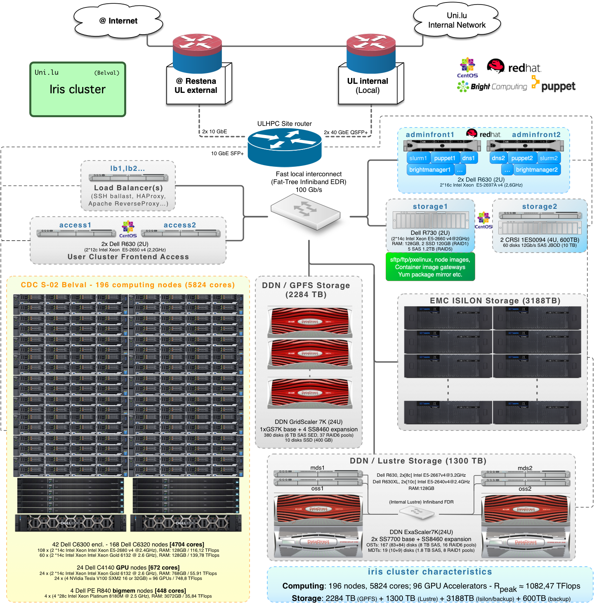

# Iris Overview

Iris is a [Dell](https://www.delltechnologies.com/lb-lu/solutions/high-performance-computing/index.htm)/Intel supercomputer which consists of **196 compute nodes, totaling 5824 compute cores** and 52224 GB RAM,
with a peak performance of about **1,072 PetaFLOP/s**.

All nodes are interconnected through a **Fast InfiniBand (IB) EDR network**[^1], configured over a ** [Fat-Tree](https://clusterdesign.org/fat-trees/) Topology** (blocking factor 1:1.5).
Iris nodes are equipped with **Intel** [Broadwell](https://en.wikipedia.org/wiki/Broadwell_(microarchitecture)) or [Skylake](https://en.wikipedia.org/wiki/Skylake_(microarchitecture))  processors.
Several nodes are equipped with 4 [Nvidia Tesla V100](https://www.nvidia.com/en-us/data-center/v100/) SXM2 GPU accelerators.
In total, Iris features **96 Nvidia V100** GPU-AI accelerators allowing for high speedup of GPU-enabled applications and AI/Deep Learning-oriented workflows.
Finally,  a few large-memory (fat) computing nodes offer multiple high-core density CPUs and a large live memory capacity of 3 TB RAM/node,  meant for in-memory processing of huge data sets.

[^1]: Infiniband (IB) EDR networks offer a 100 Gb/s throughput with a very low latency (0,6$\mu$s).

Two global [_high_-performance clustered file systems](../../filesystems/index.md) are available on all ULHPC computational systems: one based on GPFS/SpectrumScale, one on Lustre.

[:fontawesome-solid-sign-in-alt: Iris Compute](compute.md){: .md-button .md-button--link } [:fontawesome-solid-sign-in-alt: Iris Interconnect](interconnect.md){: .md-button .md-button--link } [:fontawesome-solid-sign-in-alt: Global Storage](../../filesystems/index.md){: .md-button .md-button--link }

The cluster runs a [Red Hat Linux Family](https://en.wikipedia.org/wiki/Red_Hat_Enterprise_Linux_derivatives) operating system.
The ULHPC Team supplies on all clusters a large variety of HPC utilities, scientific applications and programming libraries to its user community.
The [user software environment](../../software/index.md) is generated using [Easybuild](https://easybuild.readthedocs.io) (EB) and is made available as [environment modules](../../environment/modules.md) from the compute nodes only.

[Slurm](https://slurm.schedmd.com/documentation.html) is the Resource and Job Management Systems (RJMS) which provides computing resources allocations and job execution.
For more information: see [ULHPC slurm docs](../../slurm/index.md).

## Cluster Organization

## Login/Access servers

* Iris has 2 access servers (128 GB of memory each, general access) `access[1-2]`
   - Each login node has two sockets, each socket is populated with an Intel [Xeon E5-2697A v4](https://ark.intel.com/content/www/fr/fr/ark/products/91768/intel-xeon-processor-e5-2697a-v4-40m-cache-2-60-ghz.html) processor (2.6 GHz, 16 core)

!!! warning "Access servers are not meant for compute!"
    - The `module` command is not available on the access servers, only on the compute nodes
    - **you MUST NOT run any computing process on the access servers**.

## Rack Cabinets

The Iris cluster (management, compute and interconnect) is installed across 7 racks within a row of cabinets in the premises of the [_Centre de Calcul_](../../data-center/index.md) (CDC), in the CDC-S02-005 server room.

| Server Room | Rack ID | Purpose    | Type        | Description                                             |
|-------------|---------|------------|-------------|---------------------------------------------------------|
| CDC-S02-005 | D02     | Network    |             | Interconnect equipment                                  |
| CDC-S02-005 | D04     | Management |             | Management servers, Interconnect                        |
| CDC-S02-005 | D05     | Compute    | regular     | `iris-[001-056]`, interconnect                          |
| CDC-S02-005 | D07     | Compute    | regular     | `iris-[057-112]`, interconnect                          |
| CDC-S02-005 | D09     | Compute    | regular     | `iris-[113-168]`, interconnect                          |
| CDC-S02-005 | D11     | Compute    | gpu, bigmem | `iris-[169-177,191-193]`(gpu), `iris-[187-188]`(bigmem) |
| CDC-S02-005 | D12     | Compute    | gpu, bigmem | `iris-[178-186,194-196]`(gpu), `iris-[189-190]`(bigmem) |

In addition, the global storage equipment ([GPFS/SpectrumScale](../../filesystems/gpfs.md) and [Lustre](../../filesystems/lustre.md), common to both Iris and [Aion](../aion/index.md) clusters) is installed in another row of cabinets of the same server room.
