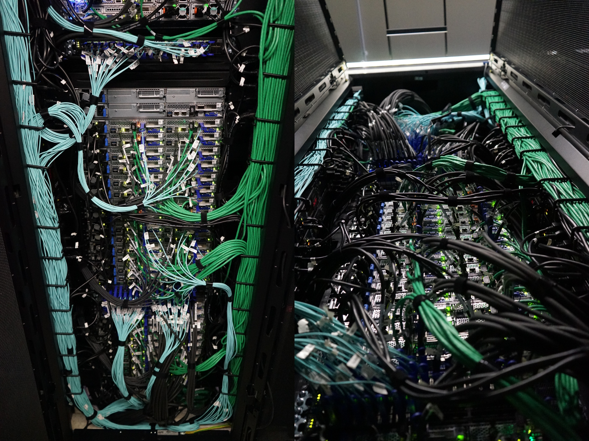

# Fast Local Interconnect Network

The Fast _local_ interconnect network implemented within Iris relies on the [Mellanox](https://www.mellanox.com/) **[Infiniband (IB) EDR](https://en.wikipedia.org/wiki/InfiniBand)[^1]** technology.
For more details, see [Introduction to
High-Speed InfiniBand Interconnect](https://www.hpcadvisorycouncil.com/pdf/Intro_to_InfiniBand.pdf).

[^1]: Enhanced Data Rate (EDR) – 100 Gb/s throughput with a very low latency, typically below 0,6$\mu$s.

One of the most significant differentiators between HPC systems and lesser performing systems is, apart from the interconnect technology deployed, the supporting topology. There are several topologies commonly used in large-scale HPC deployments ([Fat-Tree](https://clusterdesign.org/fat-trees/), [3D-Torus](https://clusterdesign.org/torus/), Dragonfly+ etc.).

{: style="width:200px;float: right;"}
Iris (like [Aion](../aion/index.md)) is part of an _Island_ which employs a "[Fat-Tree](https://clusterdesign.org/fat-trees/)" Topology[^2] which remains the widely used topology in HPC clusters due to its versatility, high bisection bandwidth and well understood routing.

Iris 2-Level 1:1.5 Fat-Tree is composed of:

* 18x Infiniband EDR[^1] [Mellanox SB7800](https://www.mellanox.com/products/infiniband-switches/SB7800) switches (36 ports)
    - 12x Leaf IB (LIB) switches (L1), each with 12 EDR L1-L2 interlinks
    - 6x Spine IB (SIB) switches (L2), with 8 EDR downlinks (total: 48 links) used for the interconnexion with the Aion Cluster
* Up to 24 Iris compute nodes and servers EDR connection per L1 switch using 24 EDR ports

[^2]: with blocking factor 1:1.5.

For more details:
[:fontawesome-solid-sign-in-alt: ULHPC Fast IB Interconnect](../../interconnect/ib.md#ulhpc-ib-topology){: .md-button .md-button--link }

Illustration of Iris network cabling (IB and Ethernet) within one of the rack hosting the compute nodes:

